# Outside X68000 (1993)

*English translation from the Japanese original*

**Introduction**

Following "Inside X68000", we are now able to publish "Outside X68000". While "Inside" was oriented towards software, this book takes a closer look at the X68000 personal computer from a hardware perspective.

As PCs have become more commonplace, hardware has gradually become a "black box." Articles on hardware have appeared frequently in PC magazines, but these articles primarily focus on the placement of registers and memory maps, with explanations limited to an "inside view" of the software. They often do not delve deeply into how hardware is structured, giving the impression that detailed knowledge of such hardware is unnecessary.

However, the fundamental operation of computers lies in the movement of LSI chips. Users may encounter difficulties, such as knowing which joystick port to use, how to configure LSI chips and microcontrollers, or how to create self-made option boards and handle connectors for cables. The confusion does not end there, as users may also struggle to determine the function of multiple numbered pins or identify the precise role of these pins even if they were to refer back to LSI manufacturer's manuals. Such detailed information is not always conveniently available, and users are often left puzzled by incomplete or missing explanations of register setups.

For personal computers to be truly "personal" and functional in user environments, having detailed information on hardware is essential. This book compiles initial views on the X68000, including its XVI model and Sharp's official option boards, along with detailed maps, pin settings, and other troubleshooting articles that have appeared in "Oh!X." 

It is our sincere hope that this book will be put to use as a resource for utilizing and analyzing the hardware of the X68000, helping you draw out more than 100% of its capabilities.

February 1993

Yukino Masahiko

C O N T E N T S

Introduction ................................... 3

Main Body ............................................ 15

Internal Circuits of X68000 .............................. 17

1. Introduction ....................................... 17

2. Input/Output Circuits ................................ 18
```
  2-1. Expansion Slot ................................ 18
  2-2. Analog RGB Connector ........................ 23
  2-3. Display Control Connector .................. 25
  2-4. Video Input Connector ..................... 26
  2-5. Printer Connector ............................ 26
  2-6. Six-Color Terminals / 3D Scope Terminal ... 29
  2-7. Line Output / Headphone Terminal ...... 29
  2-8. Joystick Connector ......................... 31
  2-9. RS-232C / Mouse / Keyboard ............. 32
  2-10. External FDD Connector .................. 34
  2-11. External HDD Connector .................. 36
```

3. Hardware Modifications .............................. 37
```
  3-1. Gate Array Modifications .................. 37
  3-2. Other Major Changes ....................... 41
```

Expansion Slot Specifications ........................... 43

1. Introduction ......................................... 43

2. Expansion Board Base Plate, Panel External Diagram ... 44

2-1 Expansion Board External Form ........................................ 44
2-2 Panel External Form ...................................................... 44

●  3  I/O Slot Signal ................................................................... 48
●  4  Expansion Slot Interruption ........................................... 56
●  5  Bus Ownership from Expansion Slot ........................ 59
●  6  I/O Slot DC Regulation .................................................. 61
●  7  I/O Slot AC Timing ....................................................... 63
●  8  Refresh / D-RAM Exclusive Signal Timing ........... 66

● Peripheral Equipment Section ............................................. 69

● Option Board .............................................................................. 71
```
     1  Introduction .............................................................................. 71
     2  I/O Address of Option Board ........................................ 72
```

● Expansion Memory ..................................................................... 75
```
     ● 1 Operational Differences by Model .......................... 75
          1-1 Internal Expansion Memory ..................................... 75
          1-2 External Expansion Memory .................................... 77

     ● 2 Component Arrangement .............................................. 77

     ● 3 Circuit Diagram / Connector Signal Arrangement
          3-1 Internal Exclusive Use ............................................... 80
          3-2 External Common Use ................................................ 81
```

CONTENTS

● Numeric Computation Processor Board (CZ-6BP1/CZ-6BP1A) ................................................ 83

● 1 Specifications ....................................................................................................................... 83
● 2 Circuit Overview .................................................................................................................. 84
● 3 Main Component Layout ...................................................................................................... 84
● 4 Settings
  4-1 Port Address Setting .......................................................................................................... 87
● 5 I/O Map ............................................................................................................................... 87
● 6 Circuit Diagram .................................................................................................................... 88

● MIDI Board (CZ-6BM1) .......................................................................................................... 89

● 1 Specifications ....................................................................................................................... 89
● 2 Circuit Overview .................................................................................................................. 90
● 3 Main Component Layout ...................................................................................................... 92
● 4 Settings
```
  4-1 Port Address Setting .......................................................................................................... 93
  4-2 Cut Level Setting ................................................................................................................ 93
  4-3 MIDI OUT/MIDI THRU Selection ....................................................................................... 93
```
● 5 I/O Map ..............................................................................................................................  93
● 6 Connector Signal Layout .................................................................................................... 108
● 7 Circuit Diagram .................................................................................................................. 110

● Parallel Board (CZ-6BN1) ..................................................................................................... 111

● 1 Specifications ..................................................................................................................... 111
● 2 Circuit Overview ................................................................................................................ 112
● 3 Main Component Layout .................................................................................................... 113
● 4 Settings
```
  4-1 Port Address Setting ......................................................................................................... 114
  4-2 Cut Level Setting .............................................................................................................. 115
```

I/O Map
```
   5-1 8255 Registers
   5-2 Interrupt Mask Register
   5-3 Interrupt Vector Number Register
```

Connector Signal Arrangement

Parallel Cable Connection Diagram

Image Scanner Connection Example

Circuit Diagram

Video Board (CZ-6BV1)

Specifications

Circuit Outline

Main Component Configuration

Setting
   4-1 Video Board Operation

SCSI Board (CZ-6BS1)

Specifications

Circuit Outline

Main Component Configuration

Setting
```
   4-1 Interrupt Level Setting
   4-2 Terminator
   4-3 Terminator Power Line
```

I/O Map

**CONTENTS**

**GP-IB Board (CZ-6BG1)**
1. Specifications .......................................................... 141
2. Circuit Overview ..................................................... 141
3. Main Component Placement ........................... 142
4. Settings ................................................................. 144
  4-1. Address Allocation ......................................... 145
5. I/O Map ................................................................... 145
6. Connector Signal Layout .................................. 146
7. Circuit Diagram ................................................. 148

**RS-232C Board (CZ-6BF1)**
1. Specifications .......................................................... 149
2. Circuit Overview ..................................................... 150
3. Main Component Placement ........................... 152
4. Settings ................................................................. 153
```
  4-1. Board Address Setting ................................. 153
  4-2. Address Allocation ......................................... 153
```
5. I/O Map ................................................................... 154
6. Connector Signal Layout .................................. 155
7. Circuit Diagram ................................................. 157

**FAX Board (CZ-6BC1)**
1. Specifications .......................................................... 159
2. Circuit Overview ..................................................... 160
3. Main Component Placement ........................... 162
4. Settings ................................................................. 163
  4-1. Setting Transmission Output Level ............ 163

4-2 Setting the Cable Equalizer ....................................................................................... 164
4-3 Setting the Clipping Level ......................................................................................... 164
```
5 I/O Map ......................................................................................................................... 164
6 Circuit Diagram ............................................................................................................. 172
```

Universal I/O Board (CZ-6BU1) ......................................................................................... 175
```
1 Specifications ................................................................................................................. 175
2 Circuit Summary ............................................................................................................ 176
3 Main Component Arrangement ...................................................................................... 178
4 Settings .......................................................................................................................... 179
```
```
  4-1 Setting the Port Address ......................................................................................... 179
  4-2 Setting the Output Strobe Signal (OUTSB 1/2) Generation Conditions ........................ 180
  4-3 Data Latch Selection ............................................................................................... 180
  4-4 Setting the Clipping Level ...................................................................................... 181
```
```
5 I/O Map ......................................................................................................................... 181
6 Connector Signal Arrangement ..................................................................................... 183
7 Circuit Diagram ............................................................................................................. 184
```

Homemade Peripheral Equipment ................................................................................. 185
Examples of Homemade Peripheral Devices ................................................................. 187

Random Number Generator .......................................................................................... 189
```
  1 Random Number Generation Experiment ............................................................... 190
  2 Circuit Design ........................................................................................................... 190
    2-1 About the Power Supply ...................................................................................... 190
    2-2 Noise Reduction Section .................................................................................... 191
```

**CONTENTS**
  
2-3 Signal Amplifier Section ............................................. 192
2-4 Waveform Shaping Section ......................................... 193
2-5 Examination of Signal Level Conversion Methods ........ 193
2-6 Level Conversion Circuit ......................................... 194
2-7 Data Acquisition Section .......................................... 195
2-8 Usage Interface .......................................................... 195

● 3 Precautions in Production .................................... 196
3-1 Board Creation ......................................................... 196
3-2 Component Layout ................................................. 196
3-3 Wiring Process ......................................................... 197
3-4 Check ................................................................. 197

● 4 Assembly ........................................................... 198

● 5 Reading Software ................................................ 198

● 6 Conclusion .......................................................... 199

● 7 Supplement ........................................................ 199

● Radio Control Stick ................................................. 203

● 1 Selection of Propeller ............................................ 204

● 2 How Does the Propeller Work? ............................ 204
2-1 Calculation of Waveform ......................................... 206

● 3 Circuit Design of Radio Control Stick .................. 206
3-1 Design of Propeller Receiving Circuit ................... 206
3-2 Design of Wireless Wave Shaping Circuit ............ 208
3-3 Design of Counting Circuit (1) .............................. 211
3-4 Design of Host Interface Circuit .......................... 213
3-5 Design of Counting Circuit (2) ............................. 217

● 4 Production of Radio Control Stick ....................... 217

● 5 Assembly .......................................................... 218

● 6 Usage ............................................................... 219

● 7 Conclusion ....................................................... 220

**Universal Remote Control ................................................................................. 233**

**1. Infrared Remote Control Experiment** .......................................................................... 233
1-1   Measurement ................................................................................................................... 234
1-2   Light Emission Side Experiment .................................................................................. 235
1-3   Interface with Main Unit ................................................................................................ 236
1-4   Connection with X68000 ............................................................................................... 236
1-5   Extending the Distance ................................................................................................ 237

**2. Circuit Design** ............................................................................................................ 238
2-1   Circuit to Prevent Unintended Light Emission ............................................................. 238
2-2   Light Emitting Diode Drive Circuit ................................................................................ 239
2-3   Reproduction Experiment ............................................................................................ 240

**3. Cautions in Manufacturing** ......................................................................................... 240
3-1   LED ............................................................................................................................... 240
3-2   Case .............................................................................................................................. 241

**4. Sample Program** ....................................................................................................... 241
4-1   Select Mode .................................................................................................................. 242
4-2   Edit Mode ...................................................................................................................... 243
4-3   Try It Out ....................................................................................................................... 243

**5. In Conclusion** ............................................................................................................. 246

**CRT Switching Device ......................................................................................... 275**

**1. Switching Experiment** ................................................................................................ 276
**2. Discussion on Switching Circuit** ................................................................................ 277

**3. Circuit Design** ............................................................................................................ 278
3-1   Display Selection Part ................................................................................................... 278
3-2   Signal Combine Part of Display Control Part ............................................................ 278
3-3   Read Drive Part ............................................................................................................ 280

**4. Cautions in Manufacturing** ......................................................................................... 280
4-1   Wiring of Analog RGB Signal ....................................................................................... 280
4-2   Attention to Relay Properties ....................................................................................... 281
4-3   About LED ..................................................................................................................... 281
4-4   Case Selection .............................................................................................................. 281
4-5   Display Device Connection Cable ............................................................................. 282

CONTENTS

5. For testing....................................................................................282
6. In conclusion..............................................................................283

In conclusion............................................285
References................................................287
Index.........................................................288

COVER DESIGN--Masaki KATSUMATA

*(Blank page in the original.)*

Main Volume

*(Blank page in the original.)*

**Internal Circuits of the X68000**

The internal circuits of the X68000 are quite complex. In this chapter, we summarize the circuits surrounding the various input/output connectors provided in the X68000 and the changes in the main gate array.

**1 Introduction**

When studying hardware, particularly digital circuits, examining the internal circuits of personal computers can be very instructive. The X68000, among personal computers, incorporates many useful functions internally, and even a brief look at how interfaces are constructed and the design concepts can be more than enough to serve as practical material for learning digital circuits.

In this chapter, we summarize the changes in hardware for each device category from the interface part of the X68000's circuits.

2. Input-Output Sections Circuits

When creating peripherals for the X68000 and connecting them, it is crucial to understand how the signals on the connected side are routed. Depending on the circuit of the main unit, you must consider what level of signals you need to provide or receive on the peripheral side.

This book provides the circuit diagrams for the X68000. You can trace the connections if necessary. While the internals of high-performance devices are straightforward, beginners must do extensive work just to catch up with LSI pin layouts and connections. Thus, summarizing how signals on I/O connectors are routed is useful. The values of resistors and capacitors, among other details, may vary based on individual preferences. As for power compatibility, it is ensured to a certain extent.

Based on the initial schematics, compilation is done here. The specifics might vary so consult the appropriate internal circuit diagrams as needed.

2.1 Expansion Slots

Expansion slots include signal lines primarily for memory I/O read/write actions. Signals are placed for necessary requirements such as clock, DMA, interrupt requests, refresh timing, and sync signals. Many different types of boards can be created using these configurations.

2.1.1 CPU Related Signals

Among the signals in expansion slots, those directly connected to the CPU are shown in Figure 1. These are signals directly related to the CPU including address, data, and status signals. ALS (Advanced Low-Power Schottky) and AS (Advanced Schottky) are used for such signals. Logic delay from the gate might increase causing timing mismatches or issues with TTL family ICs, so take caution with timing margins.

X68000 Internal Circuit

● Fig. 1  Expansion Slot Signals (1)  CPU Periphery

HD68HC000

A23
A1
D15
D0
FC0 - FC2
AS
LDS
UDS
R/W
VMA
VPA
E
HALT
BERR
BGACK
DTACK
RESET

ALS244 → AB23, AB1
AS245 → DB15, DB0
ALS244 → FC0 - FC2, AS, LDS, UDS, R/W, VMA

S08, 2.2K Vcc1 → EXVPA
ALS34 → E
S09 → HALT
Vcc1 2.2K → EXBERR
ALS32, S09 (VRAMBERR, TIMEOUT), LS14, Vcc1 4.7K → BGACK
S15, Vcc1 1K, S15 → DTACK
Vcc1 2.2K, S09, ALS34 → EXRESET

We aim to minimize it as much as possible.
In the open collector driver of this section, use an open collector gate or a tristate buffer, and ensure that only your access and no other LSI bus master overlaps with the clean data. In cases where power is used, it is noted that a mixed type should be used.

2 - ○2    Bus Release Request, Interrupt, Synchronous Signals

Bus release request, interrupt, and synchronous signals are shown in Figure 2. For each expansion slot, there are lines for bus release request, interrupt request, NMI (non-maskable interrupt), IDIDR (bus packet identification signal), etc., and these are synchronized with BUDDHA and output when BUDDHA becomes active. Bus release request signals (BRn, BGn) and interrupt request signals (IRQ 2, IRQ 4, IACK 2, IACK 4) are held by a latch for each slot. BUDDHA holds latches for each slot. For signals other than BUDDHA as source, activation to IDIDR inputs are connected to expansion slots, and for inputs when expansion slots are empty, they go to pull-up resistors connected to 2.2 KΩ for these signals. Although open collector driver types are easy to use, considering issues such as cleanliness or conflict prevention, it is better to use standard push-pull output ICs that are electrically isolated from the expansion slots at some distance.

Regarding video, horizontal synchronization controller is VIA1, and VINAS1 outputs. For the CRT connector, an open collector buffer is used, in contrast, the expansion slots use LS04 buffers etc., so although there are some minor differences, they are basically the same signals as those in the CRT connector.

2 - ○3    Other Signals

Clock related, external power-on signals, DMA request signals, are arranged as shown in Figure 3. The clock is obtained by dividing 40 MHz oscillation into 20 MHz and 10 MHz using the LS540 buffer, and it is used for the CPU clock and the clock for the expansion slots. Dividers use JK flip-flops, with the positions of 20MHz and 10MHz being buffered.

Page 20

**Top right:**
X68000 Internal Circuit

**Top left:**
●Fig:....2 Expansion Slot Signals (2) Bus Exchange, Synchronous Signal Relationships
```
    BUDDHA
    (System Controller)
```

ALS34

```
    IDDIR
    BR-1
    BR-2
    BG-1
    BG-2
    IRQ2-1
    IRQ4-1
    IACK2-1
    IACK4-1
    EXNMI
```

**Labels within the circuit:**
    Vcc1

```
    VINAS1
    (Video Controller)
    HSYNC
    VSYNC
```

**Labels within the circuit:**
```
    LS04
    LS06
    IS5119
```

```
    1K
    CRT Connector
```

**Bottom right:**

●Figure...3 Expansion Slot Signals (3) Clock, DMA Requirements, etc.

Vcc1 1K

LS112
Vcc1

LS112
Vcc1

LS540

10MHz 
(CPU Clock etc) 

10MHz 

20MHz 

OSCAR
40MHz 

PR

J

CK

Q

K

C 

PR

J

CK

Q

K

CL

Vcc2

LS11

Vcc2

LS11
10K

LS11
22K

(EXP WON)

0.47

0.777

(ALARM)

(POWER OFF)
(Power Switch)

1.5K

0.001

LS244 × 3

I1
I0
I2

MC68901(MFP)
E T
D-RAM
Controller

AS34 × 4

INH2
SELEN
CASDREN
CASWRL
CASWRU

HD63450 (DMAC)
EXOWN
DONE
DTC
REQ2

PCL2

ACK2

ALS244

Vcc1
4.7K

Vcc1
2.2K

Vcc1
4.7K

EXOWN

DONE

DTC

4.7K

Vcc1
2.2K

EXREQ
EXPCL
EXACK

It is designed so that there is no adverse effect.

- EXPWON is a signal to turn on the power of the X68000. By setting it to the 'L' (low) level, the main unit's power can be turned on even when the power switch on the front of the main unit is not on. A filter circuit with a CR is included to prevent operation errors due to noise.
With the power of X68000 turned on, it is determined whether an external power source should be connected by examining whether the power of the main unit is turned on by pressing the power switch on the main unit, whether the RTC frame motor (alarm function) is operating, and whether  the ON signal is connected to the MFP on the GPIP terminal.

- INH 2, SELEN, CASDREN, CASWRL, CASWRU: These 5 signals are for the D-RAM controller and can be checked in the ET. During expansion, they are used to determine the memory refresh cycle for expansion output select, and are also used for other signals such as memory select and other chip enable lines. Only INH 2 is used to prevent signal collision with RAM.

- EXOWN, DONE, DTC, EXREQ, EXPCL, EXACK: These signals are related to the DMA controller. Channel #2 of the DMA controller is released for expansion board use. With proper usage, it is possible to use DMA in Channel #1 slot of the expanded RAM board. Series models post-SUPER support SCSI interface. Channel 1 or Channel 2 of the DMA is utilized when an expansion board that supports SCSI interface is installed. Even so, if the DMA channel is released, the board remains uncontrolled.

◉ 2

Analog RGB Connector

- ⑀ 2: The method of circuit connection of the analog RGB connector is as shown in figure 4. The analog RGB connector usually outputs RGB signals in sync, but the left and right audio power is delivered and it is stereo compatible. After passing through the buffer amplifier, the output of the NJM2070 to the RGB connector is combined with the headphone and internal speaker channels. There is volume adjustment before the output to headphone or speaker, so the RGB connector output level does not receive effects from the main volume adjustment by the main unit front.

- The output related to video, brightness, and sync is produced by ferrite beads, a 33 pF capacitor, and a filter. The RGB brightness consists of 2SA1015Y, YS and S 2SC1815Y transistors. The sync signal is cut by a crossover collector LS06 and KΩ level pull-up resistor.

"Fig 4 Analog RGB Connector

24"

2-3 Display Control Connector

The display control connector is equipped with a remote control signal line, a display TV on/off status and a display TV side horizontal/vertical synchronization input signal. The periphery of the connector is as shown in the figure below.

The remote control signal is treated the same as the wireless remote control signal within the display TV, and it is assumed that the remote control signal is being input wirelessly. On the X68000, the remote control input is mainly assumed to be from the keyboard. When operating the keyboard from the keyboard, if the remote control output has no purpose, you can disable remote control by disconnecting the signal from the keyboard remote control circuit.

The actual connection to the main unit for display control is via TV remote (TVREMOTE) and keyboard remote control signal (KYRMT). These are connected via diodes. The KYRMT is controlled by the KEYSET signal. If set to "0", remote control from the keyboard will not be possible.

■ Display Control Connector■

[Image of the circuit]

**TVREMOTE** stays in "H," the remote control signal remains in "H," and the control from the keyboard becomes unavailable. In this case, control via wireless remote control is not possible (in the case of CZ-600 DE), with the possibility of not fully connecting to the TV in the display. The synchronizing signal from the remote control is essential for the actual Superimpose action. With the Superimpose operation, the display content from the TV might overlap with that of the computer. Because the synchronizing signal from the TV broadcast and the timing of the signal reaching the TV are uncertain, the display timing of the actual device has to be matched with the TV.

**2-4 Video Input Connector**

The connector used for image input as an option in the Outline Menu. The sync signal pin layout is as shown in Fig.6. The signal is transmitted by the lower-bit command port, converting from parallel to serial, and transmitted to 16-byte data. The QA signal is synchronized, inserted into the D/A, and transmitted to V-RAM for image input.

The power lines of the 12V and +5V supplied by the connector pass through the (*filter) and are prepared through the analog switch. Noise from internal circuits does not affect the external circuits, avoiding issues caused by internal noise.

**2-5 Printer Connector**

The details of the printer connector are shown in Fig. 7 as circuits. Considering the X 68000 printer board, the toggling of the printer packet is crucial, whether the data is strobed, busy, PE (paper end), ONLINE, or ACK (data reception completion indicator). The printer status is determined by monitoring the BUSY state alone.

Data latch to the printer is controlled by the printer latch (LS 273). The open type lap-proof, such as LS07, sends the data to the printer, and the data latches at LSO. STROBE signals go out from BUDDHA and are also buffered by output from LS07.

Top Left:
Figure 6 Video Input Connector

Top Right:
Internal Circuitry of X68000

Bottom Right:

● Fig. 7  Printer Connector

LS273
LS07 × 8 → PA0, PA1, PA2, PA3, PA4, PA5, PA6, PA7
D, Q, CK, CLR0, 1K Vcc1
Vcc1, 4.7K, 4.7K
1SS119, 1SS119
BUDDHA, LS07 → STROBE
ALS244 → PRT BUSY
SIOLIAN

It is connected to the printer. To output the correct voltage level, it is pulled up with 4.7 KΩ, and by inserting a diode, current is prevented from flowing back from the printer into the interior of the main unit when the main unit's power is off or when the printer's output voltage is higher than that of the main unit.
BUSY (PRT BUSY in Fig. 7) indicates whether or not the printer is in a state to receive data. Since it is an input pin, a pull-up is provided so that the pin does not go into a high-impedance state and cause false recognition when the printer is not connected. When the cable is not plugged in, it stays in the BUSY state. The pull-up uses the same method as for the STROBE signal.

2•6 Sleeveless Color Terminal/3D Scope Terminal

The circuits around the sleeveless color terminal and the 3D scope terminal are shown in Diagram 8. The sleeveless color terminal indicates the scanning area, and the 3D scope terminal is where the shutter synchronization signal is attached when using an LCD shutter. Each signal is output as an open collector, but the sleeveless color terminal is pulled up with 270 Ω to suppress unnecessary radiation by passing through a ferrite bead.

Diagram 8 Sleeveless Color Terminal/3D Scope Terminal

2•7 Line Output/Headphone Connection

The circuits related to audio, such as line output and headphone, are as shown in Diagram 9. There are many capacitors for DC protection and for DC bias cut to protect each circuit, and it seems complicated, but if you look at it step by step, it is not difficult.

Page 29

**Figure 9 - Audio Related**

ADPCM:
* MSM6258 (ADPCM)

* LINE IN

* (Circuit diagram and component names)

* LINE OUT

FM Sound:
* YM2151 + YM3012 (FM Sound Source)

* R (HEAD PHONE)
* L (HEAD PHONE)

* R (DISPLAY)
* L (DISPLAY)

**X68000 Inside Circuit Diagrams**

After the line input is inverted by NJM 072, the 1 µF capacitor filters out the DC component, leaving a signal centered around 2.5 V for the ADPCM chip (MSM6258). In the inverted circuit, a 1800 pF capacitor provides a high-pass characteristic. The creation of ADPCM signals involves compressing sound waves as these ensure frequency band savings.

The sound output from the ADPCM is divided into left and right channels and then passes through a low-pass filter buffer amplifier to remove unwanted frequency bands. Following this, it goes to DTC114ES's mute circuit. DTC114ES forcibly sets the ADPCM output to 0 V to prevent noise from being outputted when the volume is cut off. Each DTC114ES is controlled by PC0 and PC1, and when the output is 'H', the output of DTC114ES is muted, and the sound output is turned OFF.

The sound output created in this way is combined with the FM sound source and output via the buffer amplifier. This inverted signal output is for layout, display control connectors, and split into headphone/inner speakers. The output to the headphone/inner speaker is amplified by the BA 526 for audio and ionized. The headphone volume is driven by the speaker driver.

**2.8 Joystick Connector**

Figure 10 shows the pin assignments of the joystick connector. Joystick #2 is for PRO types only and is explained on the next page.

Joysticks #1 and #2 are controlled by 8255. The data is read with port A or port B, and control is done by the PC. What’s a little different is that to joystick #1, pins 6 and 7 can also be used as output pins. This feature allows you to use it as an output pin without changing the operational mode of ports PC6 and PC7.

The input lines A and B used are all pulled up to 15 kΩ resistance. These can be read as long as they are pulled down. It is better to program by avoiding using port C and ports A and B directly. Additionally, note that 8255 writes all ports to the output after the reset. It may be good to set modes as early as possible after the reset for clarity.

**Page 31**

●Fig......10  Joystick Connector

⒉•9   RS-232C/Mouse/Keyboard

The circuits around the connectors for RS-232C, mouse, and keyboard are shown in Fig. 11. The X 68000 performs serial communication for both the mouse and keyboard, and since the keyboard also has a connector for the mouse, they are related to each other. Therefore, the circuits are summarized in a single diagram here.

Note: There might be slight differences due to context and technical terminology.

- RS-232C / Mouse / Keyboard connector
- X68000 internal circuits
- R S 2 3 2 C Connector
- Mouse Connector
- Keyboard Connector

**External FDD Connector**

We'll describe the periphery around the external FDD connector at positions 12 and 11. The X68000 uses an SESD9420 for the FDD's data separator in the FDC (floppy disk controller) LH8530 or MFP (68901). Basically, reading and writing can be done by adding some LSIs (large scale integration circuits) to the FDD, but in the case of the X68000, it is a bit more complicated. To explain it simply, the X68000 converts keyboard data, mouse data, and serial data using the MFP (68901) serial port. First, viewing from LH8530, channel A usually functions as RS-232 C and channel B as mouse input; however, for LH8530, this RS232 C channel supports both transmission and reception, and channel B supports RTS and control signals when channel B's signals are routed to the RS 232 port C HIC. Channel A DCD uses DSR, and CTS and DCD are used from the external TRxCA (transmit clock) to receive buffer ON/OFF signals. 

MSCTRL (mouse control signal) sends data transfer start indications from the mouse. MSTDATA receive mouse movement data and button updates just like the keyboard. RS-232 C roughly works with a 12-volt setup using TTL for mouse input; however, this is complicated.
Keyboard and mouse data are regulated in the same manner with TTL signals sent back when a key is pressed or released. X68000 uses LS367 for keyboard control and mouse connector data routed to RxD. 

Keyboard data includes control signals, now this involves various changes like LED lights on the keyboard, display TV control signal routing is meticulously organized. There are measures initiated to diminish noise due to external signals using ferrite beads and capacitors.

**2.10 External FDD Connector**

We'll describe the periphery around the external FDD connector at positions 12 and 11. The X68000 uses an SESD9420 for the FDC (floppy disk controller) FDD's data separator. Basically, reading and writing can be done by adding some LSIs (large scale integration circuits) to the FDD, but in the case of the X68000, it is a bit more complicated.

X68000 Internal Circuit

● Fig. 12  External FDD Connector

SIOLIAN
Vcc1 1K, 7438 × 7
OP.SEL 0 → OPTION SELECT 0
OP.SEL 1 → OPTION SELECT 1
OP.SEL 2 → OPTION SELECT 2
OP.SEL 3 → OPTION SELECT 3
EJECT → EJECT
EJECT MASK → EJECT MASK
LED BLINK → LED BLINK

Vcc1 1K, 7438 × 4, Vcc1 150 × 5
DRVSEL 0 → DRIVE SELECT 0
DRVSEL 1 → DRIVE SELECT 1
DRVSEL 2 → DRIVE SELECT 2
DRVSEL 3 / TRK0 → DRIVE SELECT 3 / TRACK00
FDDINT → FDD INT
ERRDISK → ERR DISK
DISKIN → DISK IN
WPRT → WRITE PROTECT

YM2151 no CT2 / ALS32
MIN/STD
LS19 × 5, Vcc1 1K, Vcc1 150 × 3
LS19, 7438 × 7
READY → READY
INDEX → INDEX
MIN/STD → DISK TYPE SELECT
LCT/DIR → DIRECTION (LS367)
RW/SEEK → STEP (LS367)
FLTR/STP → WRITE GATE
WE → WRITE PROTECT
WDATA → WRITE PROTECT
SIDE → MOTOR ON
TMOUT → READ DATA
RDATA → READ DATA (LS19)

µPD72065 + SED9420

The LED indicator and auto-eject feature are handled by a dedicated gate array called SICILIAN. According to the diagram, SICILIAN can support toggling between 2 HD and 2 DD, but in reality, it can only handle 2 HD.

**2•11 External HDD Connector**

◇ Diagram 13 External HDD Connector

The external HDD connector peripheral circuit is shown in Figure 13. Up until the original type X68000 SUPER, the HDD interface was using a SASI bus. For traditional control input/output control, the gate array for the model SICILIAN receives everything.

For the data input and output, LS 642 is used, while for control output, the open-collector buffer with high drive capability 7438 is used. For input on the PNP side, LS 19 is used, which is simulated with a pull-up resistor.

Signal resistance is connected in parallel at either 220Ω or 330Ω for both pull-up and pull-down parts, and it is designed to suppress waveform disturbances due to signal reflection.

3. Changes in Hardware

Except for major revision changes, the basic internal architecture of the X68000 series remains mostly unchanged. As functionalities increase from the SUPER model onwards, it shifted from HDD interface SASI to SCSI, with new minute changes added. Let's organize the major areas which have transitioned over time.

3.1 Changes in Gate Arrays

Tables 1 to 9 show the order of the main gate arrays used in each model. Table 10 summarizes the parts that have slightly changed or relocated to another location.

The composition of gate arrays has significantly changed, especially during the transition from the initial machine to the ACE model. Out of the 9 gate arrays, most were migrated to the ACE model, consolidated into 7 in total. Among the newly developed parts, SPRITE controller CYNTHIA was used initially but continued with little alteration.

During the transition to the ACE model, in addition to the migration from ACE to EXPERT, the memory controller and I/O controller were altered, further during the transition to the SUPER model the HDD interface changed to SASI from SCSI, altering the internal I/O controller. With the removal of SASI interface, support for SCSI controller is assured.

**Table 1: Main Gate Array List X 68000 (CZ-600CE)**

| Function                  | Model Number | Name       |
|---------------------------|--------------|------------|
| Memory Controller       | IX0904CE     | ET         |
| System Controller       | IX0905CE     | BUDDHA |
| Sprite Controller        | IX0906CE     | CYNTHIA  |
|                         | IX0908CE     | CYNTHIA JR |
| CRT Controller          | IX0902CE     | VINAS 1     |
|                         | IX0903CE     | VINAS 2     |
| Video Controller        | IX0901CE     | VSOP         |
| Video Data Selector    | IX0907CE     | RESERVE     |
| I/O Controller          | IX0909CE     | SICILIAN     |

**Table 2: Main Gate Array List X 68000 ACE (CZ-601C/611C)**

| Function                  | Model Number | Name       |
|---------------------------|--------------|------------|
| Memory Controller       | IX1097CE     | OHM       |
| System Controller       | IX1099CE     | MESSIAH |
| Sprite Controller        | IX0906CE     | CYNTHIA  |
| CRT Controller          | IX1093CE     | VICON      |
| Video Controller        | IX1095CE     | VIPS        |
| Video Data Selector    | IX1094CE     | CATHY      |
| I/O Controller          | IX1098CE     | IOSC        |

**Table 3: Main Gate Array List X 68000 EXPERT (CZ-602C/612C)**

| Function                  | Model Number | Name       |
|---------------------------|--------------|------------|
| Memory Controller       | IX1197CE     | OHM2       |
| System Controller       | IX1099CE     | MESSIAH |
| Sprite Controller        | IX0906CE     | CYNTHIA  |
| CRT Controller          | IX1093CE     | VICON      |
| Video Controller        | IX1095CE     | VIPS        |
| Video Data Selector    | IX1094CE     | CATHY      |
| I/O Controller          | IX1264CE     | IOSC-2      |

**Table 4: Main Gate Array List X68000 PRO (CZ-652C/662C)**

| Function            | Model Number | Name     |
|---------------------|--------------|----------|
| Memory Controller   | IX1266CE     | McCOY    |
| System Controller   | IX1267CE     | SCOTCH   |
| Sprite Controller   | IX0906CE     | CYNTHIA  |
| CRT Controller      | IX1093CE     | VICON    |
| Video Controller    | IX1095CE     | VIPS     |
| Video Data Selector | IX1094CE     | CATHY    |
| I/O Controller      | IX1264CE     | IOSC-2   |

**Table 5: Main Gate Array List X68000 EXPERT 2 (CZ-603C/613C)**

| Function            | Model Number | Name    |
|---------------------|--------------|---------|
| Memory Controller   | IX1197CE     | OHM2    |
| System Controller   | IX1099CE     | MESSIAH |
| Sprite Controller   | IX0906CE     | CYNTHIA |
| CRT Controller      | IX1093CE     | VICON   |
| Video Controller    | IX1095CE     | VIPS    |
| Video Data Selector | IX1094CE     | CATHY   |
| I/O Controller      | IX1264CE     | IOSC-2  |

**Table 6: Main Gate Array List X68000 PRO 2 (CZ-653C/663C)**

| Function            | Model Number | Name     |
|---------------------|--------------|----------|
| Memory Controller   | IX1266CE     | McCOY    |
| System Controller   | IX1267CE     | SCOTCH   |
| Sprite Controller   | IX0906CE     | CYNTHIA  |
| CRT Controller      | IX1093CE     | VICON    |
| Video Controller    | IX1095CE     | VIPS     |
| Video Data Selector | IX1094CE     | CATHY    |
| I/O Controller      | IX1264CE     | IOSC-2   |

● Table 7    Main Gate Array List    X 68000 SUPER-HD (CZ-623 C)

| Function                 | Model Name | Alias       |
| ------------------------ | ---------- | ----------- |
| Memory Controller        | IX1197CE   | OHM2        |
| System Controller        | IX1099CE   | MESSIAH     |
| Sprite Controller        | IX0906CE   | CYNTHIA     |
| CRT Controller           | IX1093CE   | VICON       |
| Video Controller         | IX1095CE   | VIPS        |
| Video Data Selector      | IX1094CE   | CATHY       |
| I/O Controller           | IX1604CE   | PEDEC       |

● Table 8    Main Gate Array List    X 68000 SUPER (CZ-604 C)

| Function                 | Model Name | Alias       |
| ------------------------ | ---------- | ----------- |
| Memory Controller        | IX1197CE   | OHM2        |
| System Controller        | IX1099CE   | MESSIAH     |
| Sprite Controller        | IX0906CE   | CYNTHIA     |
| CRT Controller           | IX1093CE   | VICON       |
| Video Controller         | IX1095CE   | VIPS        |
| Video Data Selector      | IX1094CE   | CATHY       |
| I/O Controller           | IX1604CE   | PEDEC       |

● Table 9    Main Gate Array List    X 68000 XVI (CZ-634 C/644 C)

| Function                 | Model Name | Alias       |
| ------------------------ | ---------- | ----------- |
| Memory Controller        | IX1748CE   | ASA         |
| System Controller        | IX1749CE   | DOSA        |
| Sprite Controller        | IX0906CE   | CYNTHIA     |
| CRT Controller           | IX1093CE   | VICON       |
| Video Controller         | IX1095CE   | VIPS        |
| Video Data Selector      | IX1094CE   | CATHY       |
| I/O Controller           | IX1604CE   | PEDEC       |

**● main gate array changes ●**

|             | X68000    | ACE    | EXPERT  | EXPERT2  | SUPER  | XVI    | PRO   | PRO2   |
|-------------|-----------|--------|---------|----------|--------|--------|-------|--------|
| Memory Controller | ET        | OHM    | OHM2    |          |        |        |        | McCOY  |
| System Controller  | BUDDHA   |        | MESSIAH |          | DOSA   | SCOTCH |        |        |
| Sprite Controller  | CYNTHIA  |        | CYNTHIA JR |         |        |        |        | CYNTHIA |
| CRT Controller        | VINAS 1  | VINAS2 |         | VICON    |        |        |        |        |
| Video Controller       | VSOP     |        | VIPS     |          |        |        |        |        |
| Video Select             | RESERVE |        | CATHY     |         |        |        | PEDEC |        |
| I/O Controller          | SICILIAN | IOSC    | IOSC-2 |          |        |        |        | IOSC-2 |

The PRO series has slightly different types of machines, and the memory controller uses McCOY. The system controller uses SCOTCH. Although each component has undergone different names over the years, it is thought to be a low-cost package replacement.

**Other Major Changes 3:2**

The main changes in the X68000 series aside from the gate array are summarized in table 11 for your reference. There are differences in the FDD unit in the early models and ACE, and also in the internal connections of the HDD in ACE, where the power supply and the FDD unit diverge. Since these were unified from the EXPERT onwards, there is no need to worry about which parts to select for products.

For electrical capacity, when the HDD was initially added to the ACE, adjustments were made to the increased electrical capacity by winding a transformer. From the beginning with the EXPERT onwards, Auxiliary power to the HDD was significantly considered. Additionally, ROM chip socket changes for the IPL-ROM content changes, and the IC socket changes for spare ROM are mainly due to the software changes and expansion of SRAM.

Page 41

Table 1.1 Main changes other than gate array

| Model Change | Main Change Details |
|--------------|---------------------|
| From Original to ACE | Change in FDD unit (DUNTK5716DE01) <br> - Removed reverse eject switch <br> - Cannot use the initial FDD unit <br> Change in power unit <br> - UADP-0058CEZZ (for ACE) / UADP-0057CEZZ (for ACE-HD) |
| From ACE to EXPERT | Change in power unit (UADP-0059CEZZ) <br> Change in HDD unit (DMECH0002CE01: 40M/with motor) <br> Removed "HIGH RESO" LED |
| From EXPERT to SUPER | Change in HDD unit (DMECH0003CE01: 80M/with motor) <br> Change in 4M bit mask ROM (IX1616CE/IX1615CE) <br> Added extension IC socket for 1M mask ROM support <br> Added SCSI controller, removed SASI interface |
| From SUPER to XVI | Added main memory expansion socket <br> Change in CPU (HD68HC000PS10 -> HD68HC000B16) <br> Added FPU socket <br> Options for MPU clock speed: 16.67MHz / 10MHz <br> Change in 4M bit mask ROM (IX1775CE/IX1776CE) <br> Moved BIOS ROM switching socket to additional RAM board |

**Expansion Slot Specifications**

In order to ensure high-speed data transfer or operations close to the CPU, a port to which an option board can be connected cannot beat an expansion slot. This chapter explains the electrical and mechanical regulations of the X68000 expansion slot.

**1. Introduction**

When creating your own option board for the X68000, or when reading the circuit diagrams of commercial boards, it is necessary to know the specifications of the expansion slot. Depending on the way you manufacture it, it may even be possible to create an original board by reading or imitating commercial boards. However, an LSI that has not been used by commercial boards or a board constructed with improper timing control may result in erratic behavior, such as the largest current passing through the slots at the maximum allowed operational timing, which may temporarily succeed but suddenly cease to operate properly.

In this chapter, we organize and provide the necessary information about the electrical (standard), DC current regulations (current consumption control), and the specific operational timing peculiar to the slot for each component name of the X68000 expansion slot.

The X68000 expansion slot is intended not only for direct control/light control by the CPU, but also for corresponding functions such as burst transfer, DMA, D-RAM refresh, and bus exchange.

Page 43

This may seem quite complicated if you try to understand everything at once, but it's not too difficult if you take it step by step.

■2 Expansion Board Base and Panel External Shape Diagram

When making an expansion board individually, it's common to use a universal base for the expansion board, but there are also places that specialize in making custom shapes. In such cases, it's faster to rely on those manufacturers. When doing so, it's essential to first grasp the correct dimensions of the panel components. Also, if you're considering whether to attach components to your own custom board for the base plate, it's more convenient if there is a dedicated method. Here, we will present the base plate and the I/O slot cover (panel) for the X 68000 expansion board. Use this as a reference for inspecting and manufacturing panel components.

■2-1 Expansion Board External Shape

The recommended external shape for the expansion board is shown in Figure 1. The dimensions are noted in the figure. The thickness of the expansion board is 1.6 mm, which is a standard value. The upper and lower edges are 4 mm to prevent impact, so components have been installed there. The two square parts on the panel side are for securing the board ejector.

■2-2 Panel External Shape

The panels of the X 68000 are typically either narrow, standard types, or PRO types for slot #4 or for expansion I/O box appliances. There are two types of typical slot panel shapes shown in Figure 2, and the panel external shape for the PRO type slot and the expansion I/O box is shown in Figure 3. The X 68000, especially the compact Manhattan Shinjuku model, has very narrow slot spacing, so the panel surfaces are arranged concisely. For slot #4 and the expansion I/O box, the panel surface has been widened to accommodate this.

Page 44

● Fig. 1  I/O Slot Board External Dimensions Drawing

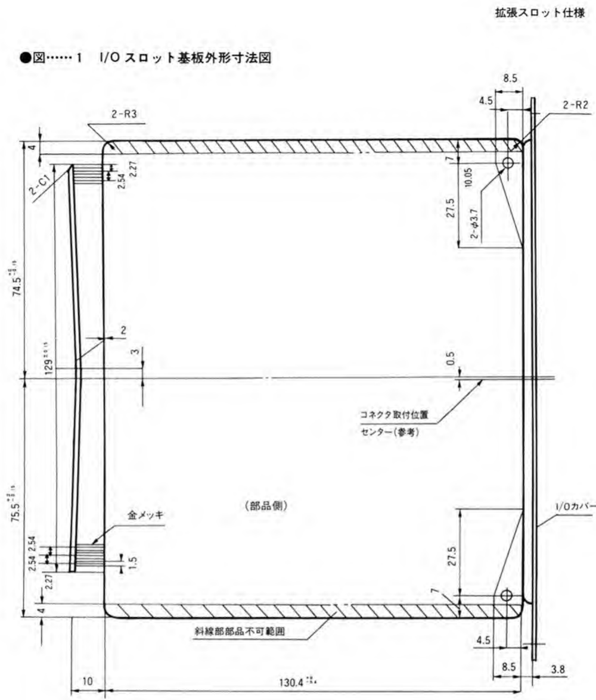

2-R3
2-R2
8.5
4.5
27.5
2-φ3.7
16.85

Connector mounting position center (reference)

Gold plating
(Component side)
Hatched area: component-prohibited range
I/O Cover

130.4
75.5
74.5

(2/1)
Board leading-edge shape
0.6
1.5

(Note) The component height shall be MAX 13 mm from the board surface. The length of the component leads shall be MAX 3.5 mm from the board surface.

● Diagram 2  I/O Slot Cover (Main Body Slot #1 - #3)

(Horizontal measurement indications)

(Horizontal slot direction)

(Outer slot direction)

Note: Unspecified corner radius is R2.

Other annotations are dimension measurements.

**Top right text:**

**Main title text:**
Figure 3
I/O Slot Cover (Main Body Slot #4, Expansion I/O Box)

**Right side middle text:**
Direction of external shape hole and chamfering

**Bottom right text:**
Note: The tolerance for dimensions without specified tolerances is ±0.2.
  The corner R without specified designation is R2.

**Bottom middle text:**
A-A' SEC

# 3 I/O Slot Signals

Here, we explain the various signals of the expansion slot. The signals of the expansion slot are all TTL level. For the names of the signals, in addition to Totem Pole and Open Collector, Tristate Triskelion and similar signal output features, we explain how to drive these signals on the main unit side or on the option board side, depending on the type of IC driver you have. If driving the input signals indicated on the main body from the option board side, pull-up resistors, open collectors, or put Tristate Buffers in the driver ICs, if necessary, and drive the signals requiring pull-up or the 2-state ones.

The signals coming from the expansion slot, such as CPU-supplied address, bus data, etc., are taken out as is from the internal LSI for bi-directional usage.

*Note: Signals integrated into LSI are output from FETs; on the other hand, signals taken by CMOS L-types (main chips) with high impedance for open-collector operation are standardized as open-collectors.

1. Clock-Related (Output: Totem Pole)

The X68000's expansion slot outputs three types of clock signals: a 10MHz CPU clock, its inverted clock, and a 20MHz clock (Figure 4). The 10MHz clock...

**Diagram 4 Clock Signals**

[Image Description]

20 MHz Clock Signal

10 MHz Clock Signal

Inverted 10 MHz Clock Signal

●Table 1 - Expansion Slot Signals

| No. | Signal Name | I/O | Description   | Signal Name | I/O | Description                                           |
|-----|-------------|-----|---------------|-------------|-----|-------------------------------------------------------|
| 1   | GND         | ... | Ground        | GND         | ... | Ground                                                |
| 2   | 20MHz       | O   | Clock (20MHz) | 10MHz       | O   | Clock (10MHz)                                         |
| 3   | GND         | ... | Ground        | 10MHz       | O   | Peripheral Device Specific Clock (10MHz)              |
| 4   | DB0         | I/O | Data Bus      | E           | O   | 68000 Peripheral Device Clock                         |
| 5   | DB1         | I/O | Data Bus      | AB1         | I/O | Address Bus                                           |
| 6   | DB2         | I/O | Data Bus      | AB2         | I/O | Address Bus                                           |
| 7   | DB3         | I/O | Data Bus      | AB3         | I/O | Address Bus                                           |
| 8   | DB4         | I/O | Data Bus      | AB4         | I/O | Address Bus                                           |
| 9   | DB5         | I/O | Data Bus      | AB5         | I/O | Address Bus                                           |
| 10  | DB6         | I/O | Data Bus      | AB6         | I/O | Address Bus                                           |
| 11  | GND         | ... | Ground        | GND         | ... | Ground                                                |
| 12  | DB7         | I/O | Data Bus      | AB7         | I/O | Address Bus                                           |
| 13  | DB8         | I/O | Data Bus      | AB8         | I/O | Address Bus                                           |
| 14  | DB9         | I/O | Data Bus      | AB9         | I/O | Address Bus                                           |
| 15  | DB10        | I/O | Data Bus      | AB10        | I/O | Address Bus                                           |
| 16  | DB11        | I/O | Data Bus      | AB11        | I/O | Address Bus                                           |
| 17  | DB12        | I/O | Data Bus      | AB12        | I/O | Address Bus                                           |
| 18  | DB13        | I/O | Data Bus      | AB13        | I/O | Address Bus                                           |
| 19  | DB14        | I/O | Data Bus      | AB14        | I/O | Address Bus                                           |
| 20  | DB15        | I/O | Data Bus      | AB15        | I/O | Address Bus                                           |
| 21  | GND         | ... | Ground        | GND         | ... | Ground                                                |
| 22  | +12V        | O   | +12V Power    | AB16        | I/O | Address Bus                                           |
| 23  | -12V        | O   | -12V Power    | AB17        | I/O | Address Bus                                           |
| 24  | FC0         | I/O | Function Code | AB18        | I/O | Address Bus                                           |
| 25  | FC1         | I/O | Function Code | AB19        | I/O | Address Bus                                           |
| 26  | FC2         | I/O | Function Code | AB20        | I/O | Address Bus                                           |
| 27  | AS          | I/O | Address Strobe| AB21        | I/O | Address Bus                                           |
| 28  | LDS         | I/O | Lower Data Strobe | AB22    | I/O | Address Bus                                           |
| 29  | UDS         | I/O | Upper Data Strobe | AB23    | I/O | Address Bus                                           |
| 30  | R/W         | I/O | Read/Write (L = Write) | IDDIR   | O   | Data Bus Direction Control                            |
| 31  | BR          | I/O | Bus Request   | -           |     |                                                       |
| 32  | -12V        | O   | -12V Power    | HSYNC       | O   | Horizontal Sync                                       |
| 33  | +12V        | O   | +12V Power    | VSYNC       | O   | Vertical Sync                                         |
| 34  | -           |    |               | DONE        | O   | DMA Peripheral Ready Signal                           |
| 35  | EXVPA        | I/O | 68000 Peripheral Device Access Signal | DTC   | O   | DMA Transfer Request Signal                            |
| 36  | DTACK       | I/O | Data Transfer Acknowledge | EXREQ | I/O | DMA Data Transfer Request Signal                      |
| 37  | XRESET      | O   | External Reset | EXACK      | O   | DMA System Acknowledge Signal                         |
| 38  | HALT        | I/O | CPU External System Halt | EXPCL    | I/O | DMA System Halt Output Signal                         |
| 39  | EXBERR      | I/O | Bus Error     | EXOWN       | O   | DMA Transfer Grant Signal                             |
| 40  | EXPWON      | O   | Power On      | EXNMI       | I/O | Non-Maskable Interrupt Signal                         |
| 41  | GND         | ... | Ground        | GND         | ... | Ground                                                |
| 42  | Vcc 2       | O

Both are synchronized with the rising edge of 20 MHz. The phase relationship between each clock is accurate so that the clock period is the same on the expansion board side, and there is almost no need to worry about timing delays due to clock division reversals.

2. Data Bus (DB0~DB15; I/O: Tri-state)
The data bus and buffers of the CPU connect step by step, resulting in a 16-bit bus. The CPU's data input/output bus is also connected to this line. On IBM's PC/AT, etc., where the 8-bit bus of the past is retained to maintain compatibility, it primarily operates with an 8-bit bus, but due to its flexible specifications, such as the complete transition to a 16-bit bus, it behaves as a 16-bit bus. For the X68000, this is not the case, so it operates as a pure 16-bit bus.

3. Address Bus (AB1~AB23; I/O: Tri-state)
The address bus and buffers of the CPU connect step by step, resulting in a 24-bit address bus.

4. Function Code (FC0~FC2; I/O: Tri-state)
The function code output by the CPU is provided. (Table 2).

- Table 2: Function Code -

| FC2 | FC1 | FC0 | Meaning                    |
|---|---|---|-----------------------------|
| 0 | 0 | 0 | Undefined                  |
| 0 | 0 | 1 | User: Data                  |
| 0 | 1 | 0 | User: Program             |
| 0 | 1 | 1 | Undefined                  |
| 1 | 0 | 0 | Undefined                  |
| 1 | 0 | 1 | Supervisor: Data        |
| 1 | 1 | 0 | Supervisor: Program   |
| 1 | 1 | 1 | Embedded Cartridge      |

5. AS, R/W, LDS, UDS (Output: Tristate)
These are control signals output by the CPU. AS indicates that an address is valid. R/W indicates whether the CPU will perform a read operation or a write operation. LDS/UDS indicate whether the lower 8 bits or upper 8 bits of the data bus will be used, respectively.

6. DTACK (Input: Open Collector)
This signal is connected to the DTACK input pin of the CPU. For option boards, it signals that data transfer has completed. The CPU knows that the read operation is complete and proceeds with the next bus cycle. In the case of a write operation, it indicates that the write operation is complete.

When using option boards for DMA transfers, be careful not to interrupt the DMA transfer. For the X68000, after the AS signal becomes valid and 9 microseconds elapse, if the DTACK signal is not returned, a bus error will occur. Circuits should be designed with this in mind to avoid such errors.

7. EXVPA (Input: Open Collector)
This signal is connected to the VPA input pin of the CPU. For the Motorola 8-bit CPUs, such as the 6800 family, this signal is used when accessing on-board LSIs. When access is made, the CPU synchronizes to the VPA signal and returns the signal indicating that it is performing an 8-bit bus transfer.

Since the 68000 CPU is an older device and belongs to the 6800 family LSI, it is rarely used on option boards.

8. VMA (Output: Tristate)
This signal is connected to the VMA output pin of the CPU. The VPA signal indicates that a family device of the 68000 has been selected, and VMA indicates that the address bus contains a valid address, meaning the processor and the address bus are operating in sync.

9. E (Output: Totem Pole)
This signal is connected to the E output pin of the CPU. This is a necessary signal for the 6800 family devices.

The E signal cycle is 10 clock cycles (6 clocks 'LOW' and 4 clocks 'HIGH').

10 EXRESET (Output: Totem Pole)
This is the system reset signal. When this signal is active (at "Low" level), the conditions and duration are as follows.

- When power is ON
  After Vcc1 is off, it becomes active for about 200 ms to 300 ms.
  
- When the RESET switch is pressed
  It becomes active for about 20 µs after being pressed.
  
- When a CPU reset command is executed
  It becomes active for about 12.4 µs after execution.

11 HALT (Input: Open Collector)
This signal is connected to the HALT line of the CPU. When it becomes active from the outside, the CPU stops executing its current cycle at the point where it ends. When this signal from the CPU is inactive, the output signal becomes a high impedance state. This signal is also used to indicate to the external device that the CPU has stopped when the CPU stops its own operation due to a double bus error, etc.

12 EXBERR (Input: Open Collector)
This is an external parity error signal. This signal is used to indicate to the main unit that an error has occurred inside the external device. When this signal becomes active, the software or the logic on the optional board can use it to notify the CPU of a bus error.

13 EXPWON (Input: Open Collector)
This is the power ON signal for X68000. When the main unit's power switch is OFF or in OFF mode (when the Vcc2 state does not exist), this signal becomes active and indicates the state to the main unit. When this signal is forced active, a power-on reset is generated in the CPU, and system reset occurs.

Use the port to drop the telephone line when the OFF process occurs.
Ensure the EXPWON signal becomes Active Low after approximately 500 ms.

14. IDDIR (Output: Totem Pole)
The read/write signal becomes 'Low', and the light signal becomes 'High'. This signal is utilized for controlling the direction of the data bus buffer.

15. Expanded Memory Board Control Signals (Output: Totem Pole)
To easily extend the memory on the expanded board, the signals SELEN, CASRDEN, CASWRL, and CASWRU, the 4 signals, are prepared.
SELEN is a signal indicating that it is a memory access cycle. This signal becomes ‘High’ during a memory access cycle, and becomes ‘Low’ otherwise.
CASRDEN is for the refresh cycle, during CASWRL and CASWRU, the upper and lower byte signals, respectively, become ‘High’ when it’s active.
It was considered to create control signals working from top down in response to AS being active. It seems like this might have been used when incorporating CAS signals in D-RAM, but looking at the schematic of a pure memory board, these signals are not used.

16. INH 2 (Output: Totem Pole)
This signal indicates the refresh cycle of system memory. The refresh cycle takes approximately 114 microseconds. When the AS signal is ‘Low’, if this signal is also ‘Low’, it is the refresh cycle.

17. Synchronization Signal (Output: Totem Pole)
HSYNC and VSYNC are horizontal and vertical synchronization signals for CRT displays, respectively. This signal, in the CZ-600 (ancestor type), is logically inverted (Going ‘Low’ during synchronization, and ‘High’ otherwise) for various models. Please be careful as it is logically inverted on some models (becomes ‘High’ during synchronization).

Fig. 5 Differences in Synchronization Signals by Model

CZ-600C
Others

18. DONE (Output: Open Collector)
The DONE signal from the DMA controller is connected to the input terminals. It is used by external devices and the DMA controller to indicate that the data currently being transferred is locked (locked data). When an external device activates this signal, indicating the data currently being transferred is locked, the DMA controller accepts this as its authoritative signal. When the value of the counter register in the DMA controller reaches 0 (indicating the transfer of the preset number of bytes is complete), the DONE signal is activated.

19. DTC (Output: Tristate)
Connected to the DTC terminal of the DMA controller. The DTC signal indicates to the outside that data transfer operations have been successfully completed by the DMA controller.

20. EXREQ (Input: Open Collector)
Connected to the transfer request signal (REQ 2) of channel 2 of the DMA controller. The X68000 DMA controller has four channels, but three of those channels are used exclusively for ADPCM, floppy disk, and hard disk functions. Therefore, channel 2 is the only one that can be used for extended slots. Even if multiple slots send DMA requests simultaneously, the DMA controller cannot distinguish between and respond to multiple simultaneous requests.

21. EXACK (Output: Totem Pole)
Connected to the transfer acknowledgment signal (ACK 2) of channel 2 of the DMA controller. It is used to indicate to the outside that the transfer of channel #2 is taking place. The signal from the DMA controller shows that the transfer for channel #2 is taking place.

When using it in single address mode, the signal will be activated on the option board side, and data input/output is performed.
Since the X68000 basically uses the DMA controller in dual address mode, there is generally no need to use this signal.

22 EXPCL (Input/Output: Tristate)
The signal is connected to the DMA controller channel 2 peripheral control signal (PCL2). This signal can be used for various purposes such as status input, transfer start pulse output, and abort input. For more details, please refer to the manual "Inside X68000."

23 EXOWN (Input/Output: Open Collector)
When using a device other than the CPU with the bus, this signal is activated. It is used on the option board when data transfer operation is performed. This signal is designed to be active on the option board side as well.

24 EXNMI (Input: Open Collector)
This is an interrupt request signal for level 7 interrupt on the CPU or NMI. Level 7 interrupt is the highest level interrupt request and cannot be masked by the interrupt mask bit in the CPU status register.
Since the X68000 normally uses NMI for auto-vector, EXNMI for interrupt requests is not active ("Low" level) during DTACK or EXVPA signals.

25 Interrupt Request Signal (IRQn=m; Input: Open Collector)
IRQ 2-1/IRQ 2-2, IRQ 4-1/IRQ 4-2 are interrupt request signals for slot 2 and slot 4 respectively. The numbers -1 and -2 indicate separate connections for each slot and can be viewed as two separate interrupt lines, one for level 2 and one for level 4 per slot.

(Page 55)

26. Interrupt Acknowledge Signal (IACKn~m; Output: Totem Pole)

IACK 2-1/IACK 2-2, IACK 4-1/IACK 4-2 are each interrupt levels 2 and 4 interrupt request acknowledge signals. The '-1,' '-2' indicate distinct request signals independently conducted per slot; they are separated from one another.

27. Bus Request Signal (BR-1, BR-2; Input: Open Collector)

These are bus request signals to the CPU. Each slot has independent request signals, distinguished by '-1' and '-2.'

28. Bus Grant Signal (BG-1, BG-2; Output: Totem Pole)

These are bus grant signals from the CPU, corresponding to bus request signals. Each slot has independent signals, denoted by '-1' and '-2.'

29. BGACK (Input: Tri-State)

Connected to CPU's BGACK terminal. If the CPU or its internal device (e.g., DMA controller) uses the bus, it becomes 'Low.' Please design onboard devices so bus request/bus grant signals only become 'Low' when the bus is occupied.

4. Interrupt Assignment for Expansion Slots

For X68000’s CPU, X68000 has interrupt levels managed sequentially from level 1 up to level 7. X68000 has two expansion slots designed with two interrupt request acknowledge signals for interrupt levels 2 and 4. Each slot’s interrupt request signal is separate, and both slots do not use the same interrupt level simultaneously.

Moreover, the IACK signal giving interrupt acknowledge is assigned independently; thus, the side slot's IACK signal becomes active. Slot priority is higher for side slots, making simultaneous request handling less frequent.

Page 56

If the priority of slot 1 is set higher than slot 2, and a request is made from both slots simultaneously, the request from slot 1 will be processed first.
Of course, in this case, the interrupt request of slot 2 is not discarded. The CPU completes the interrupt processing and, if it is ready to accept the next interrupt, returns an ACK signal at that moment.
Figures 6 and 7 show the interrupt request block from the I/O slot and the timing of the interrupt sequence for your reference.

■ Figure 6 Block Diagram Relating to Interrupt Requests from I/O Slots

[Diagram Labels]
I/O Slot 1:
- IRQ2-1
- IRQ4-1
- EXNMI
- IACK2-1
- IACK4-1

8 to 3 Priority Encoder:
- A2
- A1
- A0
- Vcc (2.2kΩ x 5)
- I/O Slot
- IRQ2-2
- IRQ4-2
- EXNMI
- IACK2-2
- IACK4-2

MPU:
- VPA
- LDS
- FC2
- FC1
- FC0
- A3
- A2
- A1
- 3 to 8 Decoder
- Gate Array

[On the Circuit]
Interrupt Switch

I/O Slot 2

● Fig. 7  Interrupt Sequence Timing Chart

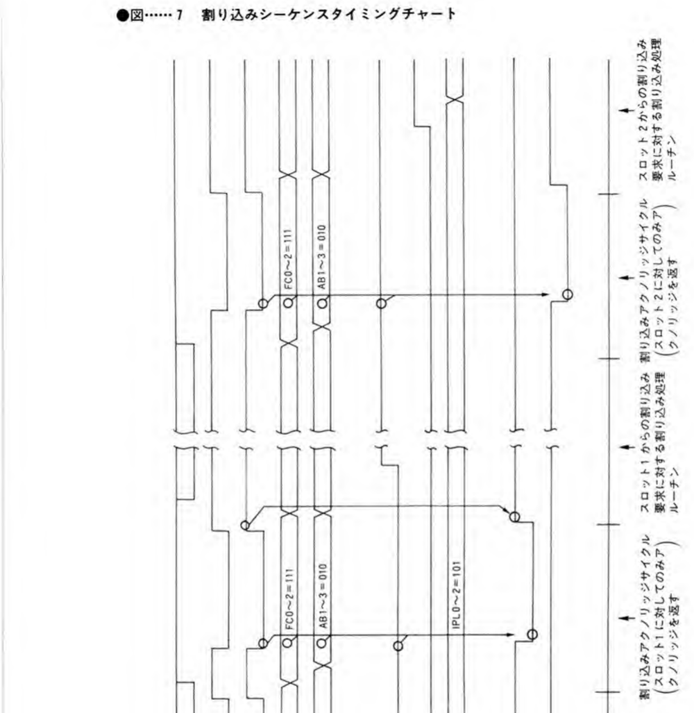

Signal lines (top to bottom):
R/W
AS
LDS
FC0 - FC2 [FC0-FC2=111]
AB1 - AB7 [AB1-AB7=010]
IRQ7-1
IRQ7-2
IPL0-2
IACK1
IACK2

Right-side annotations (top to bottom):
- Interrupt acknowledge processing sequence for the interrupt from the slot (for slot 1)
- Interrupt acknowledge processing sequence for the interrupt from the slot (for slot 2)
- Interrupt acknowledge processing sequence for the interrupt from the slot

Bottom-left note: Interrupt sources occur simultaneously

# 5. Bus Occupation from Expansion Slot

In the X68000, it is possible for the DMA controller or similar to release the bus from the CPU, allowing the expansion board to occupy the bus (sometimes referred to as "taking over"). This can be done by sending a bus release request signal from the two expansion slots and the internal DMA controller.

**Figure 8: Block Diagram for Bus Requests from I/O Slot**

(Note: The figure numbers, labels, and technical terms are retained from the original text for clarity.)

Top left:
"Figure 9 Bus Arbitration Timing Chart"

Middle right:
"Device in slot 1 asserts bus request"

Right side:
"Bus mastership occurs simultaneously"

Bottom:
"BR (DMAC)
BR-1
BR-2
BR (MPU)
MPU
DMAC
BRG
BG-1
BG-2
BGACK"

To occupy the bus from the expansion slot:

(1) Set the BR signal to 'Low' to request bus release.
(2) When the BG signal is set to 'Low' and the bus release request is accepted, set the BGCACK signal to 'Low'.
(3) When usage is complete, set the BGCACK signal to 'High' to notify the CPU that bus usage has ended.

For more details, please refer to [Figure 8] for the flowchart of signals related to bus release requests, and [Figure 9] for the timing of the bus occupation sequence.

•6
DC Specifications for I/O Slots

The DC specifications for the I/O slots of the X68000 are shown below. The table lists the maximum allowable current values that can be supplied from the board and drawn from the option board when the signal levels 'L' and 'H' are reached for III/IIH signals. IOL/IOH values indicate the maximum allowable current values that must not be exceeded when driving the signals from the option board. When using driver ICs and series ICs on the option board, please select those that meet these current tolerances and have power-up/power-down resistance. Also, please receive signals taken out of the I/O slot with a buffer IC at a distance close to the board's interior to prevent issues. The cross-talk and reflection of signals from the I/O slot, distribution arrays, etc., can easily interfere with not only the board itself but also the overall system, so be careful.

Page 61

● Table 3  I/O Slot DC Specifications

| Signal Name        | IIL (mA)        | IIH (µA)        | IOL (mA) | IOH (mA) |
|--------------------|-----------------|-----------------|----------|----------|
| AB1～AB23          |                 |                 |          |          |
| DB0～DB15          |                 |                 |          |          |
| AS                 |                 |                 |          |          |
| LDS                | -2.0            | 50              | 24       | -3.0     |
| UDS                |                 |                 |          |          |
| R/W                |                 |                 |          |          |
| FC0～FC2           |                 |                 |          |          |
| VMA                |                 |                 |          |          |
| DTACK              | -0.4            | 300             | 8        |          |
| EXVPA              | ——              | total of 600    |          |          |
| E                  | -1.2            | 60              |          |          |
| 10MHz / 10MHz / 20MHz | -2.0         | 500             |          |          |
| HALT               | total of -0.2   | total of 250    | 8        |          |
| EXRESET            | -1.2            | 60              |          |          |
| EXBERR             | -0.4            | 300             | 8        |          |
| EXOWN              | ——              | 60              |          |          |
| IDDIR              | -0.8            | 40              |          |          |
| HSYNC              | -0.4            | 60              |          |          |
| VSYNC              |                 |                 |          |          |
| SELEN              |                 |                 |          |          |
| CASRDEN            |                 |                 |          |          |
| CASWRL             | -3.0            | 300             |          |          |
| CASWRU             |                 |                 |          |          |
| INH2               |                 |                 |          |          |
| DONE               | -1.2            | 120             | 8        |          |
| DTC                | -0.8            | 60              |          |          |
| EXREQ              | ——              | 120             | 8        |          |
| EXACK              | ——              | 60              |          |          |
| EXPCL              | -0.8            | 60              |          | 1.0      |
| EXOWN              | ——              | ——              | 8        |          |
| IRQ2-1～IRQ4-2     |                 |                 |          |          |
| EXNMI              | ——              | 120             |          |          |
| IACK2-1～IACK4-2   | -0.8            |                 |          |          |
| BR-1, BR-2         | ——              | ——              | 8        |          |
| BG-1, BG-2         | -0.8            | 60              | 8        | -1.0     |
| BGACK              |                 |                 |          |          |

**Power Capacity (per slot)**

| Vcc1 (+5V)  | 600 mA |
|-------------|--------|
| Vcc2 (+5V)  | 30 mA  |
| Vcc3 (+12V) | 30 mA  |
| Vcc4 (-12V) | 30 mA  |

**7 I/O Slot AC Timing**

The X68000 expansion slot operation is fundamentally categorized into three cycles: read cycles, write cycles, and memory refresh cycles. By using DMA for data transfer with the X68000, where it employs dual address mode, there is little to no change in the operation from when only the CPU is used. When accessed by the CPU, the EXOWN signal is 'H'; for access by the DMA controller, the EXOWN signal is 'L', allowing distinction between the access cycles.

The read/write timing is illustrated in figure 10. Below are the operations during read time:

1.  The CPU or DMA controller (simply referred to as CPU) outputs the address bus signals to designate the address, specifying the FCn and ABn to validate AS (Address Strobe). At this time, UDS/LDS (upper data strobe/lower data strobe) signals are 'L.' During this time, the R/W signal is in the read status and IDDIR is 'H'.

2.  The accessed side (option board side) places data on the bus and raises the DTACK signal to indicate that valid data is available on the bus to the CPU.

3.  The CPU receives the DTACK and hence AS, UDS, and LDS signals turn 'H,' reflected back to the DTACK signal to the option board side as 'H.'

During memory access/refresh cycles, such as vector table setting cycles based on CPU instructions and for IACKn signal handling, the operation mirrors read cycles. The write cycle details, after the address is designated by AS and access size decision, the CPU writes data onto the data bus, setting UDS, LDS to 'L'. This time, the R/W signal turns to write status with IDDIR as 'L'.

(Page 63)

● Fig. 10  Read/Write Cycle Timing Chart

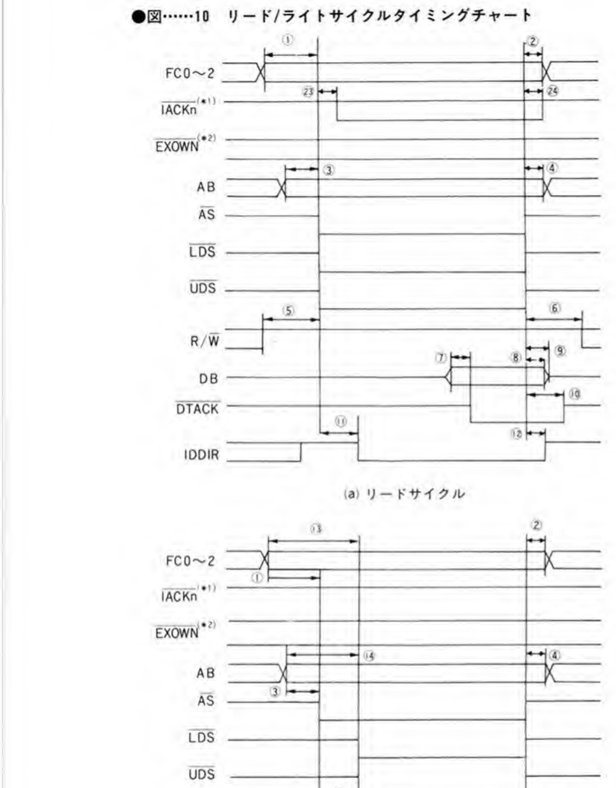

(a) Read Cycle

(b) Write Cycle

*1 In the interrupt acknowledge cycle, the IACKn signal becomes 'L'.
(n is the interrupt level and slot number)

*2 In the MPU cycle, the EXOWN signal becomes 'H', and in the DMAC cycle, it becomes 'L'.

**Table 4 Characteristics of I/O Slot A and C**

| Item No. | Item | Description | Delay Time (ns) | Remarks |
|---|---|---|---|---|
|   |   |   | Min | Max |   |
| 1 |   | Until FC assertion by AS, UDS, LDS = "L" | 10 |   |
| 2 |   | From AS, UDS, LDS = "H" until FC is valid | 10 |   |
| 3 |   | Until AS, UDS, LDS = "L" assertion from address determination | 10 |   |
| 4 |   | Valid address period after AS, UDS, LDS = "H" | 10 |   |
| 5 |   | Until AS, UDS, LDS = "L" from R/W = "H" | 30 |   |
| 6 |   | Until R/W = "L" from AS, UDS, LDS = "H" | 80 |   |
| 7 |   | Until data phase wait after DTACK assertion | 0 |   |
| 8 |   | Data hold period from DS = "H" | 0 |   |
| 9 |   | Until data = "Z" from DS = "H" | 80 |   |
| 10|   | Until DTACK = "Z" from DS = "H" | 130 |   |
|11 |   | Until IDDIR = "L" from AS, UDS, LDS = "L" | 150 |   |
|12 |   | Until IDDIR = "H" from AS, UDS, LDS = "H" | 45 | 150 |
|13 |   | Until DS = "L" assertion from address confirmation | 90 |   |
|14 |   | Until DS = "L" from address determination | 45 |   |
|15 |   | Until DS = "L" from R/W = "L" | 40 |   |
|16 |   | Until R/W = "H" from AS, UDS, LDS = "H" | 10 |   |
|17 |   | Until DS = "L" after data confirmation | -10|   |
|18 |   | Valid data period from DS = "H" | 10 |   |
|19 |   | Until data = "Z" from R/W = "H" | 35 |   |
|20 |   | Until AS, UDS, LDS = "H" from DTACK = "L" | 80 | 300 |
|21 |   | Until AS, R/W = "L" from IDDIR = "H" | 10 |   |
|22 |   | Until IDDIR = "L" from AS, UDS, LDS = "H" | 180|   |
|23 |   | Until IACKn = "L" from UDS, LDS = "L" | 40 |   |
|24 |   | Until IACKn = "H" from UDS, LDS = "H" | 5  | 40 |

This should help in understanding the contents and delay times for the I/O slot characteristics!

**8 Refresh/D-RAM Signal Timing**

Below, the timing of the group of signals designed to facilitate refresh and D-RAM control is shown in Figure 11.

**Figure 11 Memory Read/Write Cycle Timing Chart**

**Read Cycle** | **Write Cycle**

**Refresh Cycle**  | **Memory Cycle**

| No. | Item                                           | Delay Time (unit: ns) |   | Remarks          |
|-----|------------------------------------------------|-----------------------|---|------------------|
|     |                                                | Minimum  | Maximum     |   |                  |
| 1   | From AS/UDS, LDS to SELEN=L                    | 40       | 120         |   |                  |
| 1A  | (During Refresh Cycle)                         | 100N+40  | 100N+120    |   | N: Wait Count    |
| 2   | From AS/UDS, LDS to SELEN=H                    | 0        | 40          |   |                  |
| 3   | From AS/UDS, LDS to CASDEN=L                   | 40       | 120         |   |                  |
| 4   | From AS/UDS, LDS to CASDEN=H                   | 0        | 40          |   |                  |
| 5   | From UDS, LDS to CASWRU/CASWRL=L               | 0        | 80          |   |                  |
| 6   | From AS/UDS, LDS to CASWRU/CASWRL=H            | 0        | 30          |   |                  |
| 7   | INH2 to Pulse Width                            | 390      | 410         |   |                  |
| 8   | From INH2 to CASDEN/SELEN=H                    | 100M+90  | 100M+120    |   | M=0 or 1         |
| 9   | From INH2 to CASWRU/CASWRL=H                   | 75       | 110         |   |                  |
| 10  | CASWRU/CASWRL Pulse Width (Refresh Cycle)      | 190      | 210         |   |                  |

*(Blank page in the original.)*

Peripheral Devices Edition.

*(Blank page in the original.)*

**Option Board**

The X68000 is a machine that initially had many standard features equipped in the main unit. At first, there was no need for an option board, but now, there are various optional and official option boards. Here, we will summarize Sharp's official boards.

**1. Introduction**

The option board is inserted into the expansion slot to compensate for the functionalities not present in the main unit. For those who are interested in hardware, you may want to try creating your own option board, using the expansion slot and leveraging RS-232C and AVercoristic boards for high-speed communication transfers. This makes the design relatively easier. If you already have a functioning circuit, you can modify it as a reference. By understanding signal meanings and handshakes (such as returning DTACK, etc.), you can avoid mistakes.

In this document, we will overview and conceptualize the option boards provided by Sharp, each with their own functionalities. The X68000 already has many standard features, however, by using the option board, various enhancements enhance the unit's usability and provide great assistance for personal hobbies.

The types and model numbers of the option boards covered in this chapter are as follows.

(Page 71)

**Internal Expansion Memory Board**

- CZ-6BE1: For original type
- CZ-6BE1A: For ACE
- CZ-6BE1A(A): For ACE/PRO
- CZ-6BE2A: For XVI
- CZ-6BE2D: For Compact
- CZ-6BE2B: Additional memory for CZ-6BE2A/D

**External Expansion Memory Board**
- CZ-6BE2/CZ-6BE4: 2 MB/4 MB board
- CZ-6BEC2/CZ-6BE4C: 2 MB/4 MB

**Video Board**
- CZ-6BV1

**GP-IB Board**
- CZ-6BG1

**Universal I/O Board**
- CZ-6BU1

**RS-232C Board**
- CZ-6BF1

**MIDI Board**
- CZ-6BM1

**Parallel Board**
- CZ-6BN1

**FAX Board**
- CZ-6BC1

**SCSI Board**
- CZ-6BS1

**Scientific Calculator Board**
- CZ-6BPI/CZ-6BPIA

2. **I/O Addresses of Optional Boards**

This section displays the address space used by each optional board. It explains the settings of the board address, indicating that some parts allow a choice between various addresses through settings such as switches on the board. Some address parts may have numbers ranging from 0-F.

The addresses used by each board are distinguished by board type, and efforts are made to ensure that these address settings do not overlap. Additionally, the optional board addresses are generally assigned to the memory-mapped I/O space. Unless it is a user I/O board made by Sharp or a compatible board, it will typically be considered a universal I/O address.

Option Board

Since the space ($EC0000～$ECFFFF) is supposed to be used, there is basically no risk of these causing an address conflict with the installed option boards.

● Table 1  Option Board I/O Addresses

| Board Category               | Board Name        | Address                                          |
|------------------------------|-------------------|--------------------------------------------------|
| Numeric Processor Board      | CZ-6BP1/CZ-6BP1A  | $E9E000～$E9E01F   $E9E080～$E9E09F               |
| SCSI Board                   | CZ-6BS1           | $EA0000～$EA1FFF                                  |
| FAX Board                    | CZ-6BC1           | $EAF900～$EAF95F                                  |
| MIDI Board                   | CZ-6BM1           | $EAFA00～$EAFA0F   $EAFA10～$EAFA1F               |
| Parallel Board               | CZ-6BN1           | $EAFB00～$EAFB0F   $EAFB10～$EAFB1F               |
| RS-232C Board                | CZ-6BF1           | $EAFC00～$EAFC0F   $EAFC10～$EAFC19               |
| Universal I/O Board          | CZ-6BU1           | $EAFC20～$EAFC29   $EAFC30～$EAFC39               |
| GP-IB Board                  | CZ-6BG1           | $EAFDX0～$EAFDX3   $EAFDX4～$EAFDX7               |
|                              |                   | $EAFDX8～$EAFDXB   $EAFDXC～$EAFDXF               |
|                              |                   | $EAFE00～$EAFE1F                                  |

*(Blank page in the original.)*

**Expanded Memory**

Increasing memory capacity will definitely lead to free area expansion. For X68000 users, memory expansion is probably the first functional enhancement they strive for. Here, we will explain the memory expansion methods for each model and the expansion memory boards.

**1. Differences in Expansion Methods by Model**

The X68000 series can expand up to a maximum of 12 MB of main memory. The methods of expansion vary by model. For models before the X68000 XVI, internal expansion is up to 2 MB, and for additional expansion, a memory board must be inserted into the expansion slot. On the XVI, internal expansion can reach up to 8 MB (6 MB from standard expansion + 2 MB internal). 

Moreover, for the Compact, an internal expansion memory board is provided along with a socket for attaching a mathematical computation co-processor (CZ-6BP2).

**1.1 Internal Expansion Memory**

Below is a list of internal expansion memory boards. The original X68000, as well as ACE and PRO models, internally have up to 1 MB of memory, and an additional 1 MB is added through an expansion memory board.

As such, the original type of memory board for this purpose is CZ-6BE1 for CZ-6BE1, ACE is CZ-6BE1, PRO is CZ-6BE1A (A). This is because CZ-6BE1A (A) has been used to respond to both ACE and PRO in addition to the conventional ones, so it can also be used with ACE.

XVI/Compact internal expansion memory board (CZ-6BE2A, CZ-6BE2D) is equipped with not only 2MB (2M bytes for the board alone), but also 2 small 2MB memory modules (CZ-6BE2B), which allows it to be used as a 6MB memory board in combination with this.

The CZ-6BE2A/6BE2D itself detects whether or not a memory module is installed, and the socket installation status and stage are automatically determined and conveyed to the main body memory controller LSI. This allows memory boards to be installed in internal expansion slots and expanded for use. The original type that used DRAM for 256 x 16-bit chips represents 1MB memory site, but ACE now supports 1MB x 8 pieces, and further, XVI/Compact has 4MB x 8 with the DRAM method, but 4 pieces with 2MB x 4, enabling flexible utilization.

● Figure - 1 Internal Expansion Memory Board List

| Board Model | Applicable Models | Capacity |
|-------------|--------------------|----------|
| CZ-6BE2D (CZ-6BE2B) | X68000 Compact (with socket for CZ-6BP2) | 2 MB |
| | HM514402 (1M x 4bit : 70ns) x 4 pieces |
| CZ-6BE2A (CZ-6BE2B) | X68000 XVI/XVI-HD | 2 MB |
| | HM514402 (1M x 4 bit : 70ns) x 4 pieces |
| CZ-6BE1A (A) | X68000 ACE/ACE-HD/PRO/PRO-HD | 1 MB |
| | MSM44256AL (256K x 4 bit : 100ns) x 8 pieces |
| CZ-6BE1A | X68000 ACE/ACE-HD | 1 MB |
| | MSM44256AL (256K x 4 bit : 100ns) x 8 pieces |
| CZ-6BE1 | X68000 | 1 MB |
| | MB81256 (256K x 1 bit : 120ns) x 32 pieces |

Page 76.

**2 External Expansion Memory**

Below is a list of external expansion memory boards. The memory used has access times that range from 120 ns to 80 ns, and due to this timing, the CAS timings differ slightly. The specifications, however, remain the same.
CZ-6BEXC/6BE4C and CZ-6BE2/6BE4 have the same substrate, but the memory capacities are different (2 MB and 4 MB respectively). If the board is set to 2 MB through a jumper setting, removing the jumper will change it to 4 MB.

<table> 
<tr> 
```
  <th> Board Model Name </th> 
  <th> Compatible Machines </th>
  <th> Capacity </th>
```
</tr> 
<tr> 
```
  <td> CZ-6BEXC/6BE4C </td> 
  <td> X68000 series compatible </td>
  <td> 2MB/4MB </td>
```
</tr> 
<tr> 
  <td> MB81C1000 (1M x 1 bit: 80ns) x 16 (2MB)/32 (4MB) </td> 
</tr> 
<tr> 
```
  <td> CZ-6BE2/6BE4 </td> 
  <td> X68000 </td>
  <td> 2MB/4MB </td> 
```
</tr> 
<tr> 
  <td> MB81C1000 (1M x 1 bit: 120ns) x 16 (2MB)/32 (4MB) </td> 
</tr> 
</table>

**2 Parts Layout**

The parts layouts for CZ-6BE1/6BEA1A (6BEIA (AA))/6BE2A/6BE2B/6BE2D and CZ-6BE2 (6BEA)/6BE2C (6BE4C) are shown in Figures 6 and 7.

Page 77

● Fig. 1  Component Layout of CZ-6BE1
CZ-6BE1
SHARP

● Fig. 2  Component Layout of 6BE1A (6BE1A(A))

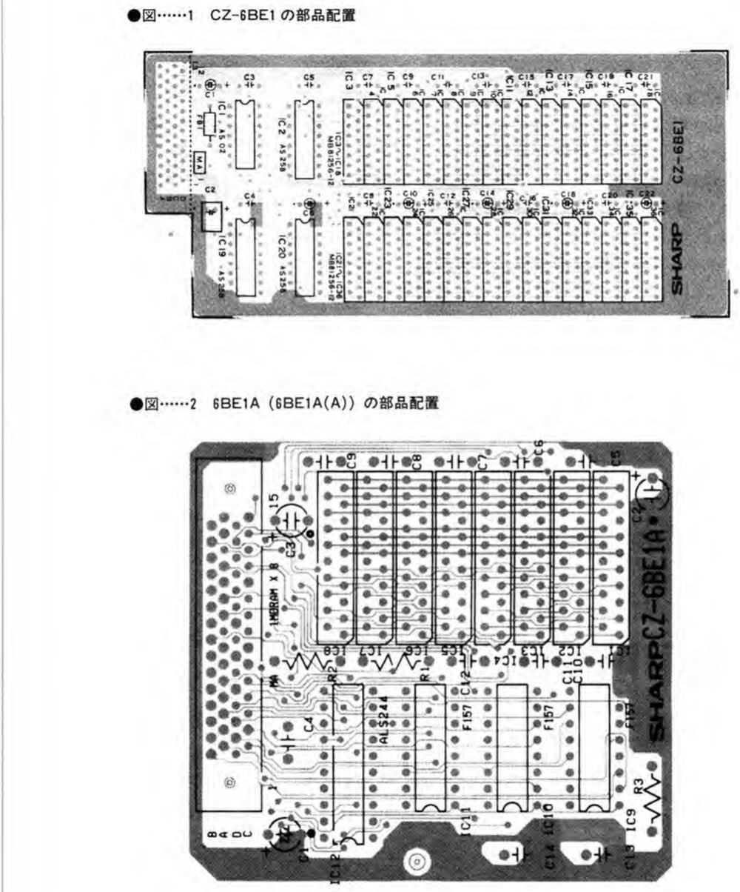

SHARP CZ-6BE1A

Expansion Memory

● Fig. 3  Component Layout of 6BE2A

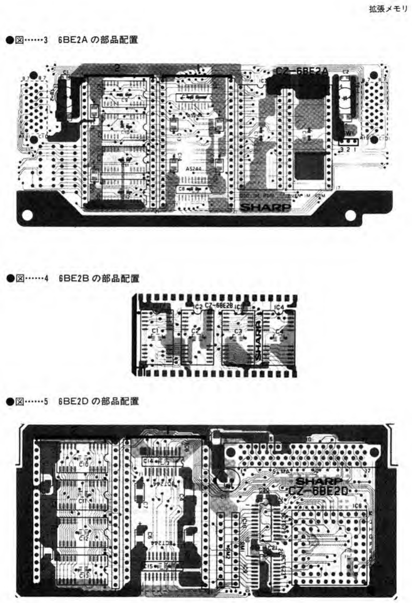

CZ-6BE2A
SHARP

● Fig. 4  Component Layout of 6BE2B
CZ-6BE2B

● Fig. 5  Component Layout of 6BE2D
SHARP CZ-6BE2D

  
**Figure 6  CZ-6BE2 (6BE4) Component Layout**

**3 Circuit Diagram/Connector Signal Layout**

3.1 Internal Expansion

The circuit diagrams for the CZ-6BE1 and 6BE1A (6BE1A(A)) are shown in Figures 8 and 9. The circuit diagrams for CZ-6BE2A and CZ-6BE2D, along with their connector signal layout diagrams, are shown in Figures 10 through 12. The memory module for CZ-6BE2A(6BE2D) is the same as CZ-6BE2B, hence the connector signals are also the same.

Page 80

Diagram 7 - 6BE2C (6BE4C) Parts Arrangement

Diagram 8 - CZ-6BE1 Circuit Diagram (Reference Manual)

Diagram 9 - 6BE1A (6BE1A(A)) Circuit Diagram (Reference Manual)

Diagram 10 - CZ-6BE2A Circuit Diagram (Reference Manual)

Diagram 11 - CZ-6BE2D Circuit Diagram (Reference Manual)

3.2 External Expansion
The circuit diagram for CZ-6BE2 (6BE4)/6BE2C (6BEAC) is shown in Diagram 13 and Diagram 14.

**Fig. 12 Connector Signal Configuration of Expansion Memory Board**

| Pin Name | Signal Name | Function | Pin Name | Signal Name | Function |
|----------|--------------|----------|----------|--------------|----------|
| TB1-A1 | GND | Ground | TB2-A1 | MD15 | Data |
| TB1-A2 | GND | Ground | TB2-A2 | MD14 | Data |
| TB1-A3 | GND | Ground | TB2-A3 | MD7 | Data |
| TB1-A4 | RAS1 | Row Address Strobe 1 | TB2-A4 | MD5 | Data |
| TB1-A5 | Vcc1 | +5V | TB2-A5 | MD7 | Memory Data |
| TB1-A6 | Vcc1 | +5V | TB2-A6 | MD4 | Data |
| TB1-A7 | Vcc1 | +5V | TB2-A7 | MD2 | Data |
| TB1-A8 | N.C. | | TB2-A8 | MD0 | Data |
| TB1-B1 | DRAM SENSE3 | Memory Board Present (0) Not Present (1) (CZ6BE2B) | TB2-B1 | MD12 | Data |
| | | Memory Address 600000H ~ 7FFFFFH | TB2-B2 | MD11 | Data |
| TB1-B2 | DRAM SENSE1 | Memory Board Present (0) Not Present (1) (CZ6BE2A) | TB2-B3 | MD9 | Data |
| | | Memory Address 200000H ~ 3FFFFFH | TB2-B4 | MA9 | Memory Address |
| TB1-B3 | RAS2 | Row Address Strobe 2 | TB2-B5 | MA5 | Memory Address |
| TB1-B4 | RAS3 | Row Address Strobe 3 | TB2-B6 | MD3 | Data |
| TB1-B5 | CASL | Lower Byte Column Address Strobe | TB2-C1 | MD13 | Data |
| TB1-B6 | CASUT | Upper Byte Column Address Strobe 1 | TB2-C2 | MD10 | Data |
| TB1-B7 | SOCKET OE | ROM/Memory Board OE (Output Enable) | TB2-C3 | MD8 | Data |
| TB1-C1 | DRAM SENSE2 | Memory Board Present (0) Not Present (1) (CZ6BE2B) | TB2-C4 | MD9 | Data |
| | | Memory Address 400000H ~ 5FFFFFH | TB2-C5 | MA8 | Memory Address |
| TB1-C2 | OE1 | Memory Control Signal (Output Enable) | TB2-C6 | MA4 | Memory Address |
| TB1-C4 | MA17 | Memory Address | TB2-C7 | MA3 | Memory Address |
| TB1-C5 | MA15 | Memory Address | TB2-C8 | MA2 | Memory Address |
| TB1-C6 | MA14 | Memory Address | TB2-D1 | GND | Ground |
| TB1-C7 | MA10 | Memory Address | TB2-D2 | GND | Ground |
| TB1-C8 | N.C. | | TB2-D3 | GND | Ground |
| TB1-D1 | ROMSEL | Select 64Mx4M Mask ROM/Memory Board/EPROM | TB2-D4 | MA6 | Memory Address |
| | | Switching Signal | TB2-D5 | Vcc1 | +5V |
| TB1-D2 | WE1 | Memory Write Signal | TB2-D6 | Vcc1 | +5V |
| TB1-D3 | MA11 | Memory Address | TB2-D7 | Vcc1 | +5V |
| TB1-D4 | MA13 | Memory Address | |
| TB1-D5 | MA16 | Memory Address | |
| TB1-D6 | MA12 | Memory Address | |
| TB1-D7 | MA1 | Memory Address | |

**Fig. 13 CZ-6BE2(6BE4) Circuit Diagram (Refer to End of Volume)**
**Fig. 14 CZ-6BE2C(6BE4C) Circuit Diagram (Refer to End of Volume)**

(Page 82)

**Numerical Calculation Processor Board (CZ-6BP1/CZ-6BP1A)**

By greatly enhancing the actual calculation performance, the numerical calculation processor board greatly shortens the calculation time from one day to less than an hour. This board is indispensable for applications such as 3D graphics and ray tracing, but can also be used effectively in other purposes.

**Specifications**

**Main LSI**
- Floating-point processor: MC 68881
- Clock frequency: 16.6 MHz
- Floating-point calculation specifications: IEEE std P754 compliance

**Power Supply**
- Supply voltage: +5V
- Current consumption: Approximately 250 mA
- Operating temperature range: 10-35°C

Port Address
$E9E000~$E9E01F/$E9E080~$E9E09F (select with jumper switch)

Cutout
Do not use

2. Circuit Overview

The block diagram of CZ-6BP1/CZ-6BP1A is shown in Figure 1. In the case of 68000, the CPU itself does not have the function to directly interface with the coprocessor, so CZ-6BP1/CZ-6BP1A uses MC68881 as an I/O device. 

Since the MC68881 is connected as an I/O device, it is not necessary to operate at the same clock speed as the X68000. CZ-6BP1/CZ-6BP1A operates the MC68881 at the chip's maximum speed of 16.665 MHz.

3. Main Parts Layout

The layout of the parts for CZ-6BP1/CZ-6BP1A is shown in Figure 2.

Top center:
"Block Diagram of Numeric Processing Board"

Inside the chart:
Top block: "Address Decoder"
Middle block: "Timing Generation Circuit"
Bottom block: "Bus Buffer"
Below bus buffer: "DTACK Generation Circuit"

Left side:
"Expansion Slot"

Right side:
Top to bottom (keywords associated with different lines):
"RESET"
"CS"
"AS"
"DS"
"D0~D31"
"A1~A4"
Bottom right: "MC68881"

"Figure 2 - Part arrangement of CZ-6BP1/CZ-6BP1A"

# 4  Settings

# 4.1 Port Address Settings

CZ-6BPI/CZ-6BPIA can switch the port address using a jumper switch (SW1) on the board (see figure 3). When the address switch is set to side 1, the port address will be $E9E000~$E9E01F, and when set to side 2, the port address will be $E9E080~$E9E09F.

**Figure 3 Jumper Switch (SW1)**

| Address SW | Port Address             |
|----------|---------------------------|
| Side 1      | $E9E000~$E9E020  |
| Side 2      | $E9E080~$E9EA0A  |

The factory setting is on side "1".

The floating-point driver provided by Software House that supports this board is set to side 1. Therefore, if you set it to side 2, you will need to either modify the driver or write a program to operate the coprocessor directly.

# 5  I/O Map

The MC 68881 has 8 floating-point registers and status registers inside. When performing actual arithmetic operations, you will use these registers. However, the CPU cannot directly access these registers. Instead, you need to be aware that indirect access is required using a register group called CIR (Coprocessor Interface Register).

(Page 87)

CZ-6BP1/CZ-6BP1A I/O address map is shown in Figure 4. As mentioned previously, the base address can be selected from either $E9E000 or $E9E080.
For an in-depth explanation on how to use the MC68881, refer to the book "Inside X68000" with examples.

● Figure 4: I/O Address Map of the Arithmetic Processor Board

|                  | bit 31 |                    | 16 |                   |                     | bit 0  |         
|------------------|--------|------------------|----|-----------------|--------------------|--------|         
| +$00             | Response CIR (R)           | | Control CIR (W)                  | +$02  |
| +$04             | Safe CIR (R)               | | List CIR (R/W)                  | +$06  |
| +$08             | (Overrun Code CIR)         | | Command CIR (W)                 | +$0A  |
| +$0C             |                            | | Condition CIR (W)               | +$0E  |
| +$10             | Response CIR (W)           | |                                |        |
| +$14             | List Select CIR (R)        | |                                |        |
| +$18             | Executor Get Address CIR (W) | |                                |        |
| +$1C             | (Overrun Address CIR)      | |                                |        |

Base Address: $E9E000 (Standard)
$E9E080 (Second Card)

(R) : Read Only
(W) : Write Only
(R/W) : Read/Write

6. Circuit Diagram

The circuit diagrams for CZ-6BP1/CZ-6BP1A are shown in Figures 5 and 6.

● Figure 5: Circuit Diagram of CZ-6BP1 (No appendix)
● Figure 6: Circuit Diagram of CZ-6BP1A (No appendix)

MIDI Board (CZ-6BM1)

With the release of affordable sound sources, MIDI, which used to be the domain of professional musicians, has become a mainstay of Desktop Music (DTM). The MIDI board is an interface board that connects this MIDI world with the X68000.

The MIDI board (CZ-6BM1) is a real-time communication interface that allows connection to synthesizers, sequencers, rhythm machines, etc., supporting the MIDI (Music Instrument Device Interface) standard. (To actually enjoy playing music, MIDI instruments in addition to this board are required.)

The CZ-6BM1 has 2 MIDI OUT ports and 1 MIDI IN port, and one of the MIDI OUT ports can also be used as a MIDI THRU port. Additionally, it has a tape-sync input/output port, allowing for synchronized performance with multi-track recorders.

Specifications:

Main LSI: 
MIDI Controller (MCS) YM 3802
Clock Frequency: 4 MHz

Page 89

**MIDI Bus Specification**

*MIDI Specifications*

- **Standard Compliance**: MIDI Specification 1.0
- **Transmission Speed**: 31.25 Kbps
- **MIDI Ports**: 
```
  - MIDI OUTx2 (one of which can be switched to MIDI THRU)
  - MIDI IN x1
```
- **Synchronous Signal**: FSK 1200 bps

**Power Requirements**

- **Supply Voltage**: +5 V
- **Power Consumption**: Approximately 180 mA

**Port Address**

- $EAFA01 ～ $EAFA0F / $EAFA11 ～ $EAFA1F
  - *(Selectable via jumper switch)*

**Interrupts**

- Level 2 / Level 4 *(Selectable via jumper switch)*

**2. Circuit Overview**

Figure 1 shows the block diagram of the CZ-6BM1. The MIDI control LSI uses the Yamaha YM3802. The YM3802 requires three different clock frequencies. The CZ-6BM1 divides a 16 MHz frequency to obtain a 4 MHz system clock by a factor of 1/4, divides it further by 1/16 to obtain a 1 MHz clock for internal operation, and additionally derives a 4.9152 MHz clock from an external source. Furthermore, it uses a 614.4 kHz clock as the MIDI active sensing and real-time clock, output to the CLKF terminal.


MIDI input is received by a phototransistor, and output is buffered by an open collector. One of the MIDI output ports can be switched to MIDI THRU (MIDI IN → as an output without going through processing) via a jumper switch.

The SYNC OUT output clock is a MIDI clock signal of 1200 bps FSK. The amplified and limited signal output from this port is converted and received by the YM3802 as a differential signal via a comparator to form wave shaping.

● Fig. 1  MIDI Board Block Diagram

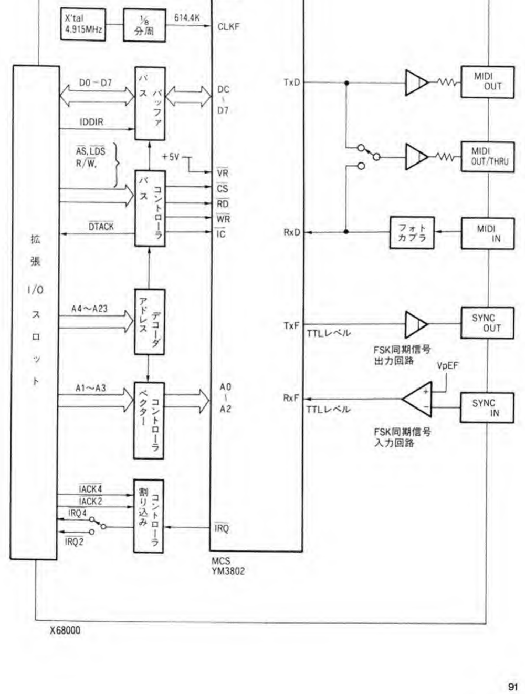

X'tal 16MHz
X'tal 4.915MHz
1/4 divide, 1/4 divide
1/2 divide
49MHz
1MHz
614.4K
4MHz
CLK
CLKAM
CLKF

Expansion I/O Slot

Buffer
IDDIR
D0 - D7 → DC, D7

Bus Controller
AS, LDS, R/W
+5V
DTACK
VR, CS, RD, WR, IC

Address Decoder
A4 - A23 → A0

Vector Controller
A1 - A3 → A2

Interrupt Controller
IACK 4
IACK 2
IRQ4
IRQ2
IRQ

MCS YM3802

TxD → (buffer) → MIDI OUT
        → MIDI OUT/THRU
RxD → Optocoupler → MIDI IN

TxF → TTL Level → FSK Sync Signal Output Circuit → SYNC OUT
RxF → TTL Level → FSK Sync Signal Input Circuit ← SYNC IN
VoCF

X68000

"●3 Main Component Layout

The component layout of the CZ-6BM1 is shown in Diagram 2 below.

●Diagram 2: Component layout of the CZ-6BM1"

**4 Settings**

**4-1 Setting the Port Address**
The CZ-6BM1 can select the port address using the jumper switch (JP1). When set to 1, the address becomes SEFA A01 to SEFA A0F, and when set to 2, the address becomes SEFA A11 to SEFA A1F. The default factory setting is 1.

**4-2 Setting the Clipping Level**
The board's DIP switch has two settings (Switch 1-1), which can be used to select the clipping level. When set to ON, clipping level 4 is used, while when set to OFF, clipping level 2 is used.

**4-3 Selecting MIDI OUT/MIDI THRU**
The board's DIP switch has two settings (Switch 1-2), which can be used to select whether the terminal functions as MIDI OUT or MIDI THRU. When set to ON, it functions as MIDI OUT, and when set to OFF, it functions as MIDI THRU.

**5 I/O Map**
The I/O address map of the CZ-6BM1 is shown in Fig 3. The YM3802 has 38 registers grouped together, indicating the addresses of the I/O.

● Fig. 3  MIDI Board I/O Address Map

| Device | Address | Register Accessed |
| --- | --- | --- |
| YM3802 | Base address + $01 | R00 |
|        | + $03 | R01 |
|        | + $05 | R02 |
|        | + $07 | R03 |
|        | + $09 | R04, R14, R24, R34, R44, R54, R64, R74, R84, R94 |
|        | + $0B | R05, R15, R25, R35, R45, R55, R65, R75, R85, R95 |
|        | + $0D | R06, R16, R26, R36, R56, R66, R76, R86, R96 |
|        | + $0F | R17, R27, R67, R77, R87 |

Base address: $EAFA00 (1st board) / $EAFA10 (2nd board)

The four registers R00 through R03 are located at $EAFA01/$EAFA11 through $EAFA07/$EAFA17 respectively, and can be accessed at any time.

For the other registers, you first write the upper value of the register number (for example, 4 in the case of R45) to R01, and then access the port address corresponding to the lower value (5 in the case of R45; for R45 this is $EAFA0B/$EAFA1B). In other words, registers that share the same lower digit of the register number share the same port address, and among them, the register whose upper digit matches the value written to R01 is the one that gets accessed.
In the YM3802, the upper data of the register number is called the "group number." Since the value written to R01 does not change even after register access, you may omit rewriting R01 when accessing registers with the same group number.
The bit layout of each YM3802 register is shown in Fig. 4 through Fig. 39; please refer to them.

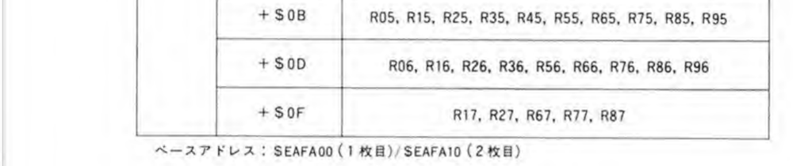

● Figure 4  R00 (Read): Interrupt Vector

```
	 bit 7     6     5     4     3     2     1     0
     ----------------------------------------------
    |        Vector Offset        |      Vector     |    '0'
     ----------------------------------------------
                                          (always '0')
```

Upper bits of Vector
(Same as upper 3 bits of R04)

Indicates the cause of the interrupt:
'1000': No current active interrupt cause
'0111': General Timer (timer count reached)
'0110': FIFO-Tx empty (transmit FIFO emptied)
'0101': FIFO-Rx ready (receive FIFO data full)
'0100': Off-line / Break detected (300 ms continuous break, or a 2+ character-frame break signal)
'0011': Recording Counter (recording counter count reached)
'0010': Play-back Counter (play-back counter count changed)
'0001': Click Counter (count value reached) / MIDI-clock detected (FIFO-IRx data: SF8)
'0000': MIDI real-time message detected (FIFO-IRx end data: SF9–SFF)

● Figure 5  R01 (Write): System Status

```
	 bit 7     6     5     4     3     2     1     0
     ----------------------------------------------
    |     IC     |           Group Number           |
     ----------------------------------------------
```

Group number of the register to access:

Initial Clear Request:
Setting bit 2 to '1' resets the YM3802.
If reusing, revert to '0'.

●Diagram·····6 R02 (Read), R03 (Write), R06 (Write)

- R02 (Read): Interrupt status (“1”: Interrupt requested)
- R03 (Write): Clear interrupt (“1”: Clear)
- R06 (Write): Enable interrupt key table (“1”: Interrupt enabled)

![Bit layout]
GT TX RX OL RC PC CC MM
bit 7     6     5     4   3    2    1   bit 0

General Timer
FIFO - Tx empty
FIFO - Rx ready
Off-line detected/Break detected
Recording Counter
Play-back Counter
Click Counter/MIDI-clock detected
MIDI real-time message detected

Please refer to Diagram 4 for the contents of each bit.

●Diagram·····7 R04 (Write): Interrupt Vector Offset

                    Vector Offset
![Bit layout]
            bit 7   6      5       4    3    2    1     0

Specify the upper 3 bits of the interrupt vector (The lower bits vary depending on the interrupt cause)

●Diagram·····8 R05 (Write): Interrupt Mode Control

![Bit layout]
bit 7    6      5       4   3    2   1     0
C/T O/B VE VM

Select vector output timing
```
    '1': Always output vector
    '0': Only during IRQ acknowledge
```

Enable vector output
```
    '1': Allow interrupt vector output
    '0': Disable
```

Select IRQ-4 source
```
    IRQ-4 (Select interrupt cause other than R02/03/06)
    '1': Use for Break detected interrupt
    '0': Use for Off-line detected interrupt
```

Select IRQ-1 source
```
    IRQ-1 (Select interrupt cause included in the bits of R02/03/06)
    '1': Use for MIDI-clock detected interrupt
    '0': Use for Click Counter detected interrupt
```

Page 96

■ Diagram ...... 9 R14 (Write): Control for MIDI Real-Time Messages 

bit
7   | 6 | 5 | 4 | 3 | 2 | 1 | 0
ASE  MCE  CDE MCDS MCFS

Select MIDI-clock or FIFO-IRx
(The setting for the clock source used by FIFO-Rx)
```
11 : MIDI-clock Timer
10 : SYNC Detector
01 : MIDI message Detector
00 : (Inhibited)
```
source, and MCFS=01 takes the MIDI clock from received serial data (MIDI-message
detector); 10 = SYNC detector and 00 = inhibited follow by elimination.)

Select MIDI-clock for distributor
(MIDI message distributor internal MID-clock signal selection)
```
1 : user (Operation of R15)
0 : FIFO-IRx
```

Enable MIDI-control (SF8 ~ SFD) detection
(Detection control of system real-time messages from SF9 to SFD)
```
1 : Enable
0 : Disable
```

Enable auto MIDI-clock (SF8) output
(MIDI message distributor's chronology message transmission control)
```
1 : Enable
0 : Disable
```

Enable auto active-sense (SFE) output
(Permit active sense message transmission by idle detection)
```
1 : Enable
0 : Disable
```

● Fig. 10 R15 (Write): MIDI Real-Time Message Request

bit 7 - 6 - 5 - 4 - 3 - 2 - 1 - bit 0
Tx - SYNC - CC - PC - RC - contents of message
bit 3-0:
```
  "111": (inhibited)
  "110": (inhibited)
  "101": SFD
  "100": SFC/stop
  "011": SFB/continue
  "010": SFA/start
  "001": SF9
  "000": SF8/clock
  * SF8 (clock) is sent to all units, regardless of the settings in bit 3-0
```

Recording Counter
Play-back Counter
Click Counter
Sync Controller
FIFO-ITx
'1': Send message
'0': Do not send message

● Fig. 11 R16 (Read): FIFO-IRx data

bit 7 - 6 - 5 - 4 - 3 - 2 - 1 - bit 0
FIFO-IRx data
Data received from MIDI

● Fig. 12 R17 (Write): FIFO-IRx Control

bit 7 - 6 - 5 - 4 - 3 - 2 - 1 - bit 0
CLK

FIFO-IRx increment clock
'1': An increment clock is sent to FIFO-IRx (and read data is extracted)
'0': Normal operation

**Top Section:**
■13 R24 (Write): Rx Communication Rate

bit 7  6  5  4                    3  2  1  bit 0
|     RxD/F     | communication rate |

Determines the MIDI reception rate:
"00XXX": CLKM/16 (prohibited when RxD/F= '1')
"01XXX": CLKM/32
"10XXX": CLKF/32
"11000": CLKF/64
"11001": CLKF/128
"11010": CLKF/256
"11011": CLKF/512
"11100": CLKF/1024
"11101": CLKF/2048
"11110": CLKF/4096
"11111": CLKF/8192

Select Receiver input connection
Determine where the receiver input is taken from:
'1': FSK demodulator
'0': RxD

**Bottom Section:**
■14 R25 (Write): Rx Communication Mode

bit 7  6  5  4  3  2  1  bit 0
|     RxCL     RxPE     RxPL     RxE/O     RxSL     RxST   |

Select stop-bit type in 2-bit length:
'1': LH
'0': HH

Select stop-bit length:
'1': 2 bit
'0': 1 bit

Select parity-bit polarity:
'1': odd
'0': even

Select parity-bit length:
'1': 4 bit
'0': 1 bit

Enable parity-bit check:
'1': enable
'0': disable

Select data bit length:
'1': 7 bit
'0': 8 bit

● Fig. 15  R26 (Write): Address-hunter Control (1)

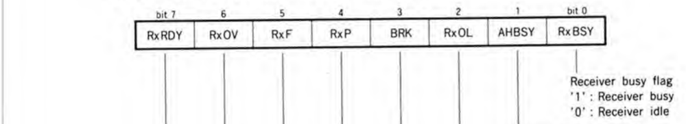

bit 7  6  5  4  3  2  1  bit 0
IDCL | define maker-ID code

Sets the maker ID code
Specifies whether or not to check the device ID code
'1': Maker-ID & device-ID
'0': Maker-ID only

● Fig. 16  R27 (Write): Address-hunter Control (2)

bit 7  6  5  4  3  2  1  bit 0
BORE | define device-ID code

Sets the device ID code
Determines whether or not to accept data with address $7F
'1': In addition to the set address, also accepts $7F
'0': Does not accept data other than the set address

● Fig. 17  R34 (Write): FIFO-Rx Status

bit 7   6     5    4    3     2     1       bit 0
RxRDY  RxOV  RxF  RxP  BRK  RxOL  AHBSY  RxBSY

Receiver busy flag
'1': Receiver busy
'0': Receiver idle

Address-hunter busy flag
'1': Address-hunter busy
   (during address hunting, after a system exclusive code with the matching ID has been received)
'0': Address-hunter idle

Off-line detected flag
'1': Off-line state detected
'0': Normal operation

Break detected flag
'1': BREAK state detected
'0': Normal operation

Parity error flag
'1': Parity error detected
'0': Normal operation

Framing error flag
'1': Framing error detected
'0': Normal operation

FIFO-Rx overflow detected flag
'1': Overflow occurred (the next data was received while the receive buffer was already full)
'0': Normal operation

FIFO-Rx ready flag
'1': There is data in the buffer to be read out
'0': The buffer is empty

18 R35 (Write): FIFO-Rx Control

| bit 7 | bit 6  | bit 5 | bit 4 | bit 3 | bit 2   | bit 1 | bit 0 |
|-------|--------|-------|-------|-------|---------|-------|-------|
| RxC   | RxOVC  | FLTE  | BLKC  | RxOLC | AHE     | RxE   |

- Enable receiver
```
  - '1': Enable
  - '0': Disable
```

- Enable Address-hunter
```
  - '1': Enable
  - '0': Disable
```

- Clear off-line detected flag
```
  - '1': Clear off-line detected flag
  - '0': Normal operation
```

- Clear break detected flag
```
  - '1': Clear break detected flag
  - '0': Normal operation
```

- Enable MIDI-clock Filter
```
  - '1': Enable MIDI clock filter operation
  - '0': Disable
```

- Clear overflow detected flag
```
  - '1': Clear overflow detected flag
  - '0': Normal operation
```

- Clear FIFO-Rx
```
  - '1': Clear the contents of FIFO-Rx
  - '0': Normal operation
```

19 R36 (Read): FIFO-Rx data

| bit 7 | bit 6 | bit 5 | bit 4 | bit 3 | bit 2 | bit 1 | bit 0 |
|-------|-------|-------|-------|-------|-------|-------|-------|
| get data from FIFO-Rx |

- Read the oldest data from FIFO-Rx

● Diagram-20 R44 (Write): Tx Communication Rate

bit 7   6      5        4         3         2         1         bit 0
+++++++++++++++++++++++++++++++++++++++++++++++++++++++++++
|     TxRx   |   TxD/F | Communication rate |
+++++++++++++++++++++++++++++++++++++++++++++++++++++++++++

Select MIDI communication rate
```
    `00XXX`: CLKIN/16 (Prohibited if TxD/F = '1')
    `01XXX`: CLKIN/32
    `100XX`: CLKF/32
    `10100`: CLKF/64
    `10101`: CLKF/128
    `10110`: CLKF/256
    `10111`: CLKF/512
    `11000`: CLKF/1024
    `11001`: CLKF/2048
    `11010`: CLKF/4096
    `11011`: CLKF/8192
```

Select transmitter output connection
```
    '1': FSK modulator
    '0': TXD
```

Select TxD connection
```
    '1': RxD (Transmits received data from RxD directly to TxD)
    '0': Transmitter (Normal transmission)
```

● Diagram-21 R45 (Write): Tx Communication Mode

bit 7    6     5      4       3       2     1      bit 0
++++++++++++++++++++++++++++++++++++++++++++++++++
|       |       |       |       |       |      |       | 
|  TxCL | TxPE | TxPL | TxE/O | TxSL | TxST |     |
++++++++++++++++++++++++++++++++++++++++++++++++++

Select stop-bit type in 2 bit length
```
    '1': LH
    '0': HH
```

Select stop-bit length
```
    '1': 2 bits
    '0': 1 bit
```

Select parity-bit polarity
```
    '1': Odd
    '0': Even
```

Select parity-bit length
```
    '1': 4 bits
    '0': 1 bit
```

Enable parity-bit generation
```
    '1': Enable
    '0': Disable
```

Select data-bit length
```
    '1': 7 bits
    '0': 8 bits
```

Page: 102

**Figure 22** R54 (Read) : FIFO-Tx Status

| bit  7 | bit 6 | bit 5 | bit 4 | bit 3 | bit 2 | bit 1 | bit 0 |
|-------|-------|-------|-------|-------|-------|-------|-------|
| TxEMP | TxRDY |       |       |       | TxIDL |       | TxBSY |

**Descriptions:**

- **TxEMP: FIFO-Tx empty flag**
```
  - ‘1’: FIFO-Tx is empty
  - ‘0’: Data is present
```

- **TxRDY: FIFO-Tx ready flag**
```
  - ‘1’: FIFO-Tx is empty
  - ‘0’: Not empty (Note: Will be ignored even if written when not empty)
```

- **TxIDL: Tx idle detected flag**
```
  - ‘1’: Idle status detected by idle detector
  - ‘0’: Normal operation
```

- **TxBSY: Transmitter busy flag**
```
  - ‘1’: Transmitter in operation
  - ‘0’: Transmitter idle
```

**Figure 23** R55 (Write) : FIFO-Tx Control

| bit  7 | bit 6 | bit 5 | bit 4 | bit 3 | bit 2 | bit 1 | bit 0 |
|-------|-------|-------|-------|-------|-------|-------|-------|
| TxC   |       |       |       |       | BRKE  | TxIDLC| TxE   |

**Descriptions:**

- **TxC: Clear FIFO-Tx & FIFO-ITx**
```
  - ‘1’: Clear FIFO-Tx and FIFO-ITx contents
  - ‘0’: Normal operation
```

- **TxIDL: Clear Tx idle flag**
```
  - ‘1’: Clear Tx idle flag
  - ‘0’: Normal operation
```

- **BRKE: Enable send-break**
```
  - ‘1’: Fix transmitter output signal to ‘1’ (break state)
  - ‘0’: Normal operation
```

- **TxE: Enable transmitter**
```
  - ‘1’: Enable transmission
  - ‘0’: Disable
```

**Figure 24** R56 (Write) : FIFO-Tx Data

| bit  7 | bit 6 | bit 5 | bit 4 | bit 3 | bit 2 | bit 1 | bit 0 |
|-------|-------|-------|-------|-------|-------|-------|-------|
| set data to FIFO-Tx                                      |

**Description:**

- Data to be sent is written into FIFO-Tx.

Diagram 25 R64 (Read): FSK Status

Bit | 7                6                5                4                3                2                1                0
----|------------------------------------------------------------------------------------------------------------
       | RxFS       SS        CSF       CFF                       PS                PDF

- PDF
```
  - Polarity detected flag
    - '1' : Polarity detected
    - '0' : Not detected
```

- PS
```
  - Polarity status
    - '1' : Negative polarity
    - '0' : Positive polarity
```

- CFF
```
  - Carrier fast detected flag
    - '1' : A signal faster than the configured tone is input
    - '0' : Normal operation
```

- CSF
```
  - Carrier slow detected flag
    - '1' : A signal slower than the configured tone is input
    - '0' : Normal operation
```

- SS
```
  - Demodulated serial signal status
    - '1' : Mark ('H')
    - '0' : Space ('L')
```

- RxFS
```
  - RxF pin status
    - '1' : 'H' level
    - '0' : 'L' level
```

Diagram 26 R65 (Write): FSK Control

Bit | 7                6                5                4                3                2                1                0
----|------------------------------------------------------------------------------------------------------------
       | ME                              CFC       DE     APD         P/N           PDFC       

- PDFC
```
  - Clear polarity detected flag
    - '1' : Clear polarity detected flag
    - '0' : Normal operation
```

- P/N
```
  - Set polarity by manual
    - If auto polarity detector is disabled
      - '1' : Negative polarity
      - '0' : Positive polarity
```

- APD
```
  - Disable auto polarity detector
    - '1' : Disable auto polarity detector
    - '0' : Enable
```

- DE
```
  - Enable demodulator
    - '1' : Enable FSK demodulator
    - '0' : Disable
```

- CFC
```
  - Clear carrier S/F detected flag
    - '1' : Clear carrier slow/fast detected flags
    - '0' : Normal operation
```

- ME
```
  - Enable modulator
    - '1' : Enable FSK modulator
    - '0' : Disable 
```

Page 104

● Fig...27  R66 (Write): Click Counter Control

(bit 7 to bit 0)
CLKM  OUTE

Enable CLICK output
```
    '1': Outputs pulses to the CLICK terminal
    '0': Fixes the CLICK terminal at the 'L' level
```

Select CLKM frequency
```
    '1': 1.0 MHz
    '0': 0.5 MHz
```

● Fig...28  R67 (Write): Click Counter Value

(bit 7 to bit 0)
LD  interval count data

Determines the load value for the CLICK counter

Immediate load request
```
    '1': Loads the data of the lower 7 bits into the CLICK counter
    '0': Normal operation
```

● Fig...29  R74 (Read): Recording Counter Current Value

(bit 7 to bit 0)
current value

Current count value of the recording counter

■●□□...30 R75 (Write): Interpolator Control
bit |    7    |   6   |   5   |   4   |   3   |   2   |   1   | bit 0 |
```
        ADD      CLR     interpolation rate
              
              Setting the interpolation rate of the MIDI clock interpolation generator
              ('0000' is invalid)

              Play-back Counter clear request
              '1': Sets the playback counter value to 0
              '0': Normal operation

              Play-back Counter addition request
              '1': The 15-bit data set in R76 and R77 is added to the playback counter
              '0': Normal operation
```

■●□□...31 R76 (Write): Play-back Counter value(L)
bit |    7    |   6   |   5   |   4   |   3   |   2   |   1   | bit 0 |
                                                     lower 8 bit data to add
Play-back counter 15-bit data lower 8 bits to be added

■●□□...32 R77 (Write): Play-back Counter value(H)
bit |    7    |   6   |   5   |   4   |   3   |   2   |   1   | bit 0 |
                                                            higher 7 bit data to add
Play-back Counter 15-bit data upper 7 bits to be added

■●□□...33 R84 (Write): General Timer value(L)
bit |    7    |   6   |   5   |   4   |   3   |   2   |   1   | bit 0 |
                                                     lower 8 bit data
Lower 8 bits of general timer load value

**Top Section:**
- General Timer value(H)
- Figure: bit 7, bit 6, bit 5, bit 4, bit 3, bit 2, bit 1, bit 0
- Higher 6 bit data
- Immediate load request: 
```
  - '1': Load preset value to general timer
  - '0': Normal operation
```

**Middle Section:**
- MIDI-clock Timer value(L)
- Figure: bit 7, bit 6, bit 5, bit 4, bit 3, bit 2, bit 1, bit 0
- Lower 8 bit data

**Bottom Section:**
- MIDI-clock Timer value(H)
- Figure: bit 7, bit 6, bit 5, bit 4, bit 3, bit 2, bit 1, bit 0
- Higher 6 bit data
- Immediate load request:
```
  - '1': Load preset value to timer
  - '0': Normal operation
```

- Diagram 37 R94 (Write): External I/O direction
```
  bit 7 6 5 4 3 2 1 bit 0
  Direction of each I/O port
  
  Determining whether to use each of the 8 I/O pins of YM3802 as output or input
  '1': output
  '0': input
```

- Diagram 38 R95 (Write): External I/O output data
```
  bit 7 6 5 4 3 2 1 bit 0
  Output request of each I/O port
  
  Setting the state of the outputs of the 8 I/O pins of YM3802 which are set to output
  '1': 'H' level
  '0': 'L' level
```

- Diagram 39 R96 (Write): External I/O input data
```
  bit 7 6 5 4 3 2 1 bit 0
  Pin level of each I/O port
  
  Reading the states of the inputs of the 8 I/O pins of YM3802 which are set to input
  '1': 'H' level
  '0': 'L' level
```

- 6 Connector Sign Arrangement
  The signal arrangement of each connector of CZ-6BM1 is as shown in diagram 40.

● Figure 40 MIDI Board Connector Signal Arrangement

■ MIDI OUT, MIDI THRU

\---
      (diagram)
\---

No. | Signal Name | Remarks  
```
1 | N.C.          |  
2 | GND           |  
3 | N.C.          |  
4 | MIDI Signal + | OUT  
5 | MIDI Signal - | IN  
```

■ MIDI IN

\---
      (diagram)
\---

No. | Signal Name | Remarks  
```
1 | N.C.          |  
2 | GND           |  
3 | N.C.          |  
4 | MIDI Signal + | IN  
5 | MIDI Signal - | OUT  
```

■ TAPE SYNC OUT

\---
      (diagram)
\---

No. | Signal Name  | Remarks  
```
1 | TAPE SYNC OUT | OUT  
2 | GND           |  
```

■ TAPE SYNC IN

\---
      (diagram)
\---

No. | Signal Name  | Remarks  
```
1 | TAPE SYNC IN  | IN  
2 | GND           |  
```

7 Circuit Diagram

The circuit diagram of CZ-6BM1 is shown in Figure 41.

● Figure ...... 41 Circuit Diagram of CZ-6M1 (See Reference Appendix)

**Parallel Board (CZ-6BN1)**

The parallel board is designed primarily for connection with image scanners and is an interface board capable of high-speed data input and output of large volumes of data. It can also be expected to be used for various purposes, such as connecting with X68000.

The parallel board is a board that can connect with Sharp's color image scanner (CZ-8NS1) or Japan Radio Co.'s image scanner (PC-IN 500 series) to perform high-speed data transfer. It can also be used as a digital output board for non-image scanner connections.

**1 Specifications**

>Main LSI
>Parallel I/O IC
µPD 8255 A
>Input/output buffer IC
SN 74 LS 244

**Parallel Interface**
>Data input/output lines
8 bits each

>Handshake lines
2 bits each

>Others (status, etc.)
4 bits

>I/O connector
37-pin D-SUB connector

**Power supply**
Power supply voltage: +5V
Power consumption: approximately 370 mA
Operating temperature range: 10–35°C
Port address: $EAFB01~$EAFB0F/$EAFB11~$EAFB1F (Select with jumper switch)
Interrupt: Level 2/Level 4 (Select with jumper switch)

**2. Circuit Overview**

The block diagram for the CZ-6BN1 is shown in Figure 1. The IC used for parallel I/O output is the µPD8255, which is also used in the joystick and quick interface of the X68000. It is connected to a 37-pin D-SUB connector via a buffer IC (74 LS 244). This interface conforms to the parallel interface specifications of the image scanner. When connected to an image scanner through an RS-232C interface, it enables high-speed data transfer.

The 8255 has several operating modes. When connected to an image scanner, set the 8255 to operate in group A or group B mode for input, and group B mode for output. In this mode, the 8255 uses I/O pins 3C, 6, and 7 for control signals in group control, or for input and output.

The remaining pins 0, 1, 2, as well as PC 4, 5 are used for input or output programming. For the CZ-6BN1, these pins are for the control bus. The terminal connected to the image scanner is used for status signals from the scanner or reset output signals from the scanner's bus controller.

Of these pins, the input pins from the 8255's PC2 are connected to the interrupt pin. When connected to a scanner, a status signal (IBF) of the scanner is issued to indicate that the data sent from the X68000 to the scanner has been received, enabling interrupt processing for the X68000.

Parallel Board

● Fig. 1  CZ-6BN1 Block Diagram

8255 PPI
CN1

JP1
Address Decoder → A0, A1

Expansion Slot

Bus Controller → RD, WR, CS, RESET
Bus Buffer → D0 - D7
Interrupt Controller
JP2

PB → Buffer
PA → Buffer
PC0
PC1
PC2
PC3 → Buffer
PC4
PC5
PC6
PC7

37-Pin External Connector

● 3  Main Component Layout

The component layout of the CZ-6BN1 is shown in Fig. 2.

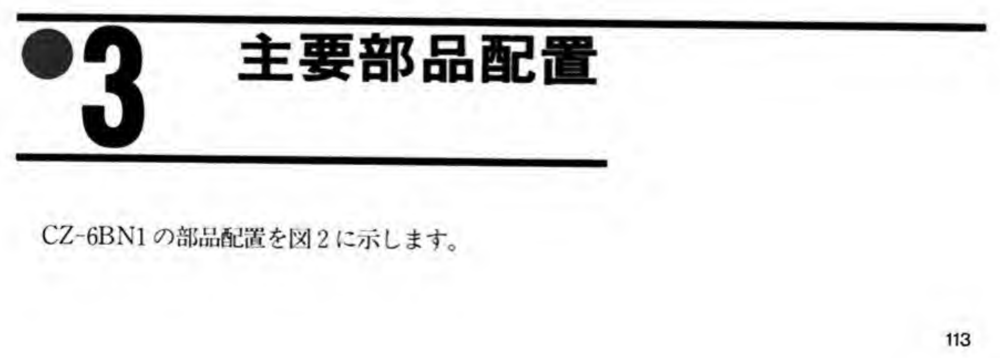

● Figure -2 Components of CZ-6BN1

● 4     Setting

1 Setting the Port Address

The port address of CZ-6BN1 can be switched with jumper switch (JP1). When JP1 is on side 1, the area from $EAFB00 to $EAFB0F is used, and when it is on side 2, the area from $EAFB10 to $EAFB1F is used.

4.2 Setting the Interrupt Level

You can choose to use either level 2 or level 4 as the interrupt level using the jumper switch (JP2). When set to 2, it will be level 2, and when set to 4, it will be recognized as level 4. Additionally, the interrupt mask register ($EAFB09/$EAFB19) can prevent the occurrence of interrupts. In this case, it is independent of the JP2 selection, and interrupt signals may be used by other boards.

5 I/O Map

CZ-6BN1 I/O map is shown here: $EAFB01/$EAFB11 to $EAFB07/$EAFB17 to 8255 AP Ports and Control Word Registers, $EAFB09/$EAFB19 is interrupt mask register. $EAFB08/$EAFB18 becomes interrupt vector registers.

(●▢):3 Parallel Board I/O Address Map

| Device | Address  | Register        | 7 | 6 | 5 | 4 | 3 | 2  | 1  | 0    |
|--------|----------|-----------------|---|---|---|---|---|----|----|------|
| Base Address + S01| Port A          |   |   |   |   |   |    |    |      |
|                  |                 |     SEND DATA                      |
| Base Address + S03| Port B          |   |   |   |   |   |    |    |      |
|                  |                 |     RECEIVE DATA                   |
| Base Address + S05| Port C          |   |   |   |   |   |    |    |      |
|                  |                 |     OBF  ACK CACK RESET INTR IBF READY DCN |
| Base Address + S07| Control Word Register |   |   |   |   |   |    |    |      |
| Base Address + S09| Interrupt Mask Register |   |   |   |   |   |    | INT      |
| Base Address + S0B| Interrupt Vector Address Register |   |   |   ...            VECT  |      

Base Address: $EAFB00 (1st page) / $EAFB10 (2nd page)

Note: The text layout has been represented as closely as possible to the original format.

# 5.1  8255 Register

The bit arrangement of the 8255 register is shown in Figure 4-7. When connecting to a scanner, group A should be programmed as mode 1, group B as mode 0, and port C's lower bits as input.

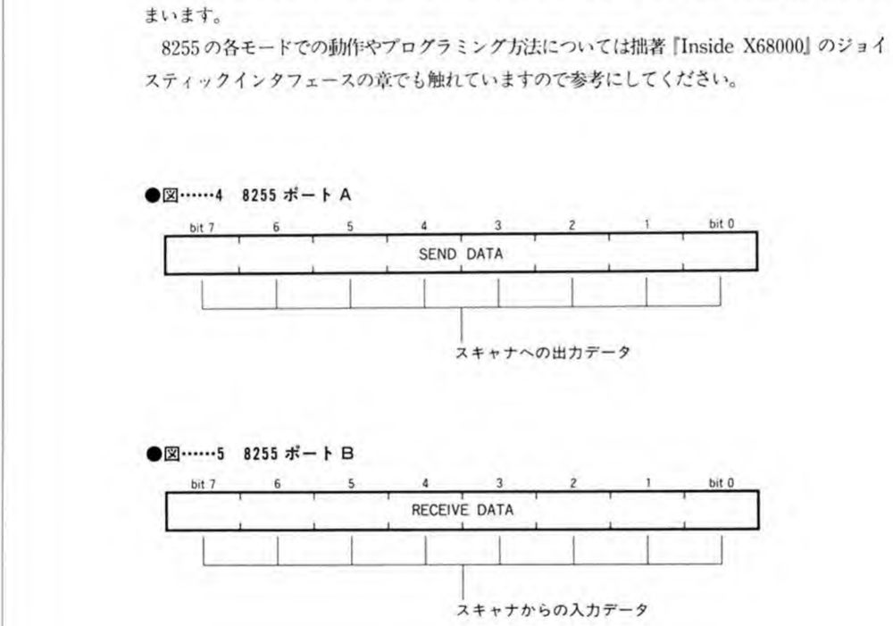

In the parallel board, since port C's bits are mixed between input and output, ensure group A is programmed to mode 1 output. To avoid conflicts, you may program port C's upper bits as mode 0 input, or buffer the output of port C with an output buffer (LS 244) to avoid data collision.

For details on the operation and programming methods of each mode in the 8255, these are also touched upon in the joystick interface chapter of my book "Inside X68000," so please refer to it.

**Figure 4  8255 Port A**

|---------------------------------------------------|
| bit 7 6 5 4 3 2 1 0                               |
| SEND DATA                                         |
|---------------------------------------------------|
* Data output to the scanner

**Figure 5  8255 Port B**

|---------------------------------------------------|
| bit 7 6 5 4 3 2 1 0                               |
| RECEIVE DATA                                      |
|---------------------------------------------------|
* Data input from the scanner

Page 116

Figure - 6 8255 Port C

bit
7  |  6   |  5   |  4   |  3   |  2   |  1   |  0

OBF |  ACK  | CACK | RESET | INTR | IBF  | READY | DCN

Shows whether the scanner is connected or not
- '1': Not connected
- '0': Connected

Indicates the state of the scanner's Ready signal
- '1': Busy
- '0': Ready

Scanner IBF (Input Buffer Full) signal status
- '1': Buffer is free
- '0': Data is in the buffer

Indicates the receipt and completion of data using the port
- '1': X68000 has start assembling data from port A
- '0': Scanner retrieved data successfully
This signal is not used by the scanner

Scanner reset
- '1': Normal operation
- '0': Resets the scanner

Response output to data transmission from the scanner to X68000
- '1': Normal
- '0': Data received from the scanner

Response input to data sent from scanner
- '1': Normal
- '0': X68000 received data sent by scanner

Status of Port A (output buffer)
- '1': Output buffer is free
- '0': Data is in output buffer

● Fig. 7 8255 Control Word Register

(1) Bit Set / Reset
bit 7   6        5        4        3        2        1        bit 0
  '0'                                      BITSEL       DATA

BITSEL: The data in the selected Port C bit
Bit to be set or reset data
'1': Set the corresponding bit to High level
'0': Set the corresponding bit to Low level

Position of the bit in Port C to set data:
000: bit 0
001: bit 1
010: bit 2
011: bit 3
100: bit 4
101: bit 5
110: bit 6
111: bit 7

(2) Operation Mode Selection
bit 7     6     5     4     3     2     1     bit 0
  '1'     GROUP A MODE       PORT A IN/OUT   PORT C (HIGH) IN/OUT   Group B MODE   PORT B IN/OUT   PORT C (LOW) IN/OUT

Group B (Port B and lower bits of Port C) Operation Mode Selection:
```
 '1': Mode 1
 '0': Mode 0
 '1': Lower bits of Port C are input 
      // Output
```

Group A (Port A and upper bits of Port C) Operation Mode Selection:
```
 '11': Mode 2
 '10': Mode 1
 '01': Mode 1
 '00': Mode 0
```

'1': Port A is input
      // Output

5.2 Interrupt Mask Register

The bit assignment of the interrupt mask register is shown in Fig. 8. Only the least significant bit of this register is valid, and setting this bit to '1' permits the interrupt request to occur. Setting it to '0' prohibits it. The reset ...

Parallel Board

...this bit is set to '0'.

● Fig. 8  Interrupt Mask Register

bit 7  6  5  4  3  2  1  bit 0
                                  INT

Interrupt generation control from the parallel board
```
   '1': Interrupt generation enabled
   '0': Interrupt generation disabled
```

● 3  Interrupt Vector Number Register

Sets the vector number generated in the interrupt acknowledge cycle (Fig. 9). The vector number is fixed in hardware, so any value would do, but since on the X68000 the vectors $8C～$FF are unused vectors that are not used by TRAP instructions in the device or software inside the X68000, the CZ-6BN1 support software uses $F9 (1st board) and $FA (2nd board) as vector numbers.


Be sure to set the vector number before enabling the interrupt in the interrupt mask register.

● Fig. 9  Interrupt Vector Register

bit 7  6  5  4  3  2  1  bit 0
VECT

Sets the vector number to be output in the interrupt acknowledge cycle
Recommended value: $F9 (1st board), $FA (2nd board)

● 6  Connector Signal Layout

The pin layout of the 37-pin D-SUB connector on the CZ-6BN1 is shown in Fig. 10.

Figure ⨀……10 Parallel Board Connector Signal Arrangement

Terminal Number | Port Number | Signal Name | Input/Output | Function
```
1  | PB0   | SEND DATA 0  | Input  | Parallel Data Input
2  | PB1   | SEND DATA 1  | Input  | Parallel Data Input
3  | PB2   | SEND DATA 2  | Input  | Parallel Data Input
4  | PB3   | SEND DATA 3  | Input  | Parallel Data Input
5  | PB4   | SEND DATA 4  | Input  | Parallel Data Input
6  | PB5   | SEND DATA 5  | Input  | Parallel Data Input
7  | PB6   | SEND DATA 6  | Input  | Parallel Data Input
8  | PB7   | SEND DATA 7  | Input  | Parallel Data Input
9  | NC    |                |        | Unused
10 | GND   | GND          |        | Signal Ground
11 | GND   | GND          |        | Signal Ground
12 | GND   | GND          |        | Signal Ground
13 | GND   | GND          |        | Signal Ground
14 | GND   | GND          |        | Signal Ground
15 | GND   | GND          |        | Signal Ground
16 | GND   | GND          |        | Signal Ground
17 | GND   | GND          |        | Signal Ground
18 | GND   | GND          |        | Signal Ground
19 | PA0   | RECEIVE DATA 0 | Output | Parallel Data Output
20 | PA1   | RECEIVE DATA 1 | Output | Parallel Data Output
21 | PA2   | RECEIVE DATA 2 | Output | Parallel Data Output
22 | PA3   | RECEIVE DATA 3 | Output | Parallel Data Output
23 | PA4   | RECEIVE DATA 4 | Output | Parallel Data Output
24 | PA5   | RECEIVE DATA 5 | Output | Parallel Data Output
25 | PA6   | RECEIVE DATA 6 | Output | Parallel Data Output
26 | PA7   | RECEIVE DATA 7 | Output | Parallel Data Output
27 | PC4   | RESET         | Output | External Reset Output
28 | PC5   | CACK          | Output | A Port Output Acknowledge
29 | PC6   | ACK           | Input  | B Port Input Acknowledge
30 | PC7   | OBF           | Output | A Port Output Buffer Full
31 | PC0   | DCN           | Input  | External Device Connection Confirmation Input Signal
32 | PC1   | READY         | Input  | External Device Operation Ready Input Signal
33 | PC2   | IBF           | Input  | B Port Input Buffer Full
34 | PC3   | INTR          | Output | A Port Output Buffer Full
35 | NC    |               |        | Unused
36 | GND   | GND           |        | Signal Ground
37 | NC    |               |        | Unused
```

Plug: DCLC-J37PAF-10L8 (Japanese Kludge Wire Code) Applicable Product

# 7 Parallel Cable Connection Diagram

The connection diagram for the parallel cable (connecting cable with the scanner), which is attached to the board, is shown in Figure 11.

- **Figure 11 Parallel Cable Connection (example of cable 1FV-SB-18P)**

| 57E - 30360 | Line Color | Mark | 17UE - 23370-02 |
|-------------|------------|------|-----------------|
| 1           | Red A1     |      | 1               |
| 2           | Blue       | //   | 2               |
| 3           | Red        | //   | 3               |
| 4           | Gray       | Blue | 4               |
| 5           |            | //   | 5               |
| 6           | White      | //   | 6               |
| 7           |            | //   | 7               |
| 8           | Yellow     | //   | 8               |
| 9           |            | //   | 9               |
| 10          | Peach      | //   | 10              |
| 11          |            | A2   | 11              |
| 12          |            | //   | 12              |
| 13          | Gray       | //   | 13              |
| 14          |            | //   | 14              |
| 15          | White      | //   | 15              |
| 16          |            | //   | 16              |
| 17          | Yellow     | //   | 17              |
| 18          |            | //   | 18              |
| 19          | Peach      |      | 19              |
| 20          |            | //   | 20              |
| 21          | Red        | A3   | 21              |
| 22          |            | //   | 22              |
| 23          |            | //   | 23              |
| 24          | Gray       | //   | 24              |
| 25          |            | //   | 25              |
| 26          | White      | //   | 26              |
| 27          |            | //   | 27              |
| 28          | Yellow     | //   | 28              |
| 29          |            | //   | 29              |
| 30          | Peach      |      | 30              |
| 31          |            | A4   | 31              |
| 32          |            | //   | 32              |

**8 Example of Image Scanner Connection**

When connected to an image scanner, the interface part of the circuit is shown in Figure 12. Naturally, the part on the image scanner side connector towards the interior can be changed due to model changes, etc., so please consider this figure as a reference.

**9 Circuit Diagram**

The circuit diagram of CZ-6BN1 is as shown in Figure 13.

Top Middle:
"Figure 12 Interface circuit when connecting an image scanner"

Middle Left:
"CZ-6BN1 board side"

Middle Right:
"Parallel board"
"Image Scanner Side"
"Sharp CZ-8NS1"
"NEC PC-IN500 Series"

Middle Board 1:
"[X68000]"
"µPD8255"

Middle Board 2:
"CN1"
"Parallel Cable"

Bottom of the page:
"Figure 13 Circuit diagram of CZ-6BN1 (reference at the end of the volume)"
Page 123

*(Blank page in the original.)*

**Video Board**  
(CZ-6BV1)

The Video Board is an adapter board that allows you to display the 15 kHz mode screen of the X68000 on a video deck or TV. It is an ideal board for projecting graphics on a large screen or recording to video.

_The Video Board is an adaptor that converts the X68000's analog RGB signal to composite video signal and S-video signal (Y/C separated signal). This allows you to record 15 kHz mode screen of the X68000 on a video deck or display it on a large TV or video projector._  

**1. Specifications**  

Main LSI:  
NTSC Encoder IC: CXA1145P  
Sync Signal Generator IC: CXD1217M  

Input signals:  
Analog RGB signal  
TV control signal  

Output signals:  
Analog RGB signal  
TV control signal  
S-video signal  
Composite video signal  

Page: 125

I/O Connectors 
Analog RGB             15-pin D-SUB
TV Control                 8-pin DIN
S-Video Signal             4-pin Mini-DIN 
Composite Video        Pin Jack

Power Supply 
Voltage                       + 5 V / + 12 V
Power Consumption 
                        + 5 V   100 mA 
                        + 12 V  150 mA
Operating Temperature Range 
                        0 ~ 35°C

2 Circuit Overview

The CZ-6BV1 block diagram is shown in Figure 1. The analog RGB signal output from the X68000 main unit is input as-is to the NTSC encoder via the buffer where it is converted to an analog RGB signal. The video board is inserted into the X68000's expansion slot, but because it does not take any additional action besides entering the expansion slot, it has no I/O port or other design specific to its function.

Upon detecting that X68000's horizontal frequency is 15 kHz, the NTSC encoder starts operating, and outputs composite video and S-Video signals. The video board has a video board operation switch, which allows the user to forcibly turn off the video board's operation when not needed.

The composition of video and analog RGB signals on the X68000 occurs within the dedicated display circuitry, allowing composite video and S-Video signal outputs by connecting the video board. However, in TV mode display (also known as video display), only the TV mode display is shown. In computer mode, super imposed mode, or tele-mode, the composition (computer super imposed) is displayed, and the super imposed display or tele-moderator's display is not shown.

**Diagram 1: Block Diagram of CZ-6BV1**

- Analog RGB  --> Buffer --> Analog RGB
- Video port
- Composite Video Output
- S Video Output
- RGB  -->  NTSC Encoder  --> Composite Video Output
- Operation SW
- Operation Control Unit (Detecting Resolution)
- Synchronization Signal Switching
- H SYNC  -->  H SYNC
- V SYNC  -->  V SYNC
- EX H SYNC
- TV Synchronization Signal Generator

TV Control  -->  TV Control
- Computer Main Unit Side
Display Side

**3. Major Component Layout**

The component layout of CZ-6BV1 is shown in Figure 2.

● Figure ······ 2  CZ-6BV1 Part Placement

●4  Settings

```
  4·1  Video Board Operation
  
  You can turn the video board operation ON/OFF with the video board operation switch. If it is turned OFF, the display on the video display will be stopped.
```

**Connector Signal Layout**

CZ-6BVI connector signal layout is shown in Figure 3.

■ Figure 3. Video Board Connector Signal Layout

- Analog RGB Signal Connector, Cable

| Pin No. | Signal Name | Direction | Notes |
| - | - | - | - |
| 1 | R OUT | C→M | Analog 0.7Vp-p (75Ω terminal) |
| 2 | GND | - | Ground |
| 3 | R OUT | C→M | Analog 0.7Vp-p (75Ω terminal) |
| 4 | GND | - | Ground |
| 5 | R OUT | C→M | Analog 0.7Vp-p (75Ω terminal) |
| 6 | GND | - | Ground |
| 7 | YS | - | Represents presence or absence of composite data |
| 8 | GND | - | Ground |
| 9 | N.C | - | Not Connected |
| 10 | AUDIO L | C→M | Audio Signal Left |
| 11 | AUDIO R | C→M | Audio Signal Right |
| 12 | GND | - | Ground |
| 13 | N.C | - | Not Connected |
| 14 | HSYNC | C→M | Horizontal Sync Signal TTL Level |
| 15 | VSYNC | C→M | Vertical Sync Signal TTL Level |

(Notes)
1. C→M: Signals from Computer Body to Display Video Board.
2. Connect the unused terminals (N.C) and GND (Ground).

- TV Control Connector, Cable

| Pin No. | Signal Name | Direction | Notes |
| - | - | - | - |
| 1 | EXHSYNC | M→C | External Horizontal Sync Signal TTL Level |
| 2 | EXVSYNC | M→C | External Vertical Sync Signal TTL Level |
| 3 | TVPOWERON/OFF | M→C | TV Power On/Off Signal |
| 4 | TVREMOTE | C→M | TV Remote Signal |
| 5 | Vcc1 | - | 5V |
| 6 | GND | - | Ground |
| 7 | GND | - | Ground |
| 8 | N.C | - | Not Connected |

(Notes)
1. C→M: Signals from Computer Body to Display Video Board.
2. M→C: Signals from Display Board to Computer Body.

Page 129

Diagram: 3  Video Board Connector Signal Arrangement (continued)

• S-Video Output
| Pin No. | Signal Name | I/O | Remarks |
| ------- | ------------ | --- | ------- |
| 1 | GND | - | Ground |
| 2 | GND | - | Ground |
| 3 | Y | OUT | Luminance signal, 1 Vp-p |
| 4 | C | OUT | Chrominance signal, burst: 0.286 Vp-p |

• Composite Video Output
|Pin No.| Signal Name   | I/O | Remarks          |
|-------|---------------|-----|------------------|
| 1     | COMP. VIDEO   | OUT | Composite Video Signal |
| 2     | GND           | -   | Ground           |

6  Circuit Diagram

CZ-6BV1 circuitry is shown in Fig. 4.

● Diagram: 4  CZ-6BV1 circuit diagram (reference only, not included in this volume)

SCSI Board (CZ-6BS1)

SCSI is noted as an interface for external media of the next generation such as CD-ROM, optical disk, DAT, etc. This SCSI board is a board that supports SCSI for machines that do not have a built-in SCSI interface prior to SUPER.

The SCSI Board (CZ-6BS1) allows the use of SCSI on the X68000 series, which do not have built-in SCSI interfaces.

In the X68000, before the SUPER or XVI models, SASI was used instead of the hard disk interface SCSI. SCSI was developed from SASI and standardized by ANSI, enabling the use of SCSI not only with hard disks but also with various devices such as CD-ROMs and optical disks as a common interface.

1. Specifications

Main LSI:

SCSI Controller (SPC):   MB 89352
Clock Frequency:         5 MHz
SCSI Bus:

Standard Compliance:     ANSI X3.131-1986

Transmission Method: Asynchronous
Data Transfer Mode: Asynchronous Transfer
Power Supply Voltage: +5V
Operating Temperature Range: 10–35°C
Port Address:
$EA 0000–$EA 1FFF
(SCSI Controller: $EA0000–$EA001F)
(SCSI ROM: $EA0020–$EA1FFF)
Interrupt Level: Level 2/Level 4 (Selectable by Jumper Switch)
DMA: DMA Channel #1

■2 Circuit Overview
Figure 1 shows the block diagram of the CZ-6BS1. The SCSI control LSI is the commonly used Fujitsu MB89352 (SCSI Protocol Controller: abbreviated as SPC). The SPC's clock receives a 10 MHz signal and outputs a 5 MHz signal.

The SCSI ROM contains software to support the SCSI bus card's booting and other functions. The IPL-ROM on the SUPER machine does not boot from SCSI, so the ROM on the CZ-6BS1 with the program is provided to solve this problem.

The CZ-6BS1 uses interrupt signals and DMA channel #1. Since DMA channel #1 is shared with SASI, when directly operating SPC to access the SCSI bus, attention is required to avoid conflicts with programs accessing the SASI bus.

SCSI Board

Figure 1: CZ-6BS1 Block Diagram

Expansion Slot
Data Bus
Control Bus
Address Bus
10 MHz
Buffer Control Circuit Buffer Address Decoder Circuit 5 MHz

Buffer Buffer Buffer SCSI ROM Interrupt Control Circuit Clock Division Circuit

SPC SCSI Protocol Controller SCSI Bus Terminator

3 Main Part Layout

Figure 2 shows the component layout of the CZ-6BS1.

Page 133

● Diagram 2 - CZ-6BS1 Component Placement 

● 4 Settings 

4.1 Interrupt Level Settings 

The CZ-6BS1 allows switching the interrupt used by the jumper switches on the board (JP1 and JP2) (Figure 3). JP1 switches the interrupt acknowledge (IACK) signal from the main unit and JP2 switches the interrupt request (IREQ).

**Figure 3 Jumper Switch (JP1, JP2)**

\---

**Usage Setting Level**
| Level 2 |
| Setting: JP1 - pin 1 to pin 2 short, JP2 - open |

**Usage Setting Level**
| Level 4 |
| Setting: JP2 - pin 2 to pin 3 short, JP1 - open |

When pins 1-2 of the jumper switch are shorted, setting level 2 is selected. When pins 2-3 are shorted, setting level 4 is selected. Since IREQ and IACK are generally used side by side, do not set the same level by any means.

**4-2 Terminating Resistor**

The SCSI bus allows for the connection of up to 8 devices. It is generally recognized that a terminal must be divided appropriately in the middle of the bus, and the terminal requires processing with resistances as shown in figure 4, using resistances from 220 ohms to 330 ohms (called termination resistors). In the case of the CZ-6BS1, RM1 and RM3 are the termination resistors.

Page 135

Figure 4-4: Terminator Resistor

In normal use, the CZ-6BS1 is positioned at the end, so the terminator resistor should be attached in such cases. However, when the CZ-6BS1 is located in the middle of the loop, the terminator resistor should not be removed. You can easily attach the terminator resistor using the provided socket.

4.3 Terminator Power Line

There is no terminator power in the basic configuration, but a little attention is required for the terminator power (TERMPWR) explained here. The terminator power is a power supply provided to the terminator resistor on the SCSI bus to ensure at least one device on the SCSI bus is always supplying power to make sure the bus operates correctly.

SCSI standards require that TERMPWR can supply up to 0.8A (with a Schottky barrier diode type) and ensure that no more than 1A flows in the event of a fault by protecting the circuit with a fuse. Diodes are used to block reverse current to ensure multiple devices can supply TERMPWR.

The TERMPWR circuitry in the CZ-6BS1 is illustrated in Figure 5. The CZ-6BS1 includes a 1A fuse in the TERMPWR power supply line. The SCSI bus operates normally without the TERMPWR, but the fuse might blow. Also, do note that other SCSI devices may not notice abnormalities in cases where TERMPWR is supplied.

Page 136

● Figure 5 - Circuit related to TERM PWR for CZ-6BS1

+5V

F1

IA

Fuse

Other SCSI device

+5V

▼5 I/O map

CZ-6BS1's I/O address map is shown in Figure 6. For more on the SCSI bus details or specific usage methods, please refer to the explanation along with examples in the publication "Inside X68000".

●6 Connector Signal Arrangement

The SCSI bus connector uses a 50P connector from Amphenol. The signal arrangement of the connectors is as shown in Figure 7.

(Page 137)

**Figure 6: I/O Address Map of SCSI Board**

**Address | Read/Write**
              bit 7  bit 6  bit 5  bit 4  bit 3  bit 2  bit 1  bit 0

**Register Name**
+$1    R |  ID     ID    ID    ID    ID    ID  ID  ID  | BDID (Bus Device ID)
       W |  (1)                  ID

+$3   R/W|
```
          Reset & Control                     Arbitration
                    Disable          DecMode   Enable               Parity Enable              Select Enable   Resellect Enable  Interrupt Enable    | SCTL (SPC Control)
```

+$5   R/W| (2)           (3)                 (4)                                         | SCMD (SPC Command) 

+$9   R/W| Selected     Resellect                Disable 
```
                   Connected           Command code      Service       Timeout     SPC Hard Error            Reset Error       
                                           Transfer                                                                  Required      
       W | (5)
```

+$B   R | REQ   ACK       ATN    SEL   BSY  MSG   C/D  I/O  | PSNS  (Phase Sense)
```
           Diag    Diag|            Diag Diag       | SDGC  (SPC Diag Control)
    Diag|                 Xfer Enable             Control 
```

+$D   R | SPC        SCSI INT|        |        |       | TC  = 0  |                 SSTS (SPC Status)
```
          Connected. Transfer              Reselts             Full                  
               TARGET  Busy        InProgress                      Empty          
          W |          (0)            Transfer
                   ITPryError                
```

+$F   R | Data Error Xfer Transfer Phase |  (SPC Error Status)
SCSI| SPC  
       |(0) EN
  
+$11   R/W| INIT  Enable                     (0)             MSG           | PCTL (Phase Control)
```
                   (F) EN               
                   (0)
```

+$13   R                    (0) | MBC   (Modified Byte Counter)

+$15   R/W| (6) Temporary Data            DREG   (Data Register)
+$17  (W)Temporary Data            TEMP (Temporary Register)

+$19  R/W| Transfer Counter (High 33)           TCH
+$1B  R/W| (2)           Transfer Counter (Mid 16)           TCM
+$1D  R/W| (5) Transfer Counter (Low 8)            TCL
**Based Addresses: SCSI Interfaces Board:**
CZ-6BS1.....$EA40000
SCSI Internal Model ..... $E96020

Note: There are several notations 1-6 that are brief state like "Connected", "Enable", and "Disable".

Figure 7 SCSI Connector Pin Assignment

Pin Number | Signal Name     | Pin Number | Signal Name       | Function
```
1          | GND             | 26         | DB0               | Data bus bit 0
2          | GND             | 27         | DB1               |           1
3          | GND             | 28         | DB2               |           2
4          | GND             | 29         | DB3               |           3
5          | GND             | 30         | DB4               |           4
6          | GND             | 31         | DB5               |           5
7          | GND             | 32         | DB6               |           6
8          | GND             | 33         | DB7               |           7
9          | GND             | 34         | DBP               | Data bus parity bit
10         | GND             | 35         | GND               | 
11         | GND             | 36         | GND               | 
12         | GND             | 37         | GND               | 
13         | OPEN            | 38         | TERMPWR          | Termination power
14         | GND             | 39         | GND               | 
15         | GND             | 40         | GND               | 
16         | GND             | 41         | ATN               | Attention signal
17         | GND             | 42         | GND               | 
18         | GND             | 43         | BSY               | Bus busy signal
19         | GND             | 44         | ACK               | Data transfer acknowledge signal
20         | GND             | 45         | RST               | Reset signal
21         | GND             | 46         | MSG               | Message phase signal
22         | GND             | 47         | SEL               | Select signal
23         | GND             | 48         | C/D               | Command/Data signal
24         | GND             | 49         | REQ               | Data transfer request signal
25         | GND             | 50         | I/O               | Data direction signal
```
Unbalanced (Single-ended) type

**7 Circuit Diagram**

The circuit diagram of CZ-6BS1 is shown in Figure 8.

■ Figure ...... .. 8 CZ-6BS1 Circuit Diagram (refer to end of volume)

● GP-IB Board
(CZ-6BG1)

GP-IB is an interface generally used to connect measuring instruments and computers. It can be said to be indispensable when performing tasks such as automating measurements in a laboratory.

The GP-IB board is an interface board for supporting the IEEE std 488 bus (GP-IB), which is widely used as an interface for measuring instruments, on the X68000 series.

● 1  Specifications

Main LSI
Transmission control LSI: µPD7210 (NEC made)

GP-IB Interface
Standard: GP-IB (IEEE std. 488-1978)
Number of Channels: 1
Transfer Speed: 50 KB/S MAX (program transfer)
                400 KB/S MAX (DMA transfer)

Support Functions
SH 1 (all transmission functions)
AH 1 (all reception functions)

T6 (Basic Talker Function)
L4 (Basic Listener Function)
SR1 (Service Request Function)
RL1 (Remote/Local Function)
DC1 (Device Clear Function)
DT1 (Device Trigger Function)
C1 (System Controller Function)
C2 (IFC Send Function)
C3 (REN Send Function)
C4 (SRQ Send Function)
C5 (I/F Message Function)
Unsupported Function
TEO (Extended Talker Function)
LE0 (Extended Listener Function)
PP0 (Parallel Poll Function)
I/O Connector
```
24 Pin Connector
57 LE-20240-77Q D35G (DDK Company)
```
Power Source
Power Voltage: +5V
Power Consumption: 465mA (TYP)
430mA (MIN)
850mA (MAX)
Operating Temperature Range: 10~35°C
Port Address: $EAFE00-$EAFE1F
Interrupt: Level 2/Level 4 (Selectable by Jumper Switch)
Used DMA Channel: Channel #2

•2 Circuit Outline

The block diagram of CZ-6BGL is shown in Diagram 1. The GP-IB controller (µPD 7210) is connected to the external bus via a transceiver IC (SN 75160/75161).

GP-IB Port

● Fig. 1  CZ-6BG1 Block Diagram

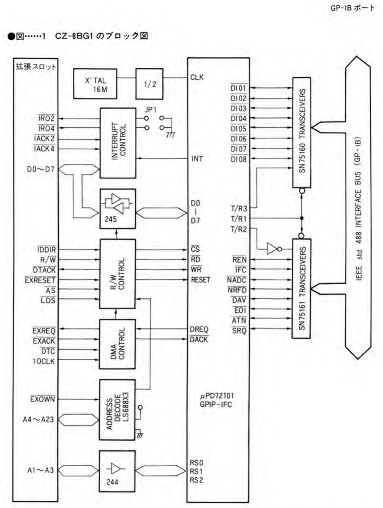

Expansion Slot

X'TAL 16M
1/2 → CLK
JP1 (??)

IRQ2
IRQ4
IACK2
IACK4
INTERRUPT CONTROL → INT
D0～D7

245 → D0 - D7

IDDIR
R/W
EXRESET
AS
LDS
R/W CONTROL → CS, RD, WR, RESET

EXREQ
EXACK
DTC
IOCLK
DMA CONTROL → DREQ, DACK

EXOWN
A4～A23
ADDRESS DECODE LS88K3

A1～A3
244 → RS0, RS1, RS2

µPD72101 GPIP-IFC

DI01 - DI08
SN75160 TRANSCEIVERS
T/R3, T/R1, T/R2

REN, IFC, NDAC, NRFD, DAV, EOI, ATN, SRQ
SN75161 TRANSCEIVERS

IEEE std 488 INTERFACE BUS (GP-IB)

Since almost everything related to the GP-IB bus operation is handled by the LSI here, the circuit configuration of the CZ-6BG1 consists only of the control circuit for connecting the µPD7210 to the expansion bus of the X68000, plus the interrupt vector generation circuit.

**3 Major Component Layout**

The parts layout of CZ-6BG1 is shown in Figure 2.

● Figure 2 - CZ-6BG1 Parts Layout

**4 Settings**

**4-1 Splitting**

By using jumper switch (JP1), you can select the slicing level to use with CZ-6BG1. If you short two, it will be level 2, and if you short four, it will be level 4 slicing. The factory setting uses level 2. 

**5 I/O Map**

CZ-6BG1's I/O address map is shown in Figure 3. $EAFE01-$EAF0EF refers to the GP-IB controller LSI, and $EAFE11-$EAFE1F refers to the slicing vector number register. To understand how to use the µPD 7210, you need detailed knowledge of the operation of GP-IB buses, and a separate manual will explain the specific usage in detail.

The slicing vector number register occupies 16 bytes in address space. In practice, only one 8-bit byte is used. $EAFE11-$EAFE1F is accessed by the vector number, which seems to be a mistake. During software development, you should assume the vector number register is located at $EAFE11.

Note: Minor adjustments were made for clarity and context.

**Fig. 3 GP-IB Board I/O Address Map**

| Device | Address | Register | 7 | 6 | 5 | 4 | 3 | 2 | 1 | 0 |
| ------ | ------- | -------- | - | - | - | - | - | - | - | - |
| $EAFE01 | 0R | Data In | DI7 | DI6 | DI5 | DI4 | DI3 | DI2 | DI1 | DI0 |
| $EAFE03 | 1R | Interrupt Status 1 | CPT | APT | DET | END | DEC | ERR | DO | DI |
| $EAFE05 | 2R | Interrupt Status 2 | INT | SRQI | LOK | REM | CO | LOKC | REMC | AESC |
| $EAFE07 | 3R | Serial Poll Status | S8 | PEND | S6 | S5 | S4 | S3 | S2 | S1 |
| $EAFE09 | 4R | Address Status | CIC | ATN | SPMS | LPAS | TPAS | LA | TA | MIMN |
| $EAFE0B | 5R | Command Pass Through | CPT7 | CPT6 | CPT5 | CPT4 | CPT3 | CPT2 | CPT1 | CPT0 |
| $EAFE0D | 6R | Address 0 | DT0 | DL0 | AD5-0 | AD4-0 | AD3-0 | AD2-0 | AD1-0 |
| $EAFE0F | 7R | Address 1 | EO1 | DT1 | DL1 | AD5-0 | AD4-0 | AD3-0 | AD2-0 | AD1-0 |
| $EAFE01 | 0W | Byte Out | BO7 | BO6 | BO5 | BO4 | BO3 | BO2 | BO1 | BO0 |
| $EAFE03 | 1W | Interrupt Mask 1 | CPT | APT | DET | END | DEC | ERR | DO | DI |
| $EAFE05 | 2W | Interrupt Mask 2 | '0' | SRQI | DMAO | DMAI | CO | LOKC | REMC | AESC |
| $EAFE07 | 3W | Serial Poll Mode | S8 | rsv | S6 | S5 | S4 | S3 | S2 | S1 |
| $EAFE09 | 4W | Address Mode | Ion | TRM1 | TRM0 | '0' | '0' | ADM1 | ADM0 |
| $EAFE0B | 5W | Auxiliary Mode | CNT2 | CNT1 | CNT0 | COM4 | COM3 | COM2 | COM1 | COM0 |
| $EAFE0D | 6W | Address 0/1 | ARS | DT | DL | AD5 | AD4 | AD3 | AD2 | AD1 |
| $EAFE0F | 7W | End of string | EC7 | EC6 | EC5 | EC4 | EC3 | EC2 | EC1 | EC0 |

```
   $EAFE11 Special Interrupt Vector Number
   ~$EAFE1F Interrupt Vector
```

**6 Connector Signal Arrangement**

Fig. 4 shows the signal arrangement of connectors on the CZ-6BG1. The physical form and signal arrangement of connectors follows the IEEE std. 488-1978.

The original formatting of the table has been maintained as closely as possible.

GP-IB Port

Diagram 4: GP-IB Board Connector Signal Assignment

[Diagram of a 24-pin connector with labels for each pin]

Pin 1 - 13: Various signal labels such as DIO1, ATN, IFC, etc.
Pin 14 - 24: Ground and other signal labels such as GND, REN, etc.

BUS CONFIGURATION SIGNAL LINES

DIO 1 (Data Input/Output 1): Transmit data
DIO 2 (Data Input/Output 2): Address
DIO 3 (Data Input/Output 3): Command
DIO 4 (Data Input/Output 4): Measurement Data
DIO 5 (Data Input/Output 5): Program Data
DIO 6 (Data Input/Output 6): Display Data
DIO 7 (Data Input/Output 7): Status
DIO 8 (Data Input/Output 8)

TRANSMISSION BUS

DAV (Data Valid): Signal indicating the validity of the data on the data bus
NRFD (Not Ready For Data): Signal indicating the receiver is not ready
NDAC (Not Data Accepted): Signal indicating the data is not accepted

ATN (Attention): Signal indicating the data on the bus is an address or command
IFC (Interface Clear): Signal to initialize the interface
SRQ (Service Request): Signal to request service
REN (Remote Enable): Remote/Local designation signal
EOI (End or Identify): Signal indicating the end of data or parallel poll execution

"7 Circuit Diagram
The circuit diagram for CZ-6BG1 is shown in Figure 5.
●Figure.....5  Circuit diagram for CZ-6BG1 (No end reference)"

**RS-232C Board**
(CZ-6BF1)

RS-232C is a commonly used interface for relatively low-speed data transfer, and it is standard equipment even in notebook computers. The RS-232C board is used to add an additional two-channel RS-232C port to the X68000.

The RS-232C board adds two channels per board of RS-232C ports to the X68000. The built-in RS-232C interface uses the same 8530 SCC, and it supports various transmission modes. Additionally, channel A supports high-speed transmission via DMA, and channel B allows for the provision of external power (+5V / +12V / -12V). This capability is useful when connecting optical modems, as it allows for the reduction of external power loads.

**1 Specifications**

Main LSI
Transmission Controller LSI: LH8530-SCC

Serial Interface
Standard Specifications: RS-232C (EIA), JIS-X 5101

Number of Channels: 2

Communication Method: Asynchronous, Synchronous

(Page 149)

Baud Rate .......... 75~19200 bps
Character Length .. 5/6/7/8
Stop Bit Length .... 1/1.5/2
Parity Bit Length ..... None/Even/Odd
I/O Connector ..... 25-pin D-SUB Connector

Power Supply
Voltage/Current
(Excluding external supply)
..... +5V/+12V/-12V
Current
..... +5V .......... 370mA
..... +12V ........ 35mA
..... -12V ......... 50mA
Operating Temperature Range
..... 10~30°C
Port Address
..... $EAF01~$EAFC09/$EAFC11~$EAFC19
..... $EAFC21~$EAFC29/$EAFC31~$EAFC39
One of these four types (select using jumper switch)
Level 2/Level 4 (select using jumper switch)

2. Circuit Overview

The block diagram of the CZ-6BF1 is shown in Figure 1. The RS-232C interface used in the X68000 main body has the same LSI (LH8530SCC) as the CZ-6BF1, so it has one SCC. The CZ-6BF1 is designed with two RS-232C connectors since it has two channels.

In the CZ-6BF1, SCC's A-channel's DSR signal, B-channel's DTR, CTS, DCD signals can each be switched to A-channel or B-channel clock sources (configured inside the SCC, selectable by ST2) to drive CI signal and CD signal.

Switching the clock for each channel, replacing DTR and CTS, and making the DSR signal inactive are possible. In the CZ-6BF1, an independent I/O port can be established for switching the clock of B-channel and the DTR output, and manually observing the CTS and DSR signals from the connected device.

By adhering strictly to the RS-232C standard, this unique peripheral device has been implemented with both A-channel and serial transmission.

Top text:
"It can also be seen as a convenient B channel for connection."

Diagram title:
"● Figure 1 CZ-6BF1 Block Diagram"

Labels in the block diagram:
- "10MHz"
- "1/2 Frequency"
- "CLK"
- "Expanded I/O Slot"
- "Address Decoder"
- "LH8530A SCC"
- "Buffer"
- "A/B"
- "D/C"
- "Controller"
- "RD"
- "WR"
- "CE"
- "Data Bus"
- "D0 - D7"
- "INTACK"
- "INT"
- "REQA"
- "Controller Interrupt"
- "External B Channel Register"
- "Driver"
- "Driver"
- "Receiver"
- "Receiver"
- "RS-232C (A CH)"
- "RS-232C (B CH)"

"151"

3 Main Component Placement

The component layout of CZ-6BF1 is shown in diagram 2.

■ Diagram 2: CZ-6BF1 Component Layout

• 4 Setting

4-1 Setting the Board Address

By using the switch (SW1) on the board, you can change I/O port addresses (refer to Figure 3).

● Figure 3 Dip Switch (SW1)

[Diagram of switch]

SW1
ON: 0
OFF: 1

In the example to the left, the setting is as it is when shipped from the factory.

| SW1 | Board Number | I/O Port Address |
|-----|--------------|------------------|
| ON  ON  | 0 (1st board) | $EAFC01 ~ $EAFC09 |
| OFF ON | 1 (2nd board) | $EAFC11 ~ $EAFC19 |
| ON  OFF | 1 (3rd board) | $EAFC21 ~ $EAFC29 |
| OFF OFF | 2 (4th board) | $EAFC31 ~ $EAFC39 |

When both 2-bit switches of SW1 are ON, $EAF01 ~ $EAFC09 is used. If the first is ON and the second is OFF, $EAFC11 ~ $EAFC19 is used. If the first is OFF and the second is ON, $EAFC21 ~ $EAFC29 is used. If both are OFF, $EAFC31 ~ $EAFC39 is used. 

4-2 Interrupt Assignment

By setting the jumper switch (JP1), you can select the interrupt level to use (refer to Figure 4). Shorting pins 1 and 2 will use IRQ 2, and shorting pins 2 and 4 will use IRQ 4.

Page 153

●Fig. 4  Jumper Switch (JP1)

[Diagram showing Jumper Switch JP1]

JP1
```
2 - Interrupt level 2 (IRQ2)
4 - Interrupt level 4 (IRQ4)
```

5 I/O Map

The I/O address map of the CZ-6BF1 is shown in Figure 5. For details on how to use the LH8530 (SCC), please refer to my book "Inside X68000."

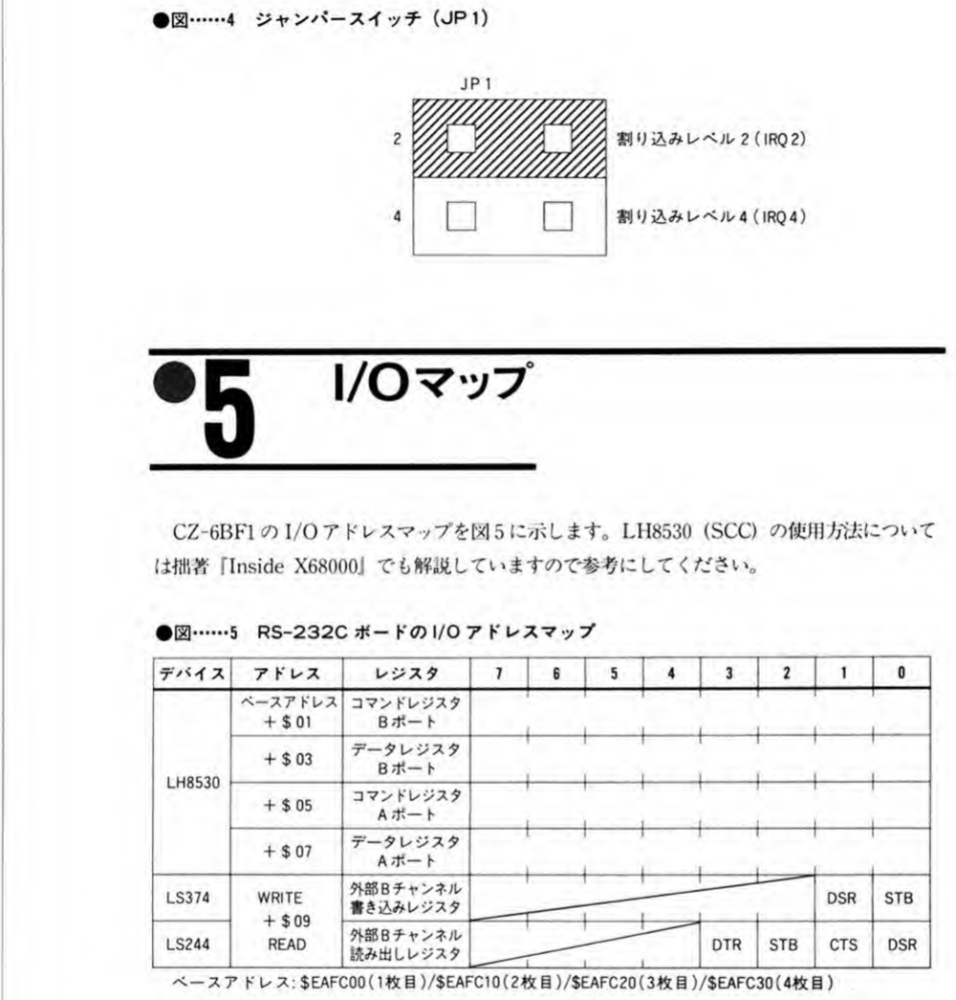

●Fig. 5  I/O Address Map of the RS-232C Board

[Device, Address, Register, Bits (7-0)]

LH8530
Base address + $01
Command register, B port

+ $03
Data register, B port

+ $05
Command register, A port

+ $07
Data register, A port

LS374 WRITE + $09
External B-channel write register

LS244 READ
External B-channel read register

Base address: $EAFC00 (board 1) / $EAFC10 (board 2) / $EAFC20 (board 3) / $EAFC30 (board 4)

RS-232C Board

● External Channel B Write Register
```
 bit 7 6 5 4 3 2 1 bit 0
                               DTR STB
 Clock selection for synchronous communication transmission timing
 '1': Use the clock from CPC187
 '0': Use the input on ST2 (ST1 = ST2)
 Set the state of the DTR signal for Channel B
 '1': Set the DTR terminal to OFF
 '0': Set the DTR terminal to ON
```
 
● External Channel B Read Register
```
 bit 7 6 5 4 3 2 1 bit 0  
                               DTR STB   CTS   DSR 
 Display the state of the DSR signal for Channel B
 '1': Display the DSR status as OFF
 '0': Display the DSR status as ON
 Display the state of the CTS signal for Channel B
 '1': Display the CTS status as OFF
 '0': Display the CTS status as ON  
 Display the state of the STB bit in the Channel B write register
 Display the state of the DTR bit in the Channel B write register
```
 
●6 Connector Signal Arrangement

The connector signal arrangement for CZ-6BF1 is shown in Example 6. CZ-6BF1 has a two-channel RS-232C connector. Remember that Channel B does not have CD or CI signals and terminal pins that are not connected can supply potential (+5 V, + 12 V, - 12 V). Please be careful about that.
 

Page 155

When making cables to connect to other devices, it is recommended to keep the pins with potential power output (pins 9, 10, and 14) open.

Figure 6 - Pinout of RS-232C Board Connector

(View from the cable connection side)

Pin No.   Signal Name   Function                              Direction          Standards                   Remarks
```
 1        FG            Protective Ground                      ---                JIS    EIA   CCITT
                                                                                  SG     AB    102 
 2        TXD           Transmitted Data                       DTE/DOE            SD     BA    103          Output
 3        RXD           Received Data                          ---                RD     BB    104          Input
 4        RTS           Request to Send                        ---                RS     CA    105          Output
 5        CTS           Clear to Send                          ---                CS     CB    106          Input
 6        DSR           Data Set Ready                         ---                DR     CC    107          Input
 7        SG            Signal Ground                          ---                SG     AB    102
 8        CD            Carrier Detect                         ---                CD     CF    109          Input
 9        +12V          DC +12V                                ---                ---    ---   ---          Output *
```
```
10        −12V          DC −12V                                ---                ---    ---   ---          Output *
14        +5V           DC +5V                                 ---                ---    ---   ---          Output *
15        ST2           Transmit Signal Element Timing         DCE                ST2    DB    114          Input
```
                           Secondary Transmit Timing
17        RT            Received Signal Element Timing         DCE                RT     DD    115          Input
```
                          Secondary Receive Timing
 20       DTR           Data Terminal Ready                    DTE/DOE            ER     CD    108/2       Output
 21       CI            Composite Indicator                    DCE                CI     CE    125          Input
 24       ST1           Transmit Signal Element Timing         DCE                ST1    DA    113          Output
                            Primary Status Timing
```

*1 - B channel connection is not used. *2 - B channel connection can be achieved via JP2. A channel connection is not used.

RS-232C Board

•7   Schematic Diagram

Please refer to Figure 7 for the schematic of the CZ-6BF1, and to Figure 8 for the equivalent circuit of the PAL on the base.

● Figure 7 CZ-6BF1 Schematic Diagram (refer to the reference materials)

●Fig. 8  Equivalent Circuit of the PAL

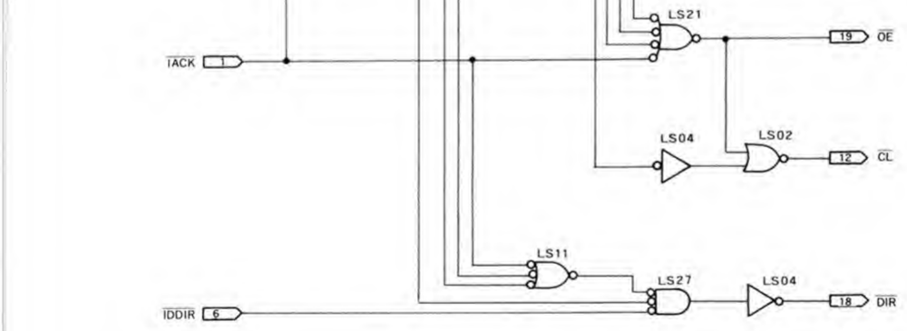

**FAX Board (CZ-6BC1)**

Using fax for image transmission allows not only text but also graphics screens to be sent almost without degradation in image quality. The FAX board connects directly to the public line from X68000 and performs fax communication.

FAX board (CZ-6BC1) is a modem board that can perform half-duplex data communication at 4800 bps using a telephone line (complying with CCITT V.27 ter and V.21 channel 2). By using the software "FAX Tool" included with the board, you can perform G3-standard fax communication.

**1 Specifications**

- Main LSI: 
```
  - Modem LSI: R48MFX
  - Status input/control: 82C55
```
- Options:
```
  - Communication control LSI: Z8530 (SCC)
  - 9600 bps modem LSI: R96MD
```

Lines

Applicable Lines: General public telephone lines, PBX internal lines

Line Connection Method: Communication Connector (Modular Jack)

NCU Part: Type AA (Software Control)

Dial Signal Type: DP (10 PPS/20 PPS), PB

Modem:

Communication Speed: 300/2400/4800 bps

Communication Method: V 21 Channel 2, V 27 ter

Transmission Signal Level: Selectable from -6 to -15 dBm in 3 dBm steps (at dispatch: -15 dBm)

Power Supply:

Power Supply Voltage / Consumption Current: +5 V approx. 500 mA
```
                                                 +12 V approx. 10 mA
                                                 -12 V approx. 25 mA
```

Operating Temperature Range: 

Port Address:  
$EAF900~$EAF95F  
```
  (8255 : $EAF 900~$EAF 907)  
  (Z 8530 : $EAF 908~$EAF 90 B) *Optional  
  (R 48 MFX : $EAF 920~$EAF 93 F)  
  (R 96 MD : $EAF 940~$EAF 95 F) *Optional  
```

Split: Level 2 / Level 4 (Selectable by DIP switch)

Circuit Overview

The block diagram of CZ-6BC1 is shown in Figure 1. R48MFX is used as the modem IC, and 82C55 (CMOS version of 8255) is used for status checks and relay control for communication switching (same as 8255 for software).

To avoid direct DC connection between the telephone line and the X68000, a relay-controlled isolation circuit is used for data lines (incoming calls) and telephone service detection (to determine whether the phone is in use). A photocoupler is used between the telephone service section and the 8255.

Title: "● Diagram 1: Block Diagram of CZ-6BC1"

In the top right corner: "FAX Board"

Top row of text:
- From left to right, above the four circles: "Power," "C1," "D1," "GND"

Inside the diagram, from top left moving down and then generally to the right:
- "Surge suppressor" (Top left box after the circles)
- "Input signal" (Box at the top center)
- "Relay coil" (Box to the right of the "Input signal" box)

Connecting boxes from top to bottom in the left side:
- "R8/M7K CS" (Box below the "Surge suppressor")
- "BZ455 CS" (Box to the right of the "R8/M7K CS" box)
- "Address buffer" (Box below "R8/M7K CS")
- "Decoder" (Box to the right of "Address buffer")
- "Output buffer" (Connected to the right side of "Data bus")
- "Data bus" (Vertical line between "Decoder" and "Output buffer")
- "LSI" (Large box connected to multiple elements in the center-right)
- "Relay driver" (Box near bottom left connected to "F" symbol and LSI)

Bottom right corner: 
- "DIP-SW" (To the right of "LSI")
- Below "+5V," "-12V," "+24V" (Voltage indicators)

Outside of the diagram to the right, vertically written: "+5V," "+12V," "+24V," and "GND".

Bottom center: 
- "+5V," "+12V"

Arrangement of Major Parts
The arrangement of the parts of CZ-6BC1 is shown in Figure 2.
Figure 2: Arrangement of the parts of CZ-6BC1

●4 Setting

The CZ-6BC1 has two dip switches. The settings for each are as shown in Figure 3.

●Figure--3 CZ-6BC1 Dip Switches

- DIP-SW1

| No. 1 | No. 2 | Transmission Level |
|:------|:------|:----------------------|
| OFF   | OFF   | -6 dBm               |
| OFF   | ON    | -9 dBm               |
| ON    | OFF   | -12 dBm              |
| ON    | ON    | -15 dBm (Default setting upon shipment)  |

- DIP-SW2

| Shipment Setting | Setting Content                  |
|:------------------|:-------------------------------|
| No. 1 ON          | Cable Equalizer Setting        |
| No. 2 ON          | Silent Level Setting           |
| No. 3 OFF         | Normal Level Setting           |

● 4-1 Setting the Transmission Level

With DIP-SW1, you can set the signal level to be transmitted to the line. Line loss (unit: dBm) should be adjusted to ensure that the calculated level does not exceed -15 dBm. 
This setting should be performed by a qualified technician who has a license for telecommunication work.

Please ensure that a qualified technician handles this setting.

4.2 Cable Equalizer Settings

Using DIP-SW 20-1 and 20-2, the equalizer can be adjusted for correction of the circuit's frequency characteristic features.

4.3 Clipping Level Settings

The CZ-6BC1 allows you to select the clipping level to be used by the DIP switch on the board. If DIP-SW 20-3 is ON, the clipping level 4 is used, and if DIP-SW 20-4 is ON, level 2 clipping is used alternately. If both are ON, the clipping function will not be used. Setting both to OFF will cause clipping to occur at both levels 2 and 4 at the same time, so please avoid this setting.

5 I/O Map

The I/O address map of the CZ-6BC1 is shown in Figure 4, and the contents of each bit are shown in Figures 5 to 21.

**Figure 4 - FAX Board I/O Address Map**

| Address | Register Number | Bit Assignment |
|---------|-----------------|----------------|
| $EAF921 | 0               |                | 
| $EAF923 | 1               | DDYL           |
| $EAF925 | 2               | DDYM           |
| $EAF927 | 3               | DDXL           |
| $EAF929 | 4               | DDXM           |
| $EAF92B | 5               | TXCD           |
| $EAF92D | 6               | RXCD           |
| $EAF92F | 7               |                |
| $EAF931 | 8               | CDET   |  PN    |
| $EAF933 | 9               |                |
| $EAF935 | A               | TDET           |
| $EAF937 | B               | RX     | FED       | GHIT |
| $EAF939 | C               | RTSP | EPT | TPDM | TDIS | EQSV | EQFZ | SDIS | RAMW |
| $EAF93B | D               | CONF           |
| $EAF93D | E               | LA     | CDIE | CDREQ | SETUP  | DDIE  | DDAEQ |
| $EAF93F | F               | RAMA           |

Note: The values in the "Bit Assignment" column are cited as they appeared in the image. "Bit" columns are designated from 7 to 0 (left to right).

**Register 0**

bit 7  6   5    4   3   2    1   bit 0
[DDYL]

Diagnostic Data Y Least
The least significant 8 bits of the 16-bit data used when reading from or writing to YRAM location, XRAM/YRAM.

**Register 1**

bit 7  6   5    4   3   2    1   bit 0
[DDYM]

Diagnostic Data Y Most
The most significant 8 bits of the 16-bit data used when reading from or writing to YRAM location, XRAM/YRAM.

**Register 2**

bit 7  6   5    4   3   2    1   bit 0
[DDXL]

Diagnostic Data X Least
The least significant 8 bits of the 16-bit data used when reading from XRAM location.

**Register 3**

bit 7  6   5    4   3   2    1   bit 0
[DDXM]

Diagnostic Data X Most
The most significant 8 bits of the 16-bit data used when reading from XRAM location.

FAX Board

●■ (Drawing) 9 Register 4
Transmitter Channel Data
CDREQ (Channel Data Request Bit) is '1', the data written into this register is sent to the transmitter.

●■ (Drawing) 10 Register 5
Receiver Channel Data
When the modem receives 8 bits, CDREQ bit is set to '1', and the received data is set in this register.

●■ (Drawing) 11 Register 8
Carrier Detector
Bandpass energy is detected, indicating it is not a training sequence.
'1': Start of data state
'0': End of reception signal
Period N
'1': Receiving sequence has started
'0': Receiving scramble has started
If this bit is '1' while TDIS (Register 4 bit 4), it is invalid

●■ (Drawing) 12 Register A
Tone Detected
'1': Tone received
'0': No tone received

Note: The term "●■ (Drawing)" is used to represent the bullet and square symbol combination used in the original text.

●Fig. 13  Register B
![bit labels 7 to 0]

- RX
- FED
- GHIT

Gain Hit
- '1': The received level increased at a rate too sudden for the AGC circuit to correct
- '0': The AGC output has returned to its normal state

Fast Energy Detector
Indicates the level of the received signal
- '00': No received level
- '01': Invalid
- '10': At or above the turn-off threshold
- '11': At or above the turn-on threshold

●Fig. 14  Register C
![bit labels 7 to 0]

- RTSP
- EPT
- TPDM
- TDIS
- EQSV
- EQFZ
- SDIS
- RAMW

RAM Write
- '1': Write diagnostic data to the modem IC
- '0': Read diagnostic data from the modem IC

Scrambler Disable
- '1': Scrambler / descrambler disabled
- '0': Scrambler / descrambler enabled

Equalizer Freeze
- '1': Stop updating the adaptive equalizer taps
- '0': Normal operation

Equalizer Save
- '1': Do not zero the adaptive equalizer taps when reconfiguring the modem or during training
- '0': Normal operation

Training Disable
- '1': Do not put the modem into the training phase (when RTSP becomes active, a training sequence will occur at the start of transmission)
- '0': Normal operation

Transmitter Parallel Data Mode
- '1': Transmit the contents of the TXCDL register
- '0': Transmit serial software data bits

Echo Protector Tone
- '1': Before the training sequence, a non-standard asynchronous signal is transmitted for 185 ms, followed by 20 ms with no transmit energy (this bit takes the value '1' when TDIS is '1')
- '0': Normal operation

Request Send Parallel
- '1': Start the transmit sequence (transmission continues until RTSP becomes '0' and the turn-off sequence completes)
- '0': Do not start

FAX Board

●Fig. 15  Register D

**Fig. 15  Register D**

| bit 7 | 6 | 5 | 4 | 3 | 2 | 1 | bit 0 |
|---|---|---|---|---|---|---|---|
| CONF | | | | | | | |

bit 7  |  6  |  5  |  4  |  3  |  2  |  1  |  bit 0
          CONF
Configuration
Configures the modem
$00: V.21 (300bps)
$04: V.27, 2400 long training
$05: V.27, 2400 short training
$06: V.27, 4800 long training (default)
$07: V.27, 4800 short training
$08: unused
Others: unused
*1: In response to the RTS or RTSP signal, the modem directly transmits either a single tone or a dual-frequency tone. The tone frequency is controlled by RAM locations written by the host. While a tone is being transmitted, the tone configuration enables detection of a single-frequency tone via the TDET bit.
The frequency of the tone detector can be changed by the host by modifying several RAM locations.

●Fig. 16  Register E
bit 7  |  6  |  5  |  4  |  3  |  2  |  1  |  bit 0
  IA      CDIE    CDREQ    SETUP    DDIE    DDREQ
Diagnostic Data Request
'1': The modem accessed the DDYL register
'0': The host CPU accessed the DDYL register

Diagnostic Data Interrupt Enable
'1': Generate an interrupt when DDREQ = "1"
'0': Do not generate an interrupt

Setup
Set to "1" when reconfiguring the modem (when changing the CONF register)

Channel Data Request
'1': After the modem writes received channel data to RXCDL, or after RXCD is read out, the host processor must return this bit to "0" once servicing is complete

Channel Data Interrupt Enable
'1': Generate an interrupt when CDREQ = "1"
'0': Do not generate an interrupt

Interrupt Active
'1': Interrupt request pending
'0': Normal operation

Figure 17 Register F

bit 7           bit 0
|    RAMA    |

RAM Access
Written by the host when reading or writing diagnostic data.

Figure 18 8255 Port A

bit 7           bit 0
|            SW1-2            |     SW1-1      |

SW1-1 Input
'1': OFF
'0': ON

SW1-2 Input
'1': OFF
'0': ON

Figure 19 8255 Port B

bit 7                          bit 0
| 8530 | INT | SW2-4 | SW2-3 | DCD | CTS | HSET | RING |

RING Output
'1': Active
'0': Idle

Handset Hook Switch
'1': Handset off-hook
'0': Handset on-hook

CTS Signal Status
'1': Using Data
'0': Not Using Data

DCD Signal Status
SW2-3 Input
'1': OFF (IRQ4 Interrupt Request Signal)
'0': ON ( )

SW2-4 Input
'1': OFF (IRQ2 Interrupt Request Signal)
'0': ON ( )

8530 Interrupt Request Status
'1': Active
'0': Request In Progress

Page 170

**Figure 20: 8255 Port C**

| bit 7 | 6 | 5 | 4 | 3 | 2 | 1 | 0 |
|---|---|---|---|---|---|---|---|
|   |   |   | RTS | RIN EN | RLDV 2 | RLDV 1 |

- Relay 1 Control
```
  - '1': Turn Relay 1 OFF
  - '0': Turn Relay 1 ON
```
- Relay 2 Control
```
  - '1': Turn Relay 2 OFF
  - '0': Turn Relay 2 ON
```
- RING Interrupt Control
```
  - '1': Prohibit Incoming Signal Generation
  - '0': Permit
```

- RTS Signal Status

**Figure 21: 8255 Control Word Register**

(1) Bit Set/Reset

| bit 7 | 6 | 5 | 4 | 3 | 2 | 1 | 0 |
|---|---|---|---|---|---|---|---|
| '0' | BITSEL | DATA |

- Data to be Set at the Corresponding Bit of Port C Selected by BITSEL
```
  - '1': Set the Corresponding Bit to High Level
  - '0': Set the Corresponding Bit to Low Level
```

- Bit Position of Port C to Set Data
```
  - 000: bit 0
  - 001: bit 1
  - 010: bit 2
  - 011: bit 3
  - 100: bit 4
  - 101: bit 5
  - 110: bit 6
  - 111: bit 7
```

Page 171

[Diagram]... 21   8255 Control Word Register (continued)

(2) Operation Mode Selection

Bit

7          6            5                 4                     3                 2                      1              0
'0'   GROUP A MODE  PORT A  PORT C  Group     PORT B   PORT C
```
                           IN/OUT   (High)     B MODE    IN/OUT    (Low)
                                            IN/OUT                      IN/OUT
```

'1': The lower bit of Port C is input
'0': The lower bit of Port C is output

'1': Port B is input
'0': Port B is output

Group B (Ports A and the upper bit of Port C) operation mode selection
'1': Mode 1
'0': Mode 0

'1': The upper bit of Port C is input
'0': Output

'1': Port A is input
'0': Output

Group A (Port A and the upper bit of Port C) operation mode selection
'11': Mode 2
'10': Mode 1
'01': Mode 1
'00': Mode 0

•6 Circuit Diagram

The circuit diagram of CZ-6BC1 is shown in figure 22, and the equivalent circuits of PAL 1 and PAL 2 are shown in figures 23 and 24, respectively.

[Diagram]... 22   Circuit diagram of CZ-6BC1 (No figure at the end of the volume)

FAX Board

●Figure 23  Equivalent circuit of PAL 1

EAF9XX  19

Vcc: 20P
GND: 10P

```
1  A8
2  A9
3  A10
4  A11
```

```
5  A12
6  A13
7  A14
8  A15
```

```
9  A16
11 A17
12 A18
14 A19
```

```
15 A20
16 A21
17 A22
18 A23
```

"Figure 24 PAL 2 equivalent circuit"

(CZ-6BU1)

Not only can it be connected to things like LEDs and switches, but the Universal I/O Board, with its input and output capabilities, can also improve functionality by focusing on the mutual communication capabilities of parallel boards.

The Universal I/O Board is a board that performs digital input and output of 16 bits each. In addition to data input, it has 8 handshake lines and 1 exclusive interrupt input line, allowing it to be used as an interface for various computer systems.

The 4 input/output buffers for data signals are socketed, making it possible to handle changes to input/output boards and signal processing/current fluctuations flexibly.

1. Specifications
Data Signal
Input/Output Logic (When Output)
TTL Logic (Can also be changed to positive logic by replacing a buffer IC.)
Number of Input Data Bits
16 bits
Can input in units of 8 bits / 16 bits
Capable of triggering latch/interrupts with an input strobe
Number of Output Data Bits
16 bits

(Page 175)

**External Interface**

- **Input**: 8-bit/16-bit units
- **Output latch**: With output latch
- **TTL Level**: TTL level
- **All output signals**: With pull-up and pull-down resistors

**Handshake Signal**

- **Input strobe**: 2 points (1 point for every 8 bits of data)
- **Output strobe**: 2 points
- **Ready B signal**: 2 points
- **Write B signal**: 2 points
- **Interrupt input**: 1 point

**I/O Connector**

50 PX2 flat cable connector (OMRON XG4A-5039-A)

**Power Supply**

- **Voltage**: +5 V
- **Current consumption**: 480 mA (MAX)

**Port Address**

$EAFD 00 - $EAFDFF, 4 bytes within this range (The lower 2 bits of the port address are always '00')

Selectable by jumper switch for Level 2/Level 4.

# 2 Circuit Overview

The block diagram of the CZ-6BUI is shown in Figure 1. The CZ-6BUI is not equipped with general-purpose TTL components like the 8255 or other I/O LSIs, but is composed using universal TTL.

In addition to 16-bit input and output, the CZ-6BUI has 2 sets (4 lines) of output handshake signals for external transmission and 2 sets (4 lines) of input handshake signals from the outside to the CZ-6BUI. Additionally, there is one pin dedicated to interrupt input. Each 16-bit input/output board can be used divided into 8 bits each, and there are 2 sets of corresponding handshake signals.

(Page 176)

●Figure 1  Block diagram of CZ-6BU1

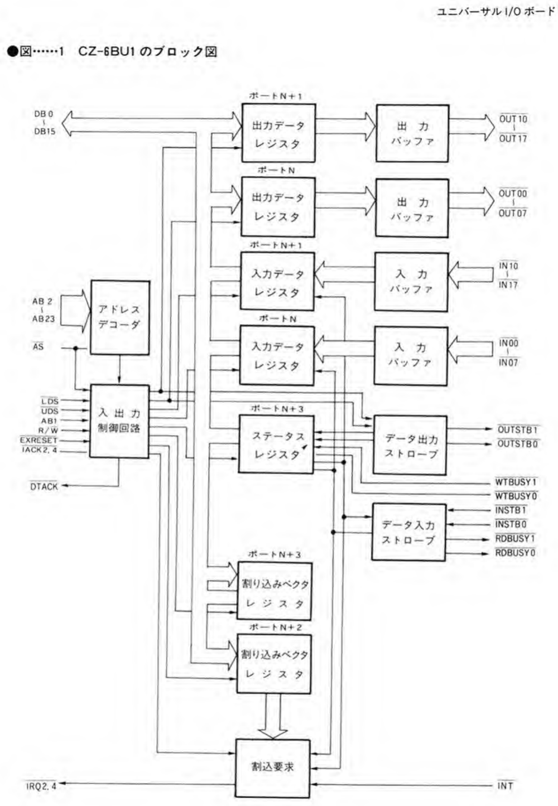

Left inputs:
DB0
DB15

A2
A23
AS

LDS
UDS
A1
R/W
EXRESET
IACK2,4

DTACK

IRQ2,4

Center blocks:
Address Decoder

Input/Output Control Circuit

Port N+1
Output Data Register   →   Output Buffer   →   OUT10
                                                OUT17

Port N
Output Data Register   →   Output Buffer   →   OUT00
                                                OUT07

Input Data Register    →   Input Buffer    ←   IN10
                                                IN17

Input Data Register    →   Input Buffer    ←   IN00
                                                IN07

Port N+3
Status Register        →   Data Output Strobe → OUTSTB1
```
                                                 OUTSTB2

                       →   Data Input Strobe  → WTBUSY1
                                                WTBUSY0
                                                INSTBT
                                                INSTBO
                                                RDBUSY1
                                                RDBUSY0
```

Port N+1
Interrupt Vector Register

Port N+2
Interrupt Vector Register

Interrupt Request   →   INT

Among output handshake signals, OUTSTB is a strobe signal that indicates that the X68000 has output data onto the data line to external devices. The external device responds with WTIBUSY in response. WTIBUSY will only be active when the terminal device is ready to receive data, and turns inactive once the intake is complete. The OUTSTB pulse is allocated from any one of the 16 bits of the input-output ports, so it can be chosen without restriction during access.

Among input handshake signals, INSTB is a strobe signal indicating from an external device to the X68000 that data is being set on the data line. When detecting this, it becomes active and changes (temporarily referred to as edge detection) to CC, and RDBUSY signal transitions to VIP when the X68000 reads complete data. As a strobe signal indicating that data has been queued by the input port, an automatic violation when inputted indicates an automatic violation (active posture) to the X68000. 

The RDBUSY signal is seen as a declaration from the external device that data for the X68000 to read is prepared. When edge detection occurs upon wave declaration, the data keeps flowing on the handshake data by controlling the memory data dynamics and powered terminals.

•3 Major Parts Arrangement

The arrangement of the parts of the CZ-6BU1 is shown in Figure 2.

●Figure 2  Component layout of CZ-6BU1

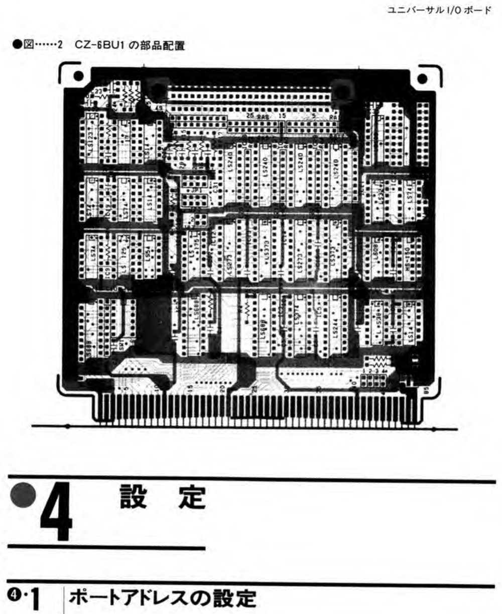

[Photograph of the CZ-6BU1 board]

●4  Settings

●4.1  Setting the port address

The port address of the CZ-6BU1 can be set using the DIP switch (SW1). Switches 1 to 6 of SW1 each correspond to A2–A7 (bits 2–7 of the address), and they set where, in the range from the base address $EAFD00 to $EAFDFC, the board is placed.
When a switch is ON, the corresponding address bit is '0', and when OFF, the bit is '1'. For example, if SW1's 1, 2, and 3 are OFF and 4, 5, and 6 are ON, the lower digits of the base address F

**4.2 Setting Conditions for Output Strobe Signal (OUTSB1/2) Generation**

Each of the 16-bit prepared output ports can access its output port from which one of the 8-bit ports and determine which signal, OUTSB1 or OUTSB2, will be generated at either JP1 or JP2.

Among the four jumpers, short one, and determine the lower bit of the output port (based on the base address + 1 offset), short two and determine the higher bit of the output port (written in pairs with the same base address), 3 or 4 for determining whether the lower or higher bit of the output port will be read and generate the OUTSB signal.

Ensure that JP1 is shorted on the worksite, and JP2 or one of the shorts is in place. Pay attention to the detailed precautions such that OUTSB signals are generated when two or more conditions are met.

**4.3 Data Latch Selection**

The CZ-6BU has an INSTB1 rise edge to latch the "lower side" data and an INSTB2 rise edge can latch "upper side" data (hold), and you can choose whether or not to use this function at JP3.

Short one side of JP3, if you short INSTB1 on the rising edge when INSTB2 rising edge latches the data, and shorting the second one, then INSTB2 rising edge latches the data accordingly, and if you open it, the data status of the data line when the data port was read will be read as it is.

When you use the latch function, once the data is latched, and you read out the new data from the data line, even if the rising edge of INSTB is reached, the data is not updated, so please be careful.

Page 180

**4 Setting the Interrupt Level**

The CZ-6BU1 can generate an interrupt on the rising edge of a dedicated interrupt input or INSTB signal. JP4 lets you select whether to use interrupt level 2 or level 4. 
When using level 2, set JP4 to 1 and 3. When using level 4, set JP4 to 2 and 4.

**5 I/O Map**

The I/O map of the CZ-6BU1 is shown in Figure 4-8, with each contents explained. The base address + 0 and + 1 are for data input ports, the base address + 2 is for the interrupt mask, and the base address + 3 is used for setting the interrupt vector and reading the status of the handshake signals (WTBUSY and INSTB).

**●Figure 4-3: I/O Address Map of Universal I/O Board**

| Access | Address         | Register          | 7 | 6 | 5 | 4              | 3      | 2   | 1 | 0 |
|--------|------------------|------------------|---|---|---|----------------|--------|-----|---|---|
| Read   | Base Address + $00 | Upper Data Input  |                       | Input Data (High)    |
|        | + $01             | Lower Data Input  |                       | Input Data (Low)     |
|        | + $02             | Not Used           |                       |                      |
|        | + $03             | Strobe Data Input  | F3   | F2 | F1 | F0    | Strobe Data Input  |

| Write  | Base Address + $00 | Upper Data Output |                        | Output Data (High)   |
|        | + $01             | Lower Data Output |                        | Output Data (Low)    |
|        | + $02             | Interrupt Mask     | M2   | M1 | M0         | Interrupt Mask       |
|        | + $03             | Interrupt Vector   |                          | Interrupt Vector     |

- Base Address: Among SEAFDX0 to SEAFDX8, values where the lower 2 bits are "00" are base addresses (SEAFDX0, SEAFDX4, SEAFDX8, SEAFDXC)

●Figure 4  Upper data input / Lower data input (base address +0 / +1)

bit 7  6  5  4  3  2  1  bit 0

Indicates the state of the input data signal
'1': Input signal is 'L' level (when the buffer is LS240)
'0': Input signal is 'H' level (         ″         )

●Figure 5  Status input (base address +3)

bit 7  6  5  4  3  2  1  bit 0
                  F3 F2 F1 F0

F3: Upper data output timing
'1': Data was written to the upper data output port
'0': Detected the rising edge of the WTBUSY1 signal

F2: Lower data output timing
'1': Data was written to the lower data output port
'0': Detected the rising edge of the WTBUSY0 signal

F1: Upper data input timing
'1': Detected the rising edge of the INSTB1 signal
'0': Read from the upper data input port

F0: Lower data input timing
'1': Detected the rising edge of the INSTB0 signal
'0': Read from the lower data input port

●Figure 6  Upper data output / Lower data output (base address +0 / +1)

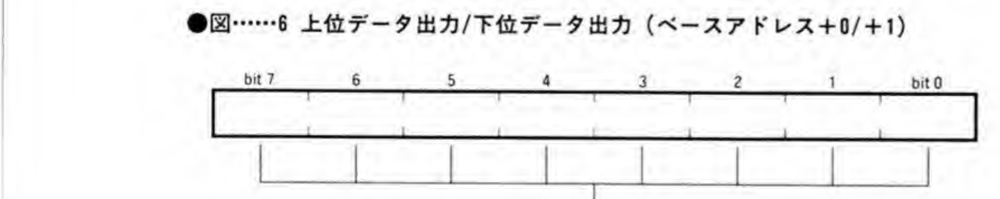

bit 7  6  5  4  3  2  1  bit 0

Sets the state of the output data signal
'1': Output signal is 'L' level (when the buffer is LS240)
'0': Output signal is 'H' level

● Figure ..... 7 Interrupt Mask Register (+2)

| bit 7 | 6 | 5 | 4 | 3 | 2 | 1 | 0 |
|------------------------------------|
|                        M2 | M1 | M0 |

Control for interrupt generation due to rising edge of INSTB1
'1': Allows interrupt generation
'0': Prohibits

Control for interrupt generation due to rising edge of INSTB0
'1': Allows interrupt generation
'0': Prohibits

Control for interrupt generation due to rising edge of INT signal
'1': Allows interrupt generation
'0': Prohibits

● Figure ..... 8 Interrupt Vector Setting (Base Address +3)

| bit 7 | 6 | 5 | 4 | 3 | 2 | 1 | 0 |
|------------------------------------|
|               Interrupt Vector    |

Sets the interrupt vector number

● 6 Connector Signal Layout

The connector signal layout of CZ-6BUI is shown in Figure 9.

Page 183

●Diagram......9 Universal I/O Board Connector Signal Arrangement

CN1
```
1   OUT10     2   GND
3   OUT11     4   GND
5   OUT12     6   GND
7   OUT13     8   GND
9   OUT14    10   GND
11  OUT15    12   GND
13  OUT16    14   GND
15  OUT17    16   GND
17  OUT00    18   GND
19  OUT01    20   GND
21  OUT02    22   GND
23  OUT03    24   GND
25  OUT04    26   GND
27  OUT05    28   GND
29  OUT06    30   GND
31  OUT07    32   GND
33  OUTSTB1  34   GND
35  OUTSTB0  36   GND
37  WTBUSY1  38   GND
39  WTBUSY0  40   GND
```
```
41            42   GND
43            44   GND
45            46   GND
47            48   GND
49            50   GND
```

CM2
```
1   IN10      2   GND
3   IN11      4   GND
5   IN12      6   GND
7   IN13      8   GND
9   IN14     10   GND
11  IN15     12   GND
13  IN16     14   GND
15  IN17     16   GND
17  IN00     18   GND
19  IN01     20   GND
21  IN02     22   GND
23  IN03     24   GND
25  IN04     26   GND
27  IN05     28   GND
29  IN06     30   GND
31  IN07     32   GND
33  INSTB1   34   GND
35  INSTB0   36   GND
37  RDBUSY1  38   GND
39  RDBUSY0  40   GND
41  INT      42   GND
```
```
43           44   GND
45           46   GND
47           48   GND
49           50   GND
```

●7 Circuit Diagram

The circuit diagram of CZ-6BU1 is shown in Diagram 10.

●Diagram......10 CZ-6BU1 Circuit Diagram (Reference)

Build-It-Yourself Peripherals Section

*(Blank page in the original.)*

Title: **Examples of Self-Made Peripheral Devices**

Connecting self-made peripheral devices to a computer and making it work exactly the way you want, or enabling something that wasn’t possible before, is enjoyable. In this segment, we will introduce some somewhat unusual peripheral devices utilizing the I/O port of the X68000.

Investigating how to connect self-made peripheral devices to a computer and adding functionalities that were not available previously has great appeal. Unlike commercial products, you can modify them to fill the gaps, focus only on simple functions, or build them exactly to your preferences. These aspects are exciting. However, if making them is too challenging, you might get frustrated and give up halfway through the process.

Among the peripheral devices that I’ve actually built, this segment will introduce relatively simple ones that even beginners can make. The examples largely utilize interfaces seen in joysticks or joystick connectors, so I think they can also be used by referencing how to utilize these ports. Here are the self-made peripheral devices that will be introduced:

- Disorderly Flasher
- Radio Control Stick
- Red-Blue Functional Selector Switch
- CRT Switch

The second example, the Radio Control Stick, is slightly more complex compared to the other three, so it might be better to try this one after getting used to making the other simpler devices.

Page 187

*(Blank page in the original.)*

Title: 
Random Number Generator

Main Text: 
A physical random number, which cannot be discussed purely by probability, is indispensable for simulations of physical behaviors created using physical phenomena. Here, we will try to create a small-scale physical random number generation device ourselves.

Additional Text:
A physical random number is a number obtained by using physical phenomena such as dice or thermal noise. In contrast, numbers generally used on personal computers and created by calculations are referred to as pseudo-random numbers. Various methods of generating pseudo-random numbers have been devised, but they basically calculate the remainder when divided by some number of sums or products and assign it to the next random number. It keeps calculating sums and remainders, for instance, the remainder when A is divided by B, the next remainder when A+X is divided by C, and so on. By repeating a, b, and c in their selection methods, somewhat disorderly random numbers are obtained.

Since pseudo-random numbers are produced by calculations, they are naturally reproducible. If the initial conditions are the same, the same sequence of numbers will be produced every time. This is convenient for some applications but cannot be used for problems that require genuine randomness. A reasonably large computer can prepare hardware to generate physical random numbers, but personal computers generally do not take such measures. I couldn't find anything in my home library about the generation of physical random numbers, at least not to the extent that I can tell.

# 1 Experiment on Random Number Generation

What to use to generate random numbers becomes the initial problem. A well-known device that generates relatively large noise is the zener diode. It was known that large computation machines use noise generated by zener diodes, but when we tried to find them, we couldn’t easily find them. So, we explored a less complex method. We found that applying reverse bias to transistors would generate noise. The simplicity in generating noise makes reaching the aforementioned electrical level with less step-up—a very convenient and appealing feature. Although there seem to be some problems with practical application, here we will use this signal to create a random number generator.

# 2 Circuit Design

It may be a bit difficult to understand at first, but let’s go through a simple explanation by breaking things down into steps. This section includes brief explanations and notes on the circuit.

# 2-1 About Power Supply

We decided to use a printed interface so that the random number generator can be connected to various PCs. The transistor’s reverse bias is around 10V, so we decided to use two 9V batteries (006P) in series. Nickel-cadmium batteries and lithium batteries maintain stable voltages until they are almost fully drained, so we confirmed that it operates stably from around 20V down to 12V.

**Figure ●1 : Circuit Diagram**

**Note:**

1) Pins 9, 11, and 13 of the 74HC14 should be connected to GND or the five-line power supply.
2) For 74HC74, pin 4 and pin 4020 GND should be connected to GNDB.

**2.2 Noise Source Part**

The part connected to a unique orientation including transistors at the end of the circuit is the noise generator. By short-circuiting the transistor collector and base to GND (0 V) and attaching resistance to the emitter, current should only flow in one direction. With a resistor of 470 KΩ or a larger value attached, an unexpected phenomenon occurred where the noise level dropped as the voltage increased. Observing the behavior, the noise frequency changed greatly when the transistor voltage was doubled, and the flowing current resulted in different noise emission. As the noise generation increases from the transistor output by trial, the output noise gradually decreased, and finally, it became a small waveform. To use noise as a sound source, a certain amount of current must flow, without which the noise would significantly reduce.

> 2-3 Signal Amplification Section

The generated noise is amplified by a six-stage transistor. The 0.1 µF capacitor in between cuts off the DC current and allows only the AC noise to pass through each stage of the transistor. The bias is set as a fixed bias for simplicity, and the collector current is designed to be around 1mA. The transistor used is the one I picked up in Akihabara, 2SC693E, and the maximum E voltage is not specified, but for reference, we assume it is 12V. Assuming the HFE of the transistor is 80 and the collector current is 1mA, the base current is calculated to be 1/80mA. The base voltage is about 0.6V fixed, so the remaining voltage for the resistor is 12-0.6=11.4V.

Following Ohm's law:
R = E/I = 11.4/(1/80) = 912 (kΩ)

From here, it was understood that the resistance value is around 1MΩ (1000 kΩ). Furthermore, assuming the maximum collector voltage is 20V (assuming around 20V as the limit response), the HFE increases (160) at this time. The base current in this case is:
I = E/R = (20-0.6)/1000 = 0.0194 (mA)

Since the HFE at this collector current is 160, the collector current becomes:
0.0194 mA × 160 = 3.10 mA.

With this operation in mind, there is some consideration to be given on how much load resistor should be. If designed per the specification of the textbook IC-VCE schematic diagram, it should be okay, but there is no need to think as far as to the worst-case design in this kind of simple circuit. Adjust it to fit the simple design. Assuming the collector voltage is 5-6V, with a supply voltage of 12V and an HFE of 160, the collector current at this stage would be:
(20-0.6)/1000 × 160 = 1.8 (mA)

The resistor should be:
R = E/I = 6/1.8 = 3.3 (kΩ)

If the HFE is small and the collector current is around 1mA, the voltage across this resistor is about 3.3V, so the input noise level may be large enough to cause the amplifying signal to clip, but there is no particular problem for audio applications.

◉What kind of amplifier do you use to amplify your content without worrying about it?

2·4 Waveform Shaping Section

The noise that has become larger in the amplification stage is eventually routed to the op-amp through a capacitor and shaped into a clean signal before being sent for digital processing. When you use an op-amp like this one, it functions as a comparator (voltage detector). If the voltage at the input terminal (+) is higher than the voltage at the input terminal (-), the output becomes almost equal to the power supply voltage (+), and if the voltage at the input terminal (-) is higher, the output becomes almost equal to the zero-side power supply voltage (let’s use the word "ground"). Thus, which voltage at the input terminal (+) or (-) is higher will result in the output value becoming discernible as a binary value (digital signal). This time, I divided one of the inputs using a 220 KΩ resistor so that the threshold of the comparator’s decision could be separated by 1:1, and added the noise into the other with a transistor-driver. Usually, the only input noise is around the noise level of the power source so the output often changes near the boundary. Therefore, the noise on both ends is eliminated, and the output just changes state when it reaches the threshold.

For the op-amp, I used an LM318. This is a precision amplifier commonly used for very high-frequency analog circuits like active filters, oscillators, etc. made by various companies like National Semiconductor, Texas Instruments, AMD, etc. The LM318 has an internal frequency compensation at 15 MHz and a slew rate (the speed at which the output voltage changes) of 50 V/µs. It is suitable for creating a quick response and highly accurate comparator as in this case.

2·5 Examination of Signal Level Conversion Method

The output from the op-amp is a binary signal, so it is suitable for digital circuits; however, the signal level can be quite different from the digital IC levels. We cannot simply directly connect it to a low-voltage digital IC that operates in the 5V range. Usually, the voltage from an op-amp is roughly around 2 times higher than the power supply voltage of most digital ICs. Considering a threshold value (offset) of 3V, if it is 0V, it is 0, and if it is 3V, it is 1, resulting in a 9V output from a 12V power supply.

To connect to a computer, we must convert the digital IC voltage to this logic level. From the voltage value, it is switched in a range so that if the voltage is around 12V, it becomes practically binary H-level; and for higher voltages, a clamping method using a Schottky diode can be applied to streamline the signal level. If the output is 3V, use a C-MOS IC.

I've considered various options, but in the end, by dropping the L-level all the way down to 0V, I decided to use an appropriate resistor division ratio to recognize the voltage as an L-level for the digital IC. Naturally, I need to calculate the division ratio accurately, or I may end up having all levels, including L-level and H-level, overlap, which would be a concern.

2.6 Level Conversion Circuit

I added a 4.7V zener and a capacitor to the output of the operational amplifier. The output of the op-amp was 20V, so let's calculate the current consumption of the zener. First, the current flowing through the 4.7K resistor is:

(20 - 4.7) / 4.7 ≈ 3.26 (mA)

So the current flowing through the 3.3K resistor is 4.7 / 3.3 ≈ 1.42 (mA), and the remaining 3.26 - 1.42 ≈ 1.84 mA is the current flowing through the zener. Therefore, the zener's power consumption is 1.84 × 4.7 ≈ 8.65 (mW). This is small compared to other 200 mW zeners, but over a long period of time, the added 4.7K resistance contributes to a 47 pF capacitor increase.

For suppressed oscillation, textbooks suggest the simpler, perfect division method. However, the real world often differs significantly. This zener thing may be placed near some improper capacitance correction thinking, thus leading to no resistance increase bleeding off the current even if it hampers normal use.

The remaining undischarged energy will also raise and lower the voltage cycles, which ultimately we want to avoid. These oscillations should ideally be attenuated. At this point, if the capacitor caused the small oscillation, we will need to replace it, which I generally regard as 47pF, added for practical reasons.

If the capacity is too small, the waveform disturbance will remain; if it's too large, a temporary increase and decrease will be seen after restoration. This will cause intermittent phenomenon (as annotated in manufacturers’ datasheets), and we must carefully select the capacitor.

A trial and error method often ends up successful through computations and practical results. I actually settled around 27pF initially, but later increased it to 100pF for compensation. 

To avoid overcompensating, I set 47pF in the final circuit. Consider simplification (plus or minus a couple pico-farads if necessary).

Page 194

If there is a tracing zero, it is best to use it so that the number of pages increases. Let's look at the waveform while adjusting.

[Section] 7 Data Acquisition

In this way, noise generated by the transistor was converted up to the digital IC level. However, read as is, it becomes a probability wave where the occurrence of 0s and 1s depends on the noise. Therefore, to discriminate between 0 and 1 at a probability ratio of about 1 to 1, we have put out this output through an HC14 with Schmitt characteristics so that the number of clock pulses becomes small.

The output of this flip-flop naturally changes if its state changes. When reading into the PC as is, there is a very high probability that the data read during this period is invalid. To ensure stable data input, the output is first input into the latch. In other words, the data from the narrow pulse generated on the PC side is latched, then slowly read so that it can be read reliably. The latched data is output at the next clock pulse.

The noise cancellation is performed. The signal to be latched is fetched into HC14, which is output from the power supply voltage input terminals. The latching signals are fetched with the HC14, which is output at the power supply voltage input terminals around the input terminals for the 1-bit latch. The reason for using the HC14 is to prevent unstable operations due to human body electrification when the IC on the input side is disconnected. Since the IC is powered by 5V, the inputs are grounded to prevent unintended latching due to human static electricity. To ensure that the voltage level of the PC input is not too low, we've included LEDs for 74HC4020.

Section in case an LED is working is functioning without significant errors. Therefore, we've included it so it can be checked visually that the reading from the PC is being performed or whether a random number is being generated.

[Section] 8 User Interface

For the connection interface, use the printer port. For 1-bit reception, this allows it to utilize the PC's own output slot. This time, the data interfaced through the connector next to the input pin port is 1-bit. To use the "latch" output, the signal output port is 1-bit.

In addition to employing joystick and printer ports, the printer port is used here for most connections. It is connected and can be seen using the printer port. The port uses the RANDOM DATA signal as BUSY and the signal for the latch.

**3. Points to Note During Production**

This is not a circuit that demands extreme precision, so there are no particularly critical points that need close attention. However, let's touch upon some details that might be slightly finicky.

**3-1 Creation of the Baseboard**

The baseboard will be created while cutting out patterns with a cutter. When using a cutter to separate patterns, cut along the grooves in a suitable width; if you go too deeply, it will become difficult to separate cleanly. When you cut, aim to make the first incision in an H-like or V-like shape. If you have a blade for lettering, it is a good idea to use a V-shaped one.

When cutting the baseboard in two, make a light cut parallel to the grain at first. If you make a 2.54 mm pitch hole in the baseboard in advance, it will form an easily breakable mesh-like pattern, so do not apply excessive force or it will break easily. Applying a groove with a cutter is enough to develop easily breakable states, but there's no need to make deep grooves.

The cutter used can be the general type used for model-making. When cutting, be careful to apply gentle force. If buying a new one, use one that has a lockable blade to fix it.

**3-2 Component Placement**

For those who find it difficult to determine the placement of components, refer to the photographs. The analog part is likely placed similarly to the circuit diagram. By doing so, you can easily compare and check when examining the subsequent circuitry, making troubleshooting easier.

● Photo ......1    Component Placement

# 3.3 Power Supply Handling

Place a 0.1 µF capacitor between the power pin and ground of each digital IC. This is to suppress noise on the power line; note that it is not shown in the circuit diagram, so take care not to forget it.

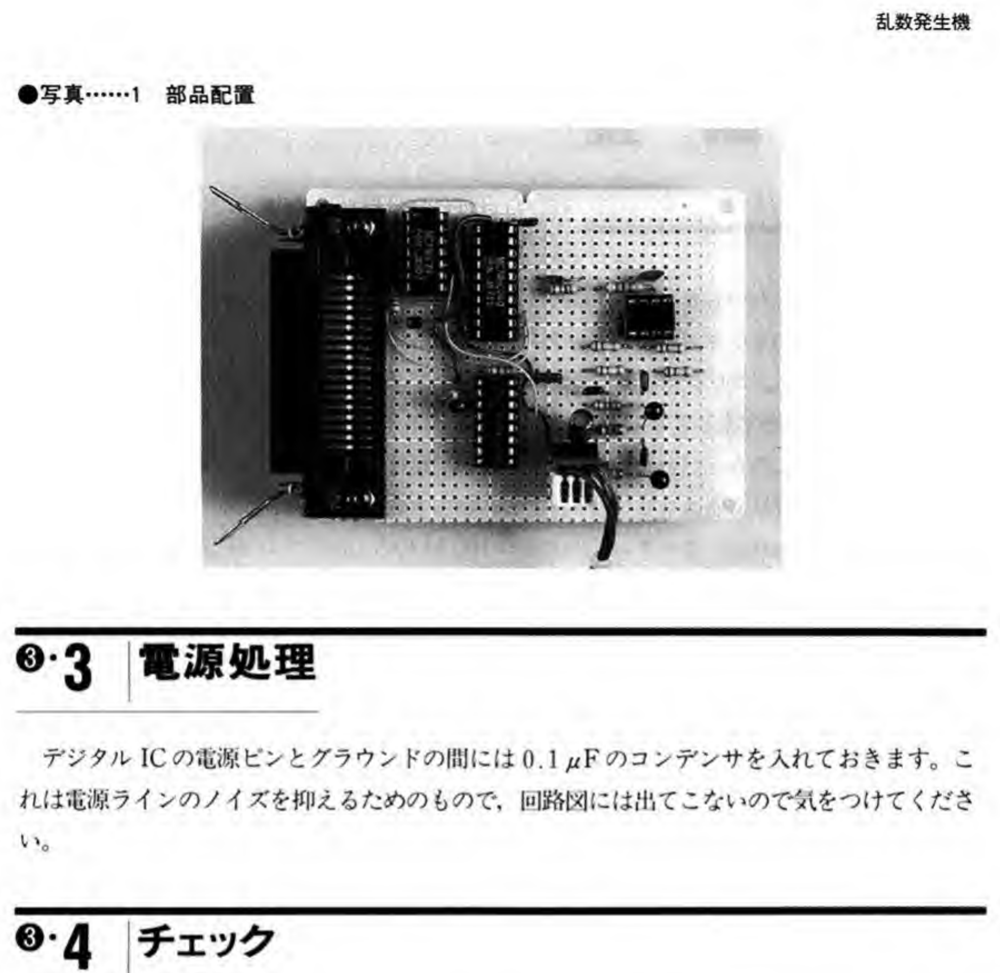

# 3.4 Checking

Once assembly is finished, do not power it up right away. First, use a tester (multimeter) to measure the current draw. With the ICs not yet inserted in their sockets, measure the supply. If the current is 100 mA or more, something is probably wrong, so check again. Next, measure the supply voltage. The voltage between the GND and Vcc terminals of the digital ICs (74HC series) should be 5 V. If it is greatly different, check around the 3-terminal regulator.

If everything is OK, turn the power off once and then insert the ICs. The legs of new ICs are spread wide, so straighten them beforehand against a flat surface. Rather than forcing them in, gently bend the legs at their base so they go in; you may carefully use tweezers for this.

Apply power again and try it. If it is working correctly, the LED connected to the 74HC4020 should keep blinking on and off.

• 4 Adjustment

As I have mentioned before, there are very few places to make adjustments, but if you have a tester, measure the collector voltage of the amplifier's transistor. When measuring, make sure to turn the pattern switch off. Adjust the resistance so that the collector voltage is about 3.3V for both transistors. It should fluctuate at around 1-2 mA, so setting it to about 3-7V should be sufficient. If that doesn't seem right, measure the 1MΩ resistor connected to the base. If there's an oscilloscope handy, it would be beneficial to observe the waveform. If you have a stereo-Zener diode, you can perform the same adjustment as with the op-amp HC 14 input resistance and a 47 pF capacitor in parallel.

Now, more than anything else, measure the oscillation frequency, which affects the degree of disorder. Using a signal generator, measure the oscillation frequency of the HC 4020's 3rd pin (the pin connected to the LED) and its second harmonic frequency. (Multiplied by 16384 times). The value should be observed as a standard. An average oscillation frequency shorter than that of a random noise will make the data scrambled at a higher frequency. Random noise typically tends to oscillate at between 500kHz to 1MHz. Reduce the length of the sampling to get a random value. If possible, sample in packets at 100 ms, preferably within the range of 100–200 ms. Whenever a 1-bit signal is added, add 200 µs (0.2 ms) to the transmitting interval. If it's too difficult to reduce the interval in one go, experiment while adjusting the read-in intervals.

• 5 Reading Software

Finally, connect it to the X68000 main unit. Repeat operations such as adding the "STB" signal as the LSI returns the signal back. If the connected LED to 74HC74 responds randomly, you are ready to proceed to the next step of reading the BUSY signal after sending the STB pulse.

.6 In Conclusion

As mentioned earlier when discussing the quality of the random numbers, you can use this comfortably as long as you pay attention to certain aspects. We were able to successfully use the analogy using a printed circuit board in practical applications, although data was obtained from individual hits. The number of occurrences was quite low, and although the generation of random numbers is still somewhat slow, it serves the purpose well enough. For now, I think we've achieved the initial goal of being able to use the physical random number generator on a personal computer.

.7 Addendum

The transistor used here, 2SC693, could be replaced with something more readily available. Upon investigation, it was found that it could be substituted with 2SC1815-Y (Table 1). The Y rank has an hFE of around 100, so the resistance value remains adequate. There’s no need to change the circuit diagram; simply replacing the transistor with 1815-Y should suffice. The base unit on my end has already been substituted.

● Table 1: Parts List

| Description           | Model No.        | Quantity | Unit Price |
|-----------------------|------------------|----------|------------|
| Transistor            | 2SC963E (or 2SC963F) | 2        | 30         |
| Light Emitting Diode  | TLR102 etc.      | 2        | 30         |
| 3-Terminal Regulator  | 78L05            | 1        | 80         |
| Operational Amplifier | LM318            | 1        | 320        |
| Digital IC            | 74HC14           | 1        | 50         |
|                       | 74HC4020         | 1        | 220        |
|                       | 74HC74           | 1        | 100        |
| Zener Diode           | RD-4.7A          | 1        | 15         |
| Electrolytic Capacitor| 10µF/50V         | 1        | 25         |
| Ceramic Capacitor     | 0.1µF            | 8        | 15         |
|                       | 47pF             | 1        | 15         |
| Resistor              | 1k               | 1        | 5          |
|                       | 3.3k             | 4        | 5          |
|                       | 4.7k             | 1        | 5          |
|                       | 10k              | 1        | 5          |
|                       | 220k             | 1        | 5          |
|                       | 470k             | 1        | 5          |
|                       | 1M               | 1        | 5          |
| Connector             | Amphenol 36 Pin  | 1        | 800        |
| Battery Snap          | For power supply | 1 set    | 40         |
| Dry Battery           | 006P             | 2        | 20         |
|                       | 006P             | 2        | 100        |
| Printing Circuit Board | ICB-504EG (Sunhayato)| 1  | 300        |
| IC Socket             | 14 Pin           | 1        | 15         |
|                       | 16 Pin           | 1        | 15         |
|                       | 20 Pin           | 1        | 20         |

Total: 2660 Yen

● List 1: Sample Program

```
1000 REM Program for Random Number Generator Check
1010 REM Transfer from MZ-2500 Ou-Hu-BASIC
1020 REM bpeek, bpoke functions are necessary. Please use those obtained from computer clubs, etc.
```

Page 200

```
1030 int a,b,i,l,r,x,y,pi,zi: float f
1040 screen 2,0,1,1
1050 cls
1060 print "0: Display random pattern 1: Drunken walk 2: Circumference ratio"::input a
1070 if a=0 then goto 1330
1080 if a=1 then goto 1140
1090 if a=2 then goto 1420
1100 beep:goto 1060
1110 /*
1120 /* Drunken walk: It should always go in the same direction
1130 /*
1140 l=0:r=0
1150 cls
1160 for i=1 to 100
1170 x=39
1180 gosub 1580
1190 locate x,0:print "-"
1200 if a=0 then x=x-1 else x=x+1
1210 if x=0 then l=l+1: locate 0,10:print "Left ="::l;:goto 1250
1220 if x=78 then r=r+1:locate 0,11:print "Right ="::r;:goto 1250
1230 locate x,0:print "#"
1240 goto 1180
1250 next
1260 locate 0,15:print "END"
1270 beep
1280 end
1290 /*
1300 /* Display random graph
1310 /*
1320 /*
1330 screen 2,0,1,1
1340 for y=0 to 199
1350 for x=0 to 639
1360 gosub 1580
1370 if a=1 then pset(x,y,15)
1380 next
1390 next
1400 beep
1410 end
1420 cls
```

```
1430 /*
1440  * By random numbers hit the target, calculate the ratio of the circumference from the probability that falls within 1/4 circle
1450 /*
1460 pi = 0
1470 for i = 1 to 10000
1480   gosub 1670: x = b
1490   gosub 1670: y = b
1500   if x*x+y*y <= 65025 then pi = pi+1
1510   locate 0,0: print using "#.####";pi*4/i
1520 next
1530 beep
1540 end
1550 /*
1560  * Generate a random number from the data and return it to variable a
1570 /*
1580 f = rnd() : if f < 0.5 then goto 1580
1590  * if f < 0.5 then a = 0 else a = 1
1600  * return
1610 bpoke(&HE8C003,0) : bpoke(&HE8C003,1)
1620 a = (bpeek(&HE9C001)/32) and 1
1630 return
1640 /*
1650  * Create an 8-bit random number. Value is returned to b
1660 /*
1670 b = 0
1680 for zi = 1 to 8
1690   gosub 1580
1700   b = b*2+a
1710 next
1720 return
```

● RC Stick

Having a far longer history as an analog stick than the Cyber Stick, the radio-control (RC) transmitter's stick is the basis here: I built an interface circuit that makes an RC transmitter masquerade as a Cyber Stick. The ease of handling of the stick really makes you feel that history behind it.

The appearance of the Cyber Stick, the first full-fledged analog joystick, can be said to have revolutionized the world of games. Because it can be connected as long as you have a standard joystick port, it is now sold with the idea that an analog joystick can be used for games on machines other than the X68000 as well.

Another feature of the Cyber Stick is that, without applying any special tricks to the existing joystick port, it adopts a method of reading 4 channels of analog information and 14 bits of digital (switch) information (the specification says the digital switches are 10 bits, but in practice 14 bits are sent). What can currently be controlled with the Cyber Stick on the market is 4 analog channels and 10 digital bits, so there is still plenty of room for it to be enhanced.

Making use of this data-transmission scheme, I decided to connect to the X68000 an RC transmitter's stick, which could be called the analog stick of the model-hobby world. Of course, while it is connected, the RC transmitter is not modified. The idea is to receive the radio waves emitted by the transmitter, and to send the stick-tilt data obtained from them in the same way as the Cyber Stick. I named it the RC Stick. As for how it is used, since the transmitter has 2 channels, throttle operation is not possible, but I made all of the switches that the Cyber Stick has usable, and added a foot switch as well.

# 1. Selecting the Propo

First of all, you probably don't know what kind of information gets conveyed just by tilting a stick on a propo. In places like model planes, the focus is more on how to build and maintain the model rather than the details of the propo, so it's not very helpful.

Even so, let's address how to actually get and use a propo to understand its capabilities. The propo in question here is FP-T2 NBL, a dual-channel radio control transmitter for general model use, designated as 27 MHz AM. Before purchasing, make sure to verify that it is indeed 27 MHz AM. The majority of radio waves used for toy models are in the CB or ham radio frequency bands. Recently, however, 40 MHz bands have also been commonly used.

For reference, the one I bought cost about 8,000 yen. 

Neither the receiver nor the servo are used, but if you have the same type of propo available, you might be able to use it.

# 2. How Does the Propo Work?

The FP-T2 NBL that I purchased, as far as the box indicates, operates on 27 MHz AM. In AM, signals vary their strength to convey information, also known as amplitude modulation.

Normal household radios also transmit sound in this manner. On the other hand, FM conveys information by varying its frequency rather than its amplitude, which is why the sound volume remains constant while the frequency shifts according to the audio signal, like FM radio or TV audio.

There is also the option of sending data by shifting signals instead of amplitude. Using a simple loop antenna made of wire, you can easily monitor the radiation pattern by bringing it close to the propo's antenna. To be straightforward, amplitude modulation means it sends ON/OFF signals on 27 MHz.

Figure 1: Propo (FP-T2 NBL) Transmission Waveform

In this waveform, you can see how data is transmitted by moving the stick. The method of sending data is relatively simple (Fig. 1).

For the Propo, the electric wave is basically transmitting at a constant strength, and a fixed period of 3. 

The interval where the wave disappears is the time when the stick's tilt is detected. When the right stick (left-right direction) is moved, the point where it disappears from the start to the second point changes. The interval between the second and third points corresponds to the stick's tilt in the up-down direction.

At the radio receiver's end, it takes this pulse width, reads it, and each channel's servo motor adjusts its rotation direction based on the comparison of the pulse width it receives and the standard width stored in itself. By using this, you can control functions such as accelerating or slowing down movements corresponding to the stick's tilt.

In summary, when using a Propo with a radio-controlled device, the flow of information is as follows:

1. Change in stick's tilt
2. Change in the interval where it disappears
3. Change in the width of the pulse generated (electronic wave)
4. Change in the received signal by the receiver
5. Change in the pulse width given to the servo motor
6. Servo motor rotation

By organizing it like this, one can grasp that, in radio control with this Propo, you are given a pulse width to the servo motor, and this is then conveyed to match the specifications of the Cyberstick with the X68000.

(Page 205)

Text at the top:
(This appears to be a partial sentence and might not make complete sense on its own.)

●1 Waveform Measurement

Next, let's take a closer look at the transmission signal of the propeller. First, the period at which data is being sent is approximately 20 ms. It sends roughly 50 times per second. The time it takes to switch to the next pulse is 0.2 ms. If you release your hand from the stick and the stick is in the center, the interval between the two higher/lower positions (pulse width) should be approximately 1.3 ms.

Pulse width: When the stick is at the far left (or top), it stays close to approximately 0.8 ms. Conversely, when the stick is at the far right (or bottom), it remains close to approximately 1.7 ms. 

Because the width changes, next we will examine how the data changes in relation to the X68000 system.

When using the X68000 system, the stick's position on the left (or top) is 00 H, and on the right (or bottom) is FFH. 

For single pulse width counting, 00H is the narrow side and FFH is the wide side. 

The joystick was designed to be in line with analog TV properties, but even in the X68000 system's VRAM XY coordinate system, it recognizes when the stick is at the center and accepts a signal of about 1.3 ms, which includes 0.8 ms and 1.7 ms as average values. Therefore, it accepts the center position correctly even if it's not precise.

●3 Radio Control Joystick Circuit Design

Now that we understand the behavior of the propeller, let's start designing circuits gradually. The design is likely to be somewhat complicated, so we will describe the circuit blocks sequentially.

●3 *1 Propeller Receiving Circuit Design

First, it is necessary to convert the signals received from the propeller into a digital signal that the IC can handle.

Radio Control Stick

There is a receiver attached to the purchased Propo, but it was not much fun to have a black box in my own handmade work, so I decided to make it myself.

Figure 2 shows the receiver circuit. The output of this circuit is a rectangular waveform corresponding to the signal simply received. When the Propo is sending a signal, it will be 1; otherwise, it will be 0. The signal is first selected by the circuit in T1. The filter data is shown in the circuit diagram, but if you can get it, it may be better to use an FCZ Research Institute ham band coil (for 28 MHz).

**Figure 2: Propo receiver circuit diagram**

T1, T2, T3: 10 K bobbin
(1-3) 8 times
⓪-2 4 times
3-6 same
(2-4 (5-6 same))

RxD
0V

The selected signal is amplified by the first-stage 2SK241 and the second-stage 2SC945. The amplified signal is detected by a 1N60, and this is used to switch a second-stage 2SC1815. In the state where there is no signal from the transmitter, the transistor is turned OFF, so the output is at the High level. When a signal comes in, the transistor turns ON and the output becomes Low.

It might be better to add AGC to stabilize the detected output. But since this is not used while flying around like an RC model, the output level is not expected to vary that much, so here I kept it simple by just detecting.

# 3.2 Design of the Received-Waveform Processing Circuit

The job of this section is to take the transmitter's output waveform coming from the receiver and produce a pulse signal for demodulating the pulse-width modulation. The signal sent from the transmitter and output from the receiver is a continuous waveform. To digitize this waveform, it must be sliced into segments. From where, and how much, should it be sliced — by getting an approximate count of how many waves (more precisely, falling edges) there are, you measure the difference between the maximum and minimum counts. Figure 3 shows the idea for this section.

![The job of this section is to take the transmitter's output waveform coming from the receiver and produce a pulse signal for demodulating the pulse-width modulation. The signal sent from the transmitter and output from the receiver is a continuous waveform. To digitize this waveform, it must be sliced into segments. From where, and how much, should it be sliced — by getting an approximate count of how many waves more precisely, falling edges there are, you measure the difference between the maximum and minimum counts. Figure 3 shows the idea for this section.](figures/outside_x68000_1993/outs-000212.png)

Once a slice is detected, the counter is started at its minimum value. When the next slice is detected, the counter value at that moment is latched. A little later the counter is reset, and it is prepared for the next channel's counting.

● Figure ......3    Concept of converting the received waveform into data

Transmitter output
Receiver output (RxD)
Channel control
Channel 1
Channel 2
Counter start
Counter clear
Channel 1 data latch
Counter reset
Channel 2 data latch
Cancel when below the minimum count
Counter start
Reset here because the pulse from the receiver side has disappeared

La Composa Mystique

If this continues, the counter for the cut-off at some point will be mistaken, and the left and right will be reversed, causing confusion. Since this would make the count required, I decided to use a counter where the cut-off is naturally set to a certain period.

As you can see in Figure 1, after sending the 7 tone signals and performing data transmission once, there is a long time before the next data is sent. Using this, if you reset it with a fixed time panel, you won't get lost in the middle, and you will be able to receive the next data correctly.

Finally, the circuit diagram became as shown in Figure 4. Please refer to the timing example shown in Figure 5 and 6 for reference. In this circuit, signal RxD received on the communication path is used as the clear signal (CCLR1) of the counter and the latch signal of the counter value (CL01-CL31).

The ICs used this time are dual-channel type, so we only use two of CL01 and CL11. CH21 and CH31 are expected to enter CH21 and CH31 (TANBL etc.) later in the future.

■ ............. Reception signal processing circuit

● Figure 5  Operation of the Received Waveform Processing Circuit (1)

(Swing to the left)     (Swing up and down)                  5.6ms
RxD  
B  
D  
CTL 01  
CTL 11  
CCLR 1       0.9 ms   (Detection width: 5 ms)

● Figure 6 Operation of the Received Waveform Processing Circuit (2)

280 kHz  
RxD  
A  
B  
C  
D  
CCLR 1  
CL 01

First, the HC14 at the bottom left is an oscillation circuit that determines the overall operation timing of the collision stick by generating a fixed-period clock. The period is adjusted using the pulse width of the probe signals. The width of the pulse sent from the probe is around 0.8ms at its shortest and about 1.7ms at its longest.

Other pulse widths are 1.7 - 0.8 = 0.9 ms. This corresponds to a clock of 0.9 / 256 = 0.00352 ms period, which results in approximately 280 kHz. Using the HC14, arbitrary oscillation periods can be realized, as shown in the diagram.

The number will be 1/CR. Here, assuming the capacitor is 0.001 µF, the resistance will be R=1/(280 KΩ × 0.001 µF), which is approximately 3.6 KΩ. The frequency of the pulse changes depending on the duty cycle, so we decided to use a resistance of 10 KΩ that allows us to adjust the clock frequency accordingly.

After rectifying the waveform from the receiving circuit with an HC14, synchronize it internally with an HC74. The HC 123 on the right side constantly checks through the probe to see if it is active, and if so, it will reset within approximately 5 ms. While the pulse is coming, it moves the counter and generates a value-latch signal. The HC123 below this makes a quick signal with a width of one pulse of HC00, and then makes it into a 1-clock wide pulse with another HC74.

The HC123 below is a circuit that cancels after resetting and the value is latched. This is adjusted so that the pulse generator is always oscillating. The amount of output from HC00 is CR after it falls and the other is reset. The output of HC123 goes low when CCLR1 goes high, and the counter is reset and remains. The next HC00 output signal is a count that shows the rise of the next pulse latch of the counter. The counter waits for the fall of the next HC164 counting pulse that was previously sent to the HC74.

The HC00 and HC614 seems to be continuous (it’s probably fine to go directly down from here). The HC74 is reversed, when HC74 ends with 1, HC123 resets and the period when the output becomes zero is synchronized, and the timing becomes easier. Even though the clock and reset timing are the same, it is because the HC00 division is multiple and is easy to understand.

3.3 Design of Counter Circuit (1)

Next, we will count the waveform from the original rectifier circuit and latch the data, making a circuit. Figure 7 on the next page arranges it.

HC4040 is a 12-stage counter, it is a common counter for the 74LS series. The degrees of freedom are many stages. In this case, we use only the lower 8 bits. The HC4040 is below the HC30 when the counter is FFH, only the rising edge proceeds. The counter is a clock-type falling edge, which advances when going from FFH to FEH, and in the case of FFH, the clock is low level. Therefore, when it becomes FFH...

●Figure 7  Circuit around the counter

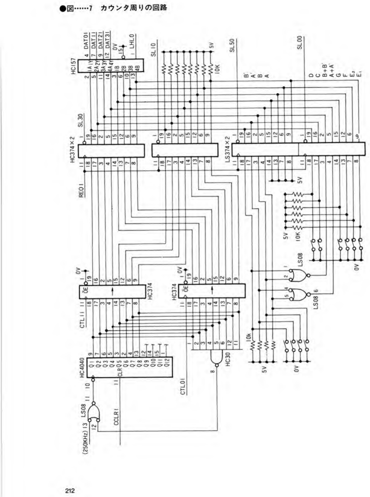

HC4040's clock input can be forcibly fixed at 0. This way, the counter will stop counting, resulting in FFH for the counter. When an interrupt signal is received, the counter value becomes 00H, the HC30 output becomes 1 again, and it restarts counting.

3.4 Designing the Host Interface Circuit

Let's discuss the stages of this part, that is, the interface part with the host, specifically the X68000. Fig. 10 shows the outline of this part.

This program begins operations by receiving the REQ signal from the host and latching the value of the counter at the timing akin to that of Cyber Stick. It seems that the Cyber Stick uses an exclusive IC for this process. Given the considerable time it takes to create a program, we decided to use a general-purpose logic chip to simplify the process.

Cyber Stick allows two choices of transmission speeds, but in slow mode, the CPU load is lower. However, in practice, the communication is conducted at the most rapid rate that the computer's file transfer DMA transmission can handle. If you used the X68000's slow mode, file transfer speed would be limited to the speed on the host's side. For example, if you only use one-third of the 280 kHz clock in the host machine, the timing for data transfer processing would be equivalent to one-third.

Figures 9 and 10 are the conceptual diagrams for processing. Figure 9 shows the outline of data transmission processing, Figure 10 is a detailed timing diagram, and Figure 11 indicates the data format for transmission. REQ0, XACK0, and XHL0 relate to the counter circuits from DAT01 to DAT31.

For the actual timing of the operations, we use the 280 kHz clock produced by the digital signal processor's counter. The Cyber Stick operates by recognizing data from the host and synchronizing the host interface circuit timing accordingly. You might think this is redundant, but in reality, the actual timing difference on the host's side isn't a problem. In fact, the process will complete so long as it falls before the maximum cycle count.

To provide accurate timings, Cyber Stick's drive pulse timing is crucial. Refer to the sample data values in Figure 9, assuming the clock as 280 kHz. Consider these values for better comprehension.

Let's examine the operations of the host interface circuit. The circuit design is somewhat complex, but understanding its workings is advantageous.

**"Figure 8 Host Interface Circuit Diagram"**

Diagram ••• 9 Host Interface Timing Diagram (1)

( ) Indicates the value when the Cyber Stick is in use (in rapid mode)
Figures indicate when the clock is at 280kHz

Diagram ••• 10 Host Interface Timing Diagram (2)

Initially, the device at the end, referred to as REQ 0, is a transmission start request from the X68000. When this becomes 0, the timing starts. Suddenly, it starts timing with the HC 123 one-shot.

In the beginning, this one-shot was not included, but when checking the timing of the Cyber Stick, it was found that when REQ 0 was set to 0, the data transmission started with a delay of 1.5 ms. Therefore, it was included to adjust the timing.

**Fig. 11 Cyber Stick Data Format**

|    | XHL | DAT31 | DAT21 | DAT11 | DAT01 |
|----|-----|-------|-------|-------|-------|
| 0  | 0   | A + A'| B + B'| C     | D     |
| 2  | 1   | E1    | E2    | F     | G     |
| 3  | 0   | Channel #1 Upper|
| 4  | 1   | Channel #2 Upper|
| 5  | 0   | Channel #3 Upper|
| 6  | 1   | Channel #4 Upper|
| 7  | 0   | Channel #1 Lower|
| 8  | 1   | Channel #2 Lower|
| 9  | 0   | Channel #3 Lower|
| 10 | 1   | Channel #4 Lower|
| 11 | 0   | A     | B'    |
| 12 |     | (4 bits of remaining data)|

• The switch is pressed and will be 0 when released it will be 1.
• A + A' (B + B') will be one of A(B) or A'(B').
• The Cyber Stick includes START, G1 and SELECT buttons.
• Adapter data is sent 8 bits at a time per channel and sent to 4 channels.

HC74 produces a signal indicating the middle of the data transmission. When REQ comes, HC123 is delayed and set. When all data transmissions are finished, it is reset. Two data transmissions are made for the timing marked by the arrow in the figure. In the Cyber Stick, data is transmitted twice as a pair. Although the ACK for these two data repeats is also formed in pairs, HC165 is used to generate SZ80 (X68000 response signal). ACK response is counted by HC161 and used to indicate whether it's an odd number or an even number and to show which group of individuals. Once these 12 data transmissions conclude, Y6 is set, completing the initial setup of the HC74. When that is set, the transmission ends.

Page 216

# 3-5 Counter Circuit Design (2)

Now, let's look at the right half of the counter circuit diagram (Diagram 7) that we left off in the previous section. Data regarding the inclination of the stick, which is returned from the left-side latch (HC374), is being read. If the data is not read by the latch at the moment when the REQ signal is returned, there is a risk that the data will change while being transferred to the host, which would be dangerous.

What cross-sectional processing does, is send all the data in such a way that the host (data of the 4-bit channel to be sent to the top nibble) does not change the data series sent from the host to the upper nibble while transmitting. This circuit routes the latch-in signal input in sequence to the upper nibble in series, so you can see switch data in parallel.

All that is required in the end is to latch the data, as the LS374 latch can be used with a signal similar to SL50, and it captures switch data from SL50 as well. This is known as the “interleaved data” on the 12th day of the transmission protocol by Perry himself, but as you can see it does the same on the input side, so it can also carry the data correctly to the host with proper switching.

In this line block, measures are taken to prevent latching hazards using LS series bus drivers. Making and solving this problem will ensure a smooth setup.

# 4 Radio Control Stick Manufacturing

There aren’t any specific essential parts, but I think it would be better to have a switch. If you press a button and it changes to ON, a switch like that might come in handy.

When I lined up at the RC parts section in the autumn Akihabara Hobby & Rescue Center entrance to get joy sticks, I saw that the one I got had both sides pressed out and neatly, it seemed quite professional, so I tried to finish the switch properly at the end.

I used a foot switch that operates well for athletic shoes. It’s not the type of foot switch you typically get in music stores for electronic instruments, but I think it can also be used similarly. Please choose the case or power supplies to suit your preferences, including external switch terminals.

Two would be sufficient for game-use switches and antenna stands etc. 

Since the output terminal attachment is delicate, please handle it carefully. This component particularly handles high frequencies, so try to make the grounding (0 V) pattern as wide as possible. Use a 504 EC grounding braid for this part.

Page 217

Cut out the necessary pattern with a cutter and try to use all the remaining parts as ground. For component placement, consider the flow of signals and make decisions accordingly. 

In the digital section, place one IC between the 5V and GND (0V) lines, and place a ceramic capacitor of approximately 0.1 µF around each two or three ICs. For 74HC series ICs, spikes in the power supply during switching are significant compared to TTL, and noise from this can be significant, so attach capacitors around them.

For empty IC sockets, make sure that the input is not left floating and is either connected to 5V or 0V. Some of my designs leave the unused inputs of the full-wave rectifier block floating; this is because I expect to connect the stray capacitance of each block when making each image creation/adjustment. Future boards can employ this method if there are only one or two unused bits on a single board.

5 Adjustment

After that, first check the power lines with a tester. Check for shorts, excessive current flow, and so on. The driving voltage is 5V. If cutting the digits, connect to the joystick input terminal of the X68000. (Excessive current may flow if cut off and an automatic power output from the X68000 power supply could be interrupted by detecting it). 

First, let's use the built-in coil of the anti-vibration block. A plastic core driver can often be replaced when plastic cracks. Otherwise, it could turn into a dangerous condition if it cracks. 

Connect a wire about 10cm to the antenna terminal. Measure with a tester (around the condenser on the IN60 card side) and adjust the core until peak force is reached. Try to find the position where the tester peaks in two places around the coil inside the case. Once the core is properly located theoretically, connect it again using traditional methods until confirmation. After adjustment, turn off the PRO switch and make sure there is no problem with full reception antenna structure.

Page 218

R/C Stick

First, shift the core slightly off the highest point so that it does not oscillate. Since it is doubling the frequency at the same frequency as the radio waves being received, it is in fact somewhat prone to oscillation.

Next, proceed to adjusting the digital section. Enter the external function written in assembler in Listing 1 and the BASIC program in Listing 2. For the trimmer potentiometers on the board, set them roughly to the center for now. When you start the program, the read data is displayed. If the message "host interface" appears, check around the host interface circuit. Once some kind of input data is displayed, first check whether the switch inputs are being read. If the switch you press is read correctly, you can consider that the host interface is at least working correctly.

Once the area around the host interface is working well, next move on to adjusting around the counter.

Toggle the switches on the proportional controller (propo) and confirm that the data changes. Set the stick's trim levers to the center. The data should be roughly graphable.

Tilt the stick to its minimum value. Adjust the trimmer potentiometer of the minimum-count control so that the count advances. Next, take your hand off the stick to put it in the center position, and adjust the trimmer potentiometer of the oscillator so that the switch value comes to approximately $80. Tilt the stick to the side where the value becomes maximum, and confirm that the read value becomes $FF. If it does not, lower the oscillation resistance, and this time adjust the trimmer potentiometer of the minimum-count control so that the center value becomes $80. With that the adjustment is essentially complete, so confirm that it oscillates properly. Per-channel offsets can be adjusted with the propo's trim levers, so you don't need to be too nervous about it. Set the stick's trim levers to the center.

If you have a synchroscope, adjustment will become much easier. While watching the waveform when the stick is at its minimum value, adjust the trimmer potentiometer of the minimum-count control resistance, then adjust the oscillation frequency so that the center comes to around $80, and you are essentially done.

●6  Usability

I tried out the finished R/C stick with After Burner to see how practical it really is. Since there is no lever corresponding to the throttle, it ends up being at full throttle all the time, which is a bit of a problem, but the operability itself is quite good. As expected, when it comes to the feel of an analog stick, the radio-control propo, with its long history, has the edge. The length of the stick, the stiffness of the spring, the position of the stick

Placement, etc. is relatively good.

●7 Conclusion
The initial goal of using the interface of the Cyber Stick to connect to the Robo was achieved. We found several functions recognized by the Cyber Stick, such as the phantom analog channel and 12-bit data including analog data on the interface. If you utilize the host interface this time, it can be said that it is an expansion of unlimited possibilities, such as connecting with A/D converter.

If you use all the analog channels as switches, you can read as many as 48 switches. Normally, you would use 8 for standard joysticks. It might also be interesting to use two joysticks for a 16 simultaneous input array battle game.

●LIST 1 ...... Remote Control Stick Check Program
```
1000 /*-----------------------------------------*/
1010 /*- Remote Control Stick Check Program -*/
1020 /*-----------------------------------------*/
1030 /*- 1990-02-11 written by M. Kuwano -*/
1040 /*-----------------------------------------*/
1050 /*- No rights reserved. -*/
1060 /*-----------------------------------------*/
1070 /*-----------------------------------------*/
1080 char c(5)
1090 int stat, px, py, pz, pt
1100 px=0; py=0
1110 pr_info()
1120 astset()
1130 repeat
1140 stat = astick(c)
1150 disp_val(stat)
```

```
1160   disp_pos()
1170   until inkey$(0)=" "
1180   astrst()
1190   end
1200   func disp_val(stat:int)
1210   int i
1220   locate 0.9
1230   if stat<>0 then color 2: print"ERROR" else color 3:print"READY"
1240   locate 0,8
1250   for i=0 to 3
1260       print right$("0"+hex$(c(i)),2);"  ";
1270   next
1280   i=&H80
1290   repeat
1300       pr_onoff(c(4) and i)
1310       i=i/2
1320   until i=0
1330   i=&H80
1340   repeat
1350       pr_onoff(c(5) and i)
1360       i=i/2
1370   until i=0
1380   endfunc
1390   func pr_onoff(s:int)
1400       if s=0 then print"ON  "; else print"OFF  ";
1410   endfunc
1420   func pr_info()
1430       screen 2.0.1.1
1440       console ..0
1450       color 3
1460       locate 0.5:print"To finish, press the space bar"
1470       color 1
1480       locate 0.7
1490       print"#1  #2  #3  #4  A+A' B+B'  C   D   E1  E2  F   G   ?
```
?    ?    ?    A   B   A'  B'"
```
1500       box(349,239,349+257,239+257,15)
1510       box(49,239,49+257,239+257,15)
1520   endfunc
1530   func disp_pos()
1540       line(350,240+py,350+255,240+py,0)
```

```
1550 line(350,240+c(0),350+255,240+c(0),15)
1560 py=c(0)
1570 line(350+px,240,350+px,240+255,0)
1580 line(350+c(1),240,350+c(1),240+255,15)
1590 px=c(1)
1600 line(50,240+pz,50+255,240+pz,0)
1610 line(50,240+c(2),50+255,240+c(2),15)
1620 pz=c(2)
1630 line(50+pt,240,50+pt,240+255,0)
1640 line(50+c(3),240,50+c(3),240+255,15)
1650 pt=c(3)
1660 endfunc
```

● List ... 2  Analog Joystick Reading Routine

* -------------------------------------------------------------------------------------------------- *
*                  Analog Joystick (Slider Stick) Reading Function                                  *
* -------------------------------------------------------------------------------------------------- *
*                  1989-06-17  M. Kuwano, No rights reserved                                        *
*                  1990-02-11  Changed to single & double rotation handling                         *
* -------------------------------------------------------------------------------------------------- *
*                  Calling example:                                                                *
*                      char c(5)                                                                   *
*                      astick(c)                                                                   *
* -------------------------------------------------------------------------------------------------- *
*                  Input data:                                                                     *
*                            c(0) ... Right stick left-right                                       *
*                            c(1) ... Right stick forward-back                                     *
*                            c(2) ... Left stick forward-back (throttle)                           *
*                            c(3) ... Reserved stick (future use?)                                 *
*                            c(4) ... Trigger button                                               *
*                            c(5) ... Trigger button                                               *
* -------------------------------------------------------------------------------------------------- *
*                  Please ensure the array size is at least 6 bytes.                               *
*                  Size checks are not done, so be sure to write until the end.                    *
* -------------------------------------------------------------------------------------------------- *
*                  Always an interpreter/compiler shared routine                                   *
* -------------------------------------------------------------------------------------------------- *

R/C Stick

*------------------------------------------------------------------
```
                .include       doscall.mac
                .include       fdef.h
                .globl         _astick
                .globl         _astset
                .globl         _astrst

IOCS           equ       $0f

PPI_PORT_A     equ       $e9a001
PPI_PORT_B     equ       $e9a003
PPI_PORT_C     equ       $e9a005
PPI_CWR        equ       $e9a007

RQ_ASSERT      equ       $8
RQ_NEGATE      equ       $9

TIME_LIMIT1    equ       1000
TIME_LIMIT2    equ       100
                .text
                .even
```
*
* Information Table
*
*
```
                        .dc.l   AS_INIT
                        .dc.l   AS_RUN
                        .dc.l   AS_END
                        .dc.l   AS_SYS
                        .dc.l   AS_BRK
                        .dc.l   AS_CTRL_D
                        .dc.l   AS_RES1
                        .dc.l   AS_RES2
                        .dc.l   PTR_TOKEN
                        .dc.l   PTR_PARAM
                        .dc.l   PTR_EXEC
                        .dc.l   0,0,0,0

AS_RES1:
AS_RES2:
```

```
AS_END:
AS_BRK:
AS_CTRL_D:
AS_INIT:
AS_RUN:
AS_SYS:
                rts
```
*
* Token Table
*
```
PTR_TOKEN:
                .dc.b    'astick'.0
                .dc.b    'astset'.0
                .dc.b    'astrst'.0
                .dc.b    0

                .even
```
*
* Parameter Table
*
```
PTR_PARAM:
                .dc.l    ASTICK_PAR
                .dc.l    ASTSET_PAR
                .dc.l    ASTRST_PAR
```

*
* Parameter ID Table
*
```
ASTICK_PAR:
                .dc.w    aryl_c
                .dc.w    int_ret

ASTSET_PAR:
                .dc.w    void_ret

ASTRST_PAR:
                .dc.w    void_ret
```

*
* Function Address Table
*

Radio Control Stick

```
PTR_EXEC:
                .dc.l           astick
                .dc.l           _astset
                .dc.l           _astrst
```
*
*       Stack buffer
*
```
SPBUF:
                .ds.l           1
                .even
```
*
*       Read analog joystick (for interpreter)
*
```
astick:
                movea.l         12(sp),a1
                lea             10(a1),a1
                move.l          a1,-(sp)
                bsr             _astick
                addq.l          #4,sp
                moveq.l         #0,d0
                rts
```

*
*       For analog joystick, set PC4 to 1
*
```
_astset:
                clr.l           -(sp)                   *       SPBUF = _SUPER(0);
                dc.w            _SUPER
                addq.l          #4,sp
                move.l          d0,SPBUF
                movea.l         #PPI_CWR,a0             *       *ppi_cwr = RQ_NEGATE;
                move.b          #RQ_NEGATE,(a0)
                move.l          SPBUF,d0                *       _SUPER(SPBUF);
                bmi             astset_already_super
                move.l          d1,-(sp)

                                                                            225
```

*
* After the program ends, if PC 4 is not returned to 0,
* some digital-mode software might cease to work.
*
*
* Analog joystick reading (for compilation time)
*

Radio Control Stick

```
                move.l          d0,6(a0)
                move.l          4(sp),d0
                move.l          d0,-(sp)
                bsr             aj_compile
                addq.l          #4,sp
                lea             AS_RETVAL,a0
                move.l          6(a0),d0
                rts
```

*
*       Analog joystick data acquisition
*
*       a0 Buffer_pointer
*       a1 PPI_PORT_A
*       a2 PPI_CWR
*       d0 data
*
*       d1 data
*       d2 Loop counter
*       d3 Timeout counter
*
get_astick:                                             *       get_astick() {
```
                clr.l           -(sp)                   *           SPBUF = _SUPER(0);
                dc.w            _SUPER
                addq.l          #4,sp
                move.l          d0,SPBUF
                move.w          sr,-(sp)                *           PUSH(SR);
                ori.w           #$0700,sr               *           disable_trap();
                lea             AS_TMP_BUF,a0           *           buffer_pointer = AS_TMP_BUF;
                movea.l         #PPI_PORT_A,a1          *           ppi_port_a = PPI_PORT_A;
                movea.l         #PPI_CWR,a2             *           ppi_cwr = PPI_CWR;
                move.w          #5,d2                   *           loop_counter = 5;
                moveq.l         #0,d0                   *           joydata = 0;
                move.w          #TIME_LIMIT1,d3         *           timer = TIME_LIMIT1;

                                                                            227
```

LIMIT1
```
        _astick_0:                                      *           do {
                move.b          #RQ_ASSERT,(a2)        *               *ppi_cwr = RQ_ASSERT;
        _astick_1:
                move.b          (a1),d0                *               while ((data = *ppi_port_a & 0x60) != 0) && timer--)
                move.b          d0,d1                  *                   ;
                andi.b          #$60,d0
                dbeq            d3,_astick_1
                bne             _astick_timeout        *               if (!timer) goto _astick_timeout;
                move.b          d1,(a0)+               *               *buffer_pointer++ = data;
                move.b          #RQ_NEGATE,(a2)        *               *ppi_cwr = RQ_NEGATE;
        _astick_11:
                btst            #5,(a1)                *               while(!(*ppi_port_a & 0x20) && timer--)
                dbne            d3,_astick_11          *                   ;
                beq             _astick_timeout        *               if (!timer) goto _astick_timeout;
        _astick_12:                                     *               while((data = *ppi_port_a & 0x40) && timer--)
                move.b          (a1),d1                *                   ;
                btst            #6,d1
                dbeq            d3,_astick_12
                bne             _astick_timeout        *               if (!timer) goto _astick_timeout;
                move.b          d1,(a0)+               *               *buffer_pointer++ = data;
                dbra            d2,_astick_0           *           } while (loop_counter--);

                moveq.l         #0,d3                  *           retstat = 0;
        _astick_exit:
                move.w          (sp)+,sr               *           sr = POP(); /* restore interrupt flag */
```

Radio Control Stick

```
                move.b          #RQ_NEGATE,(a2)        *           *ppi_cwr = RQ_NEGATE;
                move.l          SPBUF,d1               *           _SUPER(SPBUF);
                bmi             _astick_already_super
                move.l          d1,-(sp)
                dc.l            _SUPER
                addq.l          #4,sp
        _astick_already_super:
                move.l          d3,d0
                rts                                     *       }

        _astick_timeout:
                moveq.l         #1,d3                  *           data = 1;
                bra             _astick_exit
```
*
*       Analog joystick data editing
*
aj_compile:                                             *       aj_compile(pack_data) {
```
                movea.l         4(sp),a0
                lea.l           AS_TMP_BUF,a1
                move.b          2(a1),d1               *           pack_data[0] = joy_raw_data[6] | (joy_raw_data[2] << 4);
                andi.b          #$f,d1
                lsl             #4,d1
                move.b          6(a1),d2
                andi.b          #$f,d2
                or.b            d2,d1
                move.b          d1,(a0)+
                move.b          3(a1),d1               *           pack_data[1] = joy_raw_data[7] | (joy_raw_data[3] << 4);
                andi.b          #$f,d1
                lsl             #4,d1
                move.b          7(a1),d2
                andi.b          #$f,d2
                or.b            d2,d1
                move.b          d1,(a0)+

                                                                            229
```

                move.b        4(al).dl             *     pack_data[2] = joy_ra
w_data[8] | (joy_raw_data[4] << 4):
```
                andi.b       #$f.dl
                lsl          #4.dl
                move.b       8(al).d2
                andi.b       #$f.d2
                or.b         d2.dl
                move.b       d1.(a0)+

                move.b        5(al).dl             *     pack_data[3] = joy_ra
```
w_data[9] | (joy_raw_data[5] << 4):
```
                andi.b       #$f.dl
                lsl          #4.dl
                move.b       9(al).d2
                andi.b       #$f.d2
                or.b         d2.dl
                move.b       d1.(a0)+

                move.b        0(al).dl             *     pack_data[4] = joy_ra
```
w_data[1] | (joy_raw_data[0] << 4):
```
                andi.b       #$f.dl
                lsl          #4.dl
                move.b       1(al).d2
                andi.b       #$f.d2
                or.b         d2.dl
                move.b       d1.(a0)+

                move.b        11(al).dl           *     pack_data[5] = joy_ra
```
w_data[10] | (joy_raw_data[11] << 4):
```
                andi.b       #$f.dl
                lsl          #4.dl
                move.b       10(al).d2
                andi.b       #$f.d2
                or.b         d2.dl
                move.b       d1.(a0)+

                rts                             *  }
```

                     .even

RC Stick

```
AS_TMP_BUF:
                .ds.b           12
AS_ACK_BUF:
                .ds.b           5
                .even
AS_RETVAL:
                .dc.w           0
                .dc.l           0
                .dc.l           0
                .end

                                                                              231
```

COLUMN

Data Transmission of Cyber Stick

Let’s touch on how to transmit data from the Cyber Stick. The only thing output from the host side is the REQ signal. The Cyber Stick sends this along with the other six axes data to the host. Data transmission is done while checking the handshake, but the REQ is received by the Cyber Stick and further transmission is indicated [unclear].

LHL 0 indicates whether data is from the nth controller or not. Since XACK is set to indicate whether data is from DAT 0-DAT 31 axis, the host reads the data sequentially.

The [transmission] format is as follows: the Cyber Stick's specification has axes A+A', B+B' being read as single entities A and B, but they are read separately in controller software. F, G reference the specification in detail, where Cyber Stick has START and SELECT switches.

The axis data is read 12 times; this was the fault in the implementation. In our program, one controller sends axis data 12 times, which is sufficient for smooth operation, without causing trouble with the Adaptor Partner. Synchronizing checks were done to remedy the timing of the Cyber Stick – thorough verification followed. Reading the list of drivers confirmed that using the 12 reads and error processing was also effective. Thus, adapting to work with the Adaptor Partner should be crucial.

Finally, a change in the route allowed smooth motion. (Since having fewer transmissions is easier), it now works efficiently. Though, what occurs during 12th transmissions remains somewhat uncertain. For the drivers list, it only shows as read and essentially unused. Future expansions may be anticipated.

Universal Remote Control

We tried to realize on the X68000 a universal remote control that can record and play back the waveforms of the infrared remote controls built into all kinds of devices. By linking several devices together, or combining it with the main unit's timer function, all sorts of applications can be imagined.

As infrared remote controls have come to be used in all kinds of equipment, before you know it your room is full of remote controls. Recently, with the increase of AV gear that comes with infrared remotes, even the very person who assembled the system can no longer tell which remote control to use for what. To improve this situation even a little, products have been released that can record the remote-control waveforms of various manufacturers so as to be able to transmit them. Couldn't we do something similar with the X68000? If the X68000 could record the waveforms and then combine and output them, it seems we could do something quite interesting.

1. Experimenting with the Infrared Remote Control

First, we have to understand by what method an infrared remote control exchanges data. We decided to build a simple light receiver using a phototransistor and investigate the output waveform of a remote control. For the phototransistor we used Toshiba's TPS601A. It has a convex lens on the top of the device, giving it strong directivity, so external influences are reduced. (Continued)

The schematic diagram of the fabricated photodetector is shown in Figure 1. The phototransistor symbol indicates the base of the transistor gets illuminated by light; such as the shape in the figure, when light hits it, current flows through the collector and emitter.

■ Figure —— 1: Schematic diagram of the fabricated photodetector.

The method of determining the resistance value connected to the collector of the phototransistor requires some attention. If the resistance is made too large, the potential can be roughly pulled down to 0V, increasing sensitivity, but conversely, if the resistance is too small, the sensitivity will be adversely affected, and if too large, dark current (current flowing without light) will flow significantly. To counteract this, the device may become insensitive. If the resistance value is reduced, the photo-transistor won’t pull down the power supply voltage, but if the maximum collector dissipation is exceeded, the phototransistor may be damaged. Therefore, it is cautious to set the resistance to a smaller value.

The datasheet shows that the maximum collector dissipation of the TPS601A is 150 mW. For instance, if the power supply voltage is 5V, you’ll need to make sure that more than 30 mA (150 mW / 5V) doesn’t flow. The current limit is calculated simply by not applying a load to the phototransistor when it is not illuminated. The maximum collector current (IC) is 50 mA, considering safety margins. From VCE (sat) = 0.5 V, if the supply voltage is 5V, then (5-0.5)/50 = 0.09 (KΩ), which is about 90 Ω. Calculating back from the allowable current boundary (the calculation basis is IC = 50mA, considering common emitter saturation voltage). The collector-emitter voltage (VCE (sat)) is roughly 0.5 V. Therefore, if the power supply is 5V, with (5-0.5)/50 = 0.09 (KΩ), 90 Ω is about the boundary value. We should calculate the resistance value for the laboratory to examine, it's not difficult.

0.1 Measurement

First of all, let's try examining the waves of the remote control with the CZ-600DE remote controller.

While observing the output with an oscilloscope, press the switch on the remote control and adjust the distance. At that time, for the RS-232C, I was assuming that the waveform would toggle the infrared ON/OFF at a periodic interval of 1/0, but the actual waveform was quite different. Upon closer inspection, it seemed to be modulated at a frequency of around 33 kHz.

Certainly, this kind of modulation is stronger against external noise. Even when I tested a completely different manufacturer's video remote control, it was modulated at approximately 33 kHz, 
and its ON/OFF toggling was also similar. When I checked cheap versions selling at certain shops, they also said 38 kHz. So, it seems modulation within this frequency range is a common approach to avoid noise.

Since the base frequency should not be too close, to avoid seeing pulse noise, I decided to change the IR light frequency from 330 to a more appropriate 38 kHz, as verified by remote control.

0.2  Experiments on the Emission Side

To use the signal received as it is for testing, like a dedicated remote control, I decided to create a repeater remote control. Figure 2 shows the configuration of the repeater built for testing. The infrared photodiode uses a TLN105A. Since the maximum current rating of TLN105A is 100 mA, with margin considered, we decided to use around 30 mA. The forward voltage (VF) characteristic of this photodiode is around 1.26 V, and checking the transistor's VBE characteristic, the resistance value is derived as:

(1.26 V - 0.75 V) / 30 mA ≈ 0.017 (kΩ), which rounds to about 100 Ω. The transistor's maximum collector current is 150 mA, and its collector loss is 400 mA, significantly higher and should be verified until confirmed with actual calculations.

Figure 2 Repeater Configuration

(Labeling in the diagram)

IR Repeater

When the repeater's infrared light emitting diode is pointed at the display and the phototransistor at the remote control, turn on the power switch on the remote's upper left. There will be a loud "chappi vean" sound as the power turns on. The channel switching will also respond. If the repeater's power is turned off, it will definitely stop working since the repeater does not connect directly.

3. Interface with the Main Body

Since it acts as a repeater, the X68000 should be placed between the receiver and the light emitting diode. We decided to use the joystick connector to connect to the main body. The connector is slightly larger, but generally uses a standard 9-pin D-SUB connector. We created a pin assignment for the eight output pins of the joystick port: pins 1, 2, 3, and 4 are dedicated to input, pins 6 and 7 are dedicated to output, and pin 8 is dedicated to input/output. The fifth pin is +5V, and the ninth pin is GND. Considering that the data output from the first pin appears to the CPU as data read from RAM, we decided to use the eighth pin for data output and input.

4. Connection with X68000

33 kHz is a relatively fast speed, so we need to be cautious about data retrieval. To retrieve data reliably at 33 kHz, the data must be retrieved at least twice as fast, at 66 kHz. In other words, data needs to be retrieved at intervals of 1/66 kHz = 0.015 ms. Retrieval cannot start within 15 µs. For MOVE commands between memory and memory at 10 MHz on the X68000, it takes about 22 cycles, which translates to 2.2 µs (22 × 0.1 µs). This means it is not possible to start retrieval within 15 µs, but it cannot be helped. While it cannot be guaranteed, the goal is to enter data consistently within 15 µs. Since the LED indicator initially lights up, the output will cease once the 8255 initialization is complete.

At any rate, we decided to test using the joystick port with hardware, software, and scope. The resulting circuit is shown in Fig.3. The 8-bit output signal is connected to the X68000 joystick quick interface with 10 KΩ and 5 V. After the 8255 reset, outputs will also stop, due to factors such as timing or high impedance. Poor contact with the LED on this ground is because the output will become high after the initial 8255 initialization.

Note that some specific technical terms and details may need additional context understanding to work accurately.

Fig. 3 Infrared Remote Control Interface (Experimental Version)

I have tried this for now. By creating an external function, setting an array, and then reading it, I initialize it to output continuously. I've read the switch shape of the distant remote control and once I've read it, I will continuously output it. In this way, turning the CZ-600 remote control to the right will prevent it from moving properly. Conversely, turning it to the left will turn it off. This works as if it's moving reliably.

5-5 Extend Distance

It started moving, but I did not know how far it would go, so I experimented. The result wasn't bad, but it was around a limit of 1m. Normally, an infrared remote control will work fine from 5m or so, but in this case, due to the bad sensitivity of the infrared receiving module, it stops at about 1m. To increase LED's current to maintain output, it is necessary to investigate step-up. However, an LED current beyond the maximum current rating shouldn't be used for long periods. Looking at the datasheet again, the "Pulse Forward Voltage (IFP)” can be used up to 1A. In this case, this value...

Attention: The pulse width is 100 µs, and the repeat frequency is 100 Hz. To clarify, this means that if a pulse is sent at 100 µs, it will pulse 100 times in 1 second. In the case of remote control signals, which send data at a frequency of around 33 kHz, a switch is made every 1 µs. Since it takes time to send data after receiving it, the stipulated time is 100 µs for the next data transmission.

#2 Circuit Design

Ultimately, in the circuit diagram of Figure 4, the inverter in Figure 4 was changed from 74HCT240 to 74HC14. This change was necessary to create the CR timing circuit with C-MOS Schmitt Gate. The received signal is shaped into a clean pulse by a resistor, capacitor, and diode, with the final pulse sent to an infrared LED. The 4.7 Ω resistor connected to this is negligible. Let's explain about this briefly.

# 2-1 Continuous Lighting Prevention Circuit

Suspicious resistors, capacitors, and diodes are connected to prevent continuous lighting for up to 100 µs. The basic configuration of the attachment circuit is the same as Figure 3. When input is received, the 74HC14 output is 100 KΩ, passing through the capacitor of 1000pF to prevent rapid charging. If the voltage at this capacitor exceeds the threshold voltage of the 74HC14, the output of the 74HC14 will be inverted to 0, turning off the transistors and dissipating the charge in the infrared diode. This process takes nearly CR seconds, about 100Ω x 10^-9 x 100 x 10^-6 = 100µs.

If the input continues for more than 100 µs, the output will not return until the input stops for 100 µs. At that time, the capacitor will discharge rapidly through the diode (1S1588). When it stops, the capacitor voltage will be reset via the diode.

The page number in the lower-left corner indicates that this is page 238 of a document.

● Figure 4   Infrared Remote Control Interface (Final Version)

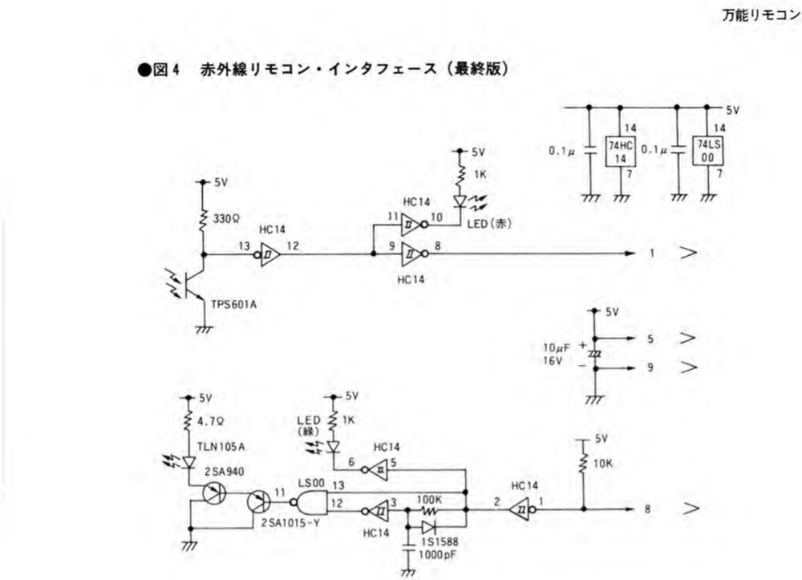

[Circuit diagram]
TPS601A, HC14, LED (red), TC74HC..., TALS..., 0.1µF, 1kΩ, 330Ω, 10µF 16V,
TLN105A, 2SA1015, LS00, 2SA940, 1S1588, 100kΩ, 100Ω, 1µF, 1000pF, 10kΩ
Signals: 1, 9, 8

[Pinout / part outline labels]
2SA1015         9-pin D-SUB        2SA940        1S1588        TPS601A        TLN105A
                (1 — 5 / 6 — 9)                  ▷│ ← marking                  K = cathode marked
E C B           [connector]        B C E         (band side)                  E C B          A K (K is the short lead)

2.2   Light-Emitting Diode Drive Circuit

The TLN105A is driven by connecting the transistors in a Darlington configuration. This is because, in order to pass a large current through the light-emitting diode, a single 2SA1015 was no longer sufficient. The TLN105A (continued)

 3. Retest

I decided to retest this circuit. I tried to match the data read with the outputs. Although the TLN105A has a direction it faces, the TV suddenly responded. I reluctantly had to bring out my X68000, but I couldn't measure the distance. It felt like the main unit was getting warm when I continued to press the remote.

 3. Points to Note in Production

Let's complete it as a production circuit. After all, it's almost a 100 kHz digital signal, so there is almost no one to argue its practicality. I use IC sockets for handmade ones, IC sockets, transistors, infrared LEDs, and infrared phototransistors. It costs less and is more reliable to buy than to attach ICs directly, so it won't break even if made cheaply. If you pay attention to heat, some people may still want to do it on a breadboard, but as long as you don't want to kill the IC with heat. Let's try it (I tried it myself with a deliberate intention, but it didn't break).

 3.1 LED

Since LEDs are used only for monitoring, you can attach your favorite ones. I use red and green.

...However, since we have to flow a current at about the same brightness so that it lights up, a little more current must be passed to the LED side. Since the IOL of the HC14 is only 4 mA, both the red and green LEDs were set to 1 kΩ. The output of the LS00 is to spare, so it is fine to use that side and reduce the current-limiting resistors further.

3.2   Case

For the case we used a small scroll case. We found it at the Akizuki electronics shop in Akihabara for 90 yen each. When you open this case to fix it to the board, the screws pop out from the back, so it is hard to handle when you do it. So we glued the nuts to the case with instant adhesive in advance, and that work was a relief.

You also cannot avoid opening holes to pass the connection cables that go to the X68000 main unit. To make clean holes, you have to open them slowly with a hand drill, but the cable fixing comes loose, so we thought of straightening a clip, heating it red-hot over the gas burner, and opening the holes by repeatedly melting through. It seems some people make holes with a kiri or a small screwdriver, but that turns it into hot work. The melted scroll material sticks to the tool, so it is better not to do it that way.

4   Sample Program

It looked like rather enjoyable hardware to build, so we also made some software. As for the data read/write portion, it is written so as to be fairly indifferent to timing, like calculations done with some leeway. So even when assembled, it links as a module relative to X-BASIC, and there is also no need to specify the assembler option (covered in another chapter).

The part that processes the read data is all written in X-BASIC, so it also works as is under the interpreter. However, displaying the waveform compression takes a fair amount of time, so use the compiled version whenever you can.

This program has two buffers: a display buffer used for displaying the waveform, and a copy buffer used for copying data and for file input/output. As for remote-control reading, the read waveform goes straight into the display buffer, so you can check on the spot whether the read succeeded; all other input/output is performed with respect to the copy buffer.

Now then, let's run the program.

4.1   Select Mode

When you run it, first 8 × 8 = 64 rectangles appear. Let's call this screen the Select Mode screen. The bottommost square corresponds to a file. If data is registered there, the square exists as a filled (recorded) square, and the file's handle name is registered (ch1 and up).

When you move the mouse to the edit (pencil) icon at the right of the screen and press the left button, the edit-mode lid opens. Pressing the left button here, or pressing the right button, takes you into Edit Mode.

4.2   Edit Mode

When you enter Edit Mode this way, the contents of the display buffer are shown at the waveform display area on the left of the screen. The waveform that was placed in the display buffer by reading is displayed here. At first glance it looks like a 30-channel logic analyzer screen, but the actual data is attached to channel 1. The contents of the display buffer can be enlarged/reduced to any magnification at any position. As a result, the display buffer has 32768 clocks' worth of capacity.

The icon group at the top of the screen, from the left: remote waveform read (eye), remote waveform output (arrow), waveform playback (square wave), file writing (file), file reading (book), and return to Select Mode (door at the right). You move the mouse cursor over one and press a button to execute it. However, buttons that cannot be enabled are in an unpressable state, and even right-clicking does nothing.

The small ones to the right of the waveform are the scroll and enlarge/reduce display icons. The numbers below them show the enlargement/reduction factor of the waveform display, indicating the magnification of the X-axis with plus/minus. If you click while watching the numbers change, you can easily understand the relationship between the numeric change and the change in the waveform display, I think.

Now, when you press the left mouse button at the waveform display, the selected waveform is underlined and a cursor appears (we'll call it the O cursor). If you move the mouse as is, another cursor (the X cursor) follows the mouse and moves around. Then you press the right button. The mode switches — NULL, SET, RESET, COPY, PASTE, JUMP — are displayed at the very bottom of the screen.

NULL does nothing. SET makes the interval from the O cursor to the X cursor the LED-on state (the state corresponding to the waveform offset width). RESET makes the interval between the two cursors the LED-off state (likewise the state that goes to the lower side). COPY transfers the data of that interval to the copy buffer. PASTE (which has unfortunately been displayed as "PAST" on the screen) copies the contents of the copy buffer to the data buffer starting from the O cursor position. JUMP moves the O cursor position so that it comes to the lower-right corner of the screen.

4.3   Trying It Out

As for how to use it: first, to read data, shape the waveform displayed on the screen with SET and RESET, capture it with COPY if necessary, try outputting it with the output icon, and if the target device works well, the flow is to dump the buffer contents to a file. So let's start with reading a signal from the remote control. The plan is to load data into the intelligent remote control we've described elsewhere.

First, enter a channel code and click the read icon; the open part of the icon closes. This is the read-standby state. Hold the remote control you built facing the ready-made remote control and have it read the signal. The LED of the photodetector section blinks, so it seems a signal has come in, and the read waveform is displayed on the screen (Photo 1).

Next, take this waveform in with copy & paste. Using the method described earlier, set the range with the O cursor and the X cursor and execute COPY. To COPY the entire read waveform data, enlarge the waveform using the enlarge/reduce icon. Here, if you try outputting the waveform using the output icon, you can confirm whether the target device operates.

For example, suppose you read a channel-code signal from a TV remote control: first point the remote control you built at the TV and click the output icon. If the channel display then appears on the TV screen, it is working properly (if it doesn't seem to function, redo the waveform reading). Once you've confirmed that the correct waveform is in the buffer, next you write it back (Photo 2). When you click the write-back icon, after the file it asks for the handle name.

● Photo …… 1 Edit Mode

● Photo …… 2 The waveform read into the copy buffer is displayed

This handle name will be the text data displayed in the rectangle that appears in Select Mode. Let's include the function name of the waveform data (such as the channel number). The file name is fixed, and the rectangle displayed at the top left in Select Mode is rmdat.000. It progresses in the following order: rmdat.001, rmdat.002, and finally to rmdat.063 on the far right. As mentioned earlier, a total of 64 files can be registered. Once the writing is complete, the length of the rectangle in Select Mode

● Photo ...... 3 Select Mode

Make sure that the frame is in place and the handle name is clearly visible (Photo 3a).
In this way, select the data registered in the select mode (click on the frame surrounding the handle in white). When you click, the data will be read from the disk and the remote control will be activated. At this time, the data also enters the COPY buffer. If you modify it in select mode, you can save it without any special preparation.
SET, RESET, COPY, or data-related information will not suddenly change the configuration of individual waveforms. This is a desirable state, indicating that other lines of display data are unaffected. The reason this phrase is written is that when the waveform is selected and called up in select mode, if any relative or icon is clicked, when all waveforms are rewritten and modified, it is standard practice to rewrite them all every time a change is made. Therefore, a reference of past data is included.
When you finish creating in select mode, press the button on the right of the icon in the lower right of the door, and the door will open. Just press this button as it is, and you will return to the previous screen in select mode. I thought about allowing tabs to click in sequence, but I realized it was trivial to have tabs fluctuating to the right, so I left it as it was.
To exit the program, press the door to the right of the right side of the select mode screen. The sequence from left to right is the same as before.

**●5 Conclusion**

Making a wireless remote control turned out to be quite enjoyable. With a remote-control-equipped device, you can control almost anything from the X68000. It might also be interesting to use it to control an original device you've built yourself. By capturing the waveforms of AV equipment beforehand and synchronizing the various devices, you could create something that truly deserves to be called an intelligent remote control.

**●List......1 Infrared Controller Sample Program**

/****************************************/
/*                                      */
/* Infrared Controller Sample Program   */
/*                                      */
/*    1989-02-24 Programmed by M.kuwano  */
/*    03-05 Remove Slight Bugs          */
/*                                      */
/****************************************/

char c(32768), buf(32768), filebuf(4096)
char mv(25644), zm(256)
int start(30), zsq(30), redraw_flag(30)
int exist_flag(64)
int s, fp, mode, bufsize, fbufsize, fsize, exitflag
dim str modes(5) = {"NULL", "SET", "RESET", "COPY", "PAST", "JUMP"}
dim bitmsk(7) = { 1, 2, 4, 8, &H10, &H20, &H40, &H80}
str fname, hname
screen 2.0, 1.1
console 0, 32, 0
```
bufsize = 0
fname = "": hname = ""
```
clear_buf(): clear_copybuf()
gen_icon()
mouse(0): mouse(1): mouse(4)
repeat
    exitflag = selector()

pdat = c(pp)
pset(10, base+5*(pdat and 1), 15)
for i=1 to 511
```
  pp = pp+1
  if pp >= 32768 then break
  if pdat <> c(pp) then {
    line(i+10, base, i+10, base+5, 15)
  } else {
    pset(i+10, base+5*(c(pp) and 1), 15)
  }
  pdat = c(pp)
```
next
endfunc
func drak_wave_sg2(num:int)
```
  int pdat, px, pp, np, base, zoom, brk

  base = num*16+16
  pp = start(num)
  if pp >= 32768 then return(0)
  pdat = c(pp)
  px = 0
  zoom = -zosq(num)
  brk = 0
  while brk=0 and px<=511
    np = pp + zoom: if np >= 32768 then np = 32768: zoom = np - pp: brk = 1
    switch chk_edge(pdat, pp, zoom)
      case 1: pset(px+10, base, 15):break
      case 2: pset(px+10, base+5, 15):break
      case 3: line(px+10, base, px+10, base+5, 15):break
    endswitch
    pp = np
    pdat = c(pp-1)
    px = px+1
  endwhile
```
endfunc     
func draw_wave_zoom(num:int)
```
  int pdat, ndat, px, nx, pp, np, base, zoom, brk

  base = num*16+16
  pp = start(num)
  if pp >= 32768 then return(0)
  pdat = c(pp)
```

```
    px = 0
    zoom = zosq(num)
    brk = 0
    while brk=0
        np = pp+1:if np >= 32768 then break
        ndat = c(np)
        nx  = px+zoom:if nx >= 511 then nx = 511:brk = 1
        line(px+10,base+5*(pdat and 1),nx+10,base+5*(pdat and 1),15)
        if brk then break
        if pdat <> ndat then line(nx+10,base,nx+10,base+5,15)
        pp = np
        pdat = ndat
        px = nx
    endwhile
```
endfunc
func chk_edge(pastdat;int,pp;int,zoom;int)
```
    int i
    if (pastdat and 1) = 0 then pastdat = 1 else pastdat = 2
    for i=1 to zoom
        if (c(pp) and 1) = 0 then pastdat = pastdat or 1 else pastdat = pastdat or 2
        if pastdat = 3 then break
        pp = pp+1
    next
    return(pastdat)
```
endfunc
func gen_icon()
```
    int x,y
    x=16:y=16
    box(x,y,x+31,y+13,15)
    line(x+2,y+6,x+7,y+2,15)
    line(x+2,y+7,x+7,y+11,15)
    line(x+7,y+2,x+7,y+5,15)
    line(x+7,y+11,x+7,y+8,15)
    line(x+7,y+5,x+24,y+5,15)
    line(x+7,y+8,x+24,y+8,15)
    line(x+24,y+5,x+24,y+2,15)
    line(x+24,y+8,x+24,y+11,15)
    line(x+7,y+2,x+29,y+6,15)
    line(x+24,y+11,x+29,y+7,15)

                                                                              249
```

get(x, y, x + 31, y + 15, mv)
wipe()
box(x, y + 31, y + 13.15)
box(x + 5, y + 5, x + 9, y + 9, 15)
box(x + 20, y + 3, x + 27, y + 10.15)
get(x, y, x + 31, y + 15, zm)
wipe()
endfunc
func draw_icon(n: int)
put(530, nk16 + 16, 530 + 31, nk16 + 16 + 15, mv)
put(570, nk16 + 16, 570 + 31, nk16 + 16 + 15, zm)
disp_number(n, 15)
endfunc
func edit_wave()
int x, y, bl, br, mscmd, num, stp, exitflag, bcount
```
exitflag = 0
bcount = 1000
```
repeat
msstat(x, y, bl, br): mspos(x, y)
if bl > 0 then !
if bcount > 0 then bcount = bcount - 1
if bcount > 0 and bcount < 999 then continue
```
mscmd = edw_ms_chk(x, y)
num = mscmd / 256
mscmd = mscmd and 255
```
switch mscmd
case 1: edw_movl(num)
break
case 2: edw_movr(num)
break
case 3: edw_sqz(num)
break
case 4: edw_zoom(num)
break
case &H10: edw_cursor(num)
break
case &H20: edw_read()
break
case &H21: edw_write()
break

```
                case &H22: edw_redraw()
                            break

                case &H23: edw_fwrite()
                            break

                case &H24: edw_fread()
                            break

                case &H25: exitflag = edw_exit()
                            break

                default:    break
            endswitch
        } else bcount = 1000
    until exitflag = 1
```
endfunc
func edw_ms_chk(x;int,y;int)
```
    int retdat
    retdat = 0
    if x < 16*31 and y >= 16 then {
        if x >= 530 and x < 602 then {
            if x>=530 and x<546 then retdat=1
            if x>=546 and x<562 then retdat=2
            if x>=570 and x<586 then retdat=3
            if x>=586 and x<602 then retdat=4
            retdat = retdat+(y/16-1)*256
            return(retdat)
        }
        if x < 530 then {
            retdat = (y/16-1)*256+&H10
            return(retdat)
        }
    }
    if x >= 720 and x < 760 then {
        if y >= 16 and y < 55 then retdat = &H20
        if y >= 66 and y < 105 then retdat = &H21
        if y >= 116 and y < 155 then retdat = &H22
        if y >= 176 and y < 215 then retdat = &H23
        if y >= 226 and y < 266 then retdat = &H24
        if y >= 460 and y < 500 then retdat = &H25
    }
    return(retdat)
```
endfunc

func edw_movl(num:int)
```
  int stp
  stp = zosq(num)
  if stp > 0 then stp = 10/stp else stp = -stp×10
  if stp = 0 then stp = 1
  stp=stp+start(num)
  if stp >= 32768 then stp = 32768
  start(num) = stp
  draw_wave(num)
```
endfunc
func edw_movr(num:int)
```
  int stp
  stp = zosq(num)
  if stp > 0 then stp = 10/stp else stp = -stp×10
  if stp = 0 then stp = 1
  stp = start(num) - stp
  if stp <= 0 then stp = 0
  start(num) = stp
  draw_wave(num)
```
endfunc
func edw_sqz(num:int)
```
  stp = zosq(num):if stp = 0 or stp = 1 then stp = -1
  if stp < 0 then stp = stp×2 else stp = stp/2
  if stp < -999 or stp > 999 then stp = zosq(num)
  zosq(num) = stp
  draw_wave(num)
```
endfunc
func edw_zoom(num:int)
```
  stp = zosq(num):if stp = 0 or stp = -1 then stp = 1
  if stp < 0 then stp = stp/2 else stp = stp×2
  if stp < -999 or stp > 999 then stp = zosq(num)
  zosq(num) = stp
  draw_wave(num)
```
endfunc
func edw_cursor(num:int)
```
  int px.ox.x.y.pbr.br.bl.mode
  pbr = 0
  mode = 0
  if redraw_flag(num) = 1 then draw_wave(num)
  mspos(px,y)
```

```
    px = set_cursor(num,px)
    ox = px
    line(10,num*16+16+6,521,num*16+16+6,9)
    line(ox,0,ox,495,15,&HAA)
    line(px,0,px,495,15,&H55)
    disp_width(csrtopos(num,px,ox))
    disp_base(csrtopos(num,px,ox))
    disp_mode(mode)
    bl = -1
    while bl = -1
        msstat(x,y,bl,br)
        if x <> 0 then {
            mspos(x,y)
            x = set_cursor(num,x)
            line(x,0,x,495,15,&H55)
            px = x
            disp_width(csrtopos(num,x,ox))
        }
        if br <> 0 then {
            if pbr = 0 then {
                mode = (mode + 1) mod 6
                disp_mode(mode)
            }
            pbr = -1
        } else pbr = 0
    endwhile
    mouse(2)
    switch mode
        case    1: edw_set_data(num,px,ox)
                    set_redraw_flag()
                    draw_wave(num)
                    break

        case    2: edw_reset_data(num,px,ox)
                    set_redraw_flag()
                    draw_wave(num)
                    break

        case    3: edw_copy_data(num,px,ox)
                    draw_wave(num)
                    break

                                                                              253
```

case 4: edw_past_data(num,ox)
```
     set_redraw_flag()
     draw_wave(num)
     break
```
case 5: edw_jump(num,ox)
```
     draw_wave(num)
     break
```
default: break
endswitch
line(px.0,px.495,0,&HFF)
line(ox.0,ox.495,0.&HFF)
line(10.num*16*16+6,521.num*16*16+6.0)
locate 0,31:print space$(90);
mouse(1)
endfunc
func set_cursor(num;int.x;int)
```
     int posdat
     posdat = csrtobpos(num,x)
     if posdat > 32768 then (
          x = postocsr(num.32768)
     } else x = postocsr(num.posdat)
     return(x)
```
endfunc
func edw_set_data(num;int.x;int,ox;int)
```
     int i,st,ed
     st = csrtobpos(num,ox)
     ed = csrtobpos(num,x)
     if ed < st then i=st:st=ed:ed=i
     ed = ed-1
     for i=st to ed
          c(i)=8
     next
```
endfunc
func edw_reset_data(num;int,x;int,ox;int)
```
     int i,st,ed
     st = csrtobpos(num,ox)
     ed = csrtobpos(num,x)
     if ed < st then i=st:st=ed:ed=i
     ed = ed-1
     for i=st to ed
```

```
        c(i)=9
    next
```
endfunc
func edw_copy_data(num;int,x;int,ox;int)
```
    int i,j,st,zoom
    st = csrtobpos(num,ox)
    ed = csrtobpos(num,x)
    if ed < st then i=st:st=ed:ed=i
    ed = ed-1
    j=0
    for i=st to ed
        buf(j)=c(i)
        j=j+1
    next
    bufsize = j
    disp_fname()
```
endfunc
func edw_past_data(num;int,ox;int)
```
    int i,j,st,zoom
    st = csrtobpos(num,ox)
    i = st
    for j=0 to bufsize-1
        if i >= 32768 then break
        c(i)=buf(j)
        i=i+1
    next
```
endfunc
func edw_jump(num;int,ox;int)
```
    int st
    st = csrtobpos(num,ox)
    if st >= 32768 then st = 32768
    start(num)=st
```
endfunc
func edw_read()
```
    int i
    mouse(2)
    draw_open_eye()
    rmread(32768,c)
    draw_close_eye()
    edw_redraw()

                                                                              255
```

mouse(1)
endfunc

func edw_write()
```
  int x,y,br,bl,i,j,col
  i = 1:col = 15
  if bufsize = 0 then return(0)
  repeat
    i = i - 1
    if i <= 0 then {
      i = 1000/bufsize+1
      draw_light(col)
      if col = 0 then col = 15 else col = 0
    }
  rmwrite(bufsize.buf)
  for j=0 to 3000:next
  msstat(x,y,bl,br)
  until bl = 0
  draw_light(0)
```
endfunc

func csrtopbos(num; int, x:int)
  return(csrtopos(num,x,10)+start(num))
endfunc

func csrtopos(num:int,px:int,ox;int)
```
  int zoom
  zoom = zosq(num)
  if zoom = 0 then return(px-ox)
  if zoom < 0 then return((ox-px)*zoom)
  return((px-ox)/zoom)
```
endfunc

func postocsr(num:int,px:int)
```
  int cpos,zoom,st
  cpos = start(num)
  zoom = zosq(num):if zoom = 0 then zoom = 1
  st = start(num)
  if zoom < 0 then cpos = (st-px)/zoom+10 else cpos = (px-st)*zoom+10
  if cpos < 10 then cpos = 10
  if cpos > 521 then cpos = 521
  return(cpos)
```
endfunc

func disp_mode(mode;int)
  locate 40,31: print modes(mode mod 6):
endfunc

endfunc
func disp_base(b:int)
    locate 20,31:print using "Base = #####":b;
endfunc
func disp_width(w:int)
```
    if w < 0 then w = -w
    locate 0,31:print using "Width = #####":w;
```
endfunc
func clear_buf()
```
    int i
    for i=0 to 32767
        c(i)=9
    next
```
endfunc
func clear_copybuf()
```
    int i
    for i=0 to 32767
        buf(i)=9
    next
```
endfunc
func edw_fwrite()
```
    int i,fp,sz,x,y,br,bl
    str s
    if bufsize = 0 then return(0)
    console 31,1.0
    input"What would you like to name the file? ":s
    if s = "" then s = fname
    if s <> "." then {
        error off
        fp = fopen(s,"c")
        if fp <> -1 then {
            input"What would you like for the handle name? ":s
            if s = "" then s = hname
            s = s+chr$($HD)+chr$($HA)
            mouse(2)
            locate 0,31:print"Compressing. ";
            bufsize = compress()
            locate 0,31:print"Writing. ";
            fwrites(s,fp)
            fputc(bufsize/256,fp)

                                                                              257
```

fputc(bufsize mod 256, fp)
sz = fwrite(filebuf, fbufsize, fp)
fclose(fp)
mouse(1)
locate 0, 31
if sz < fbufsize then {
    print "Cannot write ..." : beep
} else print "Writing is finished."
} else {
```
    locate 0, 31
    print "I feel that the file name is strange ..."
    beep
```
}
error on
repeat
    msstat(x, y, bl, br)
until x<0 or y<0
} else beep
locate 0, 31 : print space$(80)
console 0, 32, 0
endfunc

func edw_fread()
```
    int i, fp, x, y, br, bl
    str s
    console 31.1, 0
    input "What shall we read?"; s
    if s = "" then s = fname
    console 0, 32, 0
    if s <> "" then {
        error off
        fp = fopen(s, "r")
        if fp <> -1 then {
            mouse(2)
            clear_copybuf()
            locate 0, 31 : print "Reading..."
            fread$(hname, fp)
            bufsize = fgetc(fp) * 256
            bufsize = bufsize + fgetc(fp)
            fbufsize = fread(filebuf, 4096, fp)
            fclose(fp)
        }
    }
```
}

mouse(1)
locate 0,31
print "Data size: " + bufsize + ".";
fname = s
disp_fname()
printf " ... Data expanding ... ";
swell()
} else {
locate 0,31
print "It seems there is no file ...";
beep

error on
repeat
msstat(x,y,b1,br)
until x<>0 or y<>0
}
locate 0,31:print space$(80);
console 0,32,0
endfunc
func edw_redraw()
int i
for i=0 to 29
draw_wave(i)
next
endfunc
func disp_fname()
locate 40,0
print space$(55);
locate 40,0
print using "BUFFER : #### : " + size + fname + hname;
endfunc
func set_redraw_flag()
int i
for i=0 to 29
redraw_flag(i) = 1
disp_number(i,7)
next
endfunc

This appears to be a snippet of code with comments in Japanese.

func disp_number(num:int,col:int)
    symbol(0,num×16+12,chr$(&H30+(num mod 10)).1,1,1,col,0)
endfunc
func edw_exit()
```
    int x,y,br,bl,retdat
    draw_open_door()
    retdat = 0
    repeat
        msstat(x,y,bl,br)
        if bl<>0 and br<>0 then retdat = 1:break
        until bl = 0
    if retdat = 0 then draw_close_door()
    return(retdat)
```
endfunc
func compress()
```
    int i,bit,bufp
    bufp = 0
    bit = 0
    filebuf() = 0
    for i = 0 to bufsize-1
        if buf(i) and 1 then filebuf(bufp) = filebuf(bufp) or bitmsk(bit)
        bit = bit + 1:if bit > 7 then bufp = bufp + 1:filebuf(bufp)=0:bit = 0
    next
    return(bufp+1)
```
endfunc
func swell()
```
    int i,bit,bufp
    bufp = 0
    bit = 0
    for i=0 to bufsize-1
        if filebuf(bufp) and bitmsk(bit) then buf(i) = 9 else buf(i) = 8
        bit = bit + 1:if bit > 7 then bufp = bufp + 1:bit = 0
    next
```
endfunc
func draw_ctrl_icon()
```
    box(720,16,760,56.15)
    box(720,66,760,106.15)
    box(720,116,760,156.15)
    box(720,176,760,216.15)
```
endfunc

```
        box(720,226,760,266,15)
        box(720,460,760,500,15)
        draw_midget_lamp()
        draw_light(0)
        draw_close_eye()
        draw_redraw_wave()
        draw_file()
        draw_book()
        draw_close_door()
```
endfunc
func draw_open_eye()
```
        fill(721,17,759,55,0)
        circle(740,16,25,15,227,313)
        circle(740,55,25,15,45,135)
        circle(740,36,5,15)
        paint(740,36,3)
```
endfunc
func draw_close_eye()
```
        fill(721,17,759,55,0)
        circle(740,16,28,15,230,310)
        circle(740,0,41,15,242,298)
```
endfunc
func draw_light(col:int)
```
        line(740,71,740,69,col)
        line(725,86,723,86,col)
        line(755,86,757,86,col)
        line(731,77,728,74,col)
        line(749,77,752,74,col)
        line(731,95,729,97,col)
        line(749,95,751,97,col)
        if col = 0 then paint(740,86,0) else paint(740,86,7)
```
endfunc
func draw_midget_lamp()
```
        circle(740,86,12,15)
        line(740,90,735,95,15)
        line(740,90,745,95,15)
        line(735,95,735,102,15)
        line(745,95,745,102,15)
```
endfunc
func draw_redraw_wave()

line(725,146,735,146,15)
line(735,146,735,136,15)
line(735,136,745,136,15)
line(745,136,745,146,15)
line(745,146,755,146,15)
endfunc
func draw_file()
box(725,187,749,211,15)
line(728,187,728,184,15)
line(728,184,752,184,15)
line(752,184,752,208,15)
line(752,208,749,208,15)
line(731,184,731,181,15)
line(731,181,755,181,15)
line(755,181,755,205,15)
line(755,205,752,205,15)
endfunc
func draw_book()
circle(738,266,13,15,57,123)
circle(747,266,13,15,57,123)
circle(733,250,13,15,57,123)
circle(747,250,13,15,57,123)
line(726,255,726,239,15)
line(754,255,754,239,15)
line(740,255,740,239,15)
endfunc
func draw_close_door()
fill(721,461,759,499,0)
box(730,465,750,495,15)
line(740,465,740,495,15)
circle(736,480,1,15)
circle(744,480,1,15)
endfunc
func draw_open_door()
fill(721,461,759,499,0)
line(730,465,750,465,15)
line(730,465,730,495,15)
line(750,465,750,495,15)
line(738,495,742,495,15)
endfunc

line(730.465,738.468,15)
line(738.470,738.498,15)
line(730.495,738.498,15)
line(750.465,742.468,15)
line(750.495,742.498,15)
line(742.468,742.498,15)
circle(735.482.1.15)
circle(745.482.1.15)

endfunc

/*
/***************** Selector *****************/
/*
```
 * draw_open_door, daw_close_door are shared.
 * Make sure not to forget to free them after use.
 */
```

func selector()
```
  int x,y,br,bl,px,py,fp,retdat
  screen 2.0.1.1
  console 0.32.0
  draw_sel_block()
  retdat = 0
  repeat
    msstat(x,y,bl,br)
    if bl>0 then {
      mspos(x,y)
      if x>30 and x<658 and y>30 and y<410 then {
        px = (x-30)/80: py = (y-38)/48
        if x-(px*80+30)<68 and y-(py*48+38)<36 and exist_flag(px*8+py*8) then {
          paint(px*80+32,py*48+40,5)
          sel_output(py*8+px)
          paint(px*80+32,py*48+40,0)
          continue
        }
      }
    }

    if x >= 720 and x < 760 then {
      if y >= 226 and y < 266 then {
        draw_open_white()
        repeat
          msstat(x,y,bl,br)
      }
    }
```

until (bl = 0) or (bl<0 and br<0)
if bl<>0 and br<>0 then break
draw_close_white()
continue
}
if y >= 460 and y < 500 then {
draw_open_door()
repeat
msstat(x,y,bl,br)
until (bl = 0) or (bl<0 and br<0)
if bl<>0 and br<>0 then retdat = 1:break
draw_close_door()
continue
}
}
until 0
return(retdat)
endfunc
func sel_output(num:int)
int i,fp,x,y,bl,br
```
fname = "rmdat."+right$("00"+str$(num),3)
fp = fopen(fname,"r")
```
if fp=-1 then return(0)
freads(hname.fp)
```
bufsize = fgetc(fp)*256
bufsize = bufsize + fgetc(fp)
fbufsize = fread(filebuf.4096.fp)
```
fclose(fp)
swell()
repeat
```
 rmwrite(bufsize,buf)
 for i=0 to 3000:next
  msstat(x,y,bl,br)
```
until bl=0
endfunc
func draw_sel_block()
draw_selector()
box(720.226,760.266.15)
box(720,460,760,500,15)

```
        draw_close_white()
        draw_close_door()
```
endfunc
func draw_selector()
```
    int i,x,y,fp,col
    str s
    error off
    i=0
    for y=0 to 7
        for x=0 to 7
            s = "rmdat."+right$("00"+str$(i),3)
            fp = fopen(s,"r")
            if fp<>-1 then {
                exist_flag(i):col=15
                freads(s,fp):locate x*10+4,y*3+3:print left$(s,8)
                fclose(fp)
            } else exist_flag(i)=0:col=9
            draw_selbox(x,y,col)
            i=i+1
        next
    next
    error on
```
endfunc
func draw_selbox(x:int,y:int,col:int)
    box(x*80+30,y*48+38,x*80+30+68,y*48+38+36,col)
endfunc
func draw_close_white()
```
    fill(721,227,759,265,0)
    box(730,247,750,262,15)
    box(735,230,745,247,15)
    box(732,249,747,257,15)
    line(737,237,737,247,15)
    line(739,237,739,247,15)
    line(741,237,741,247,15)
```
endfunc
func draw_open_white()
```
    fill(721,227,759,265,0)
    box(730,247,750,262,15)
    box(735,230,745,240,15)
    box(732,249,747,257,15)

                                                                              265
```

line(737,230,737,240,15)
```
    line(739,230,739,240,15)
    line(741,230,741,240,15)
    box(736,244,744,247,15)
    fill(738,240,742,244,15)
```
endfunc

● List ……2  remocon.fnc

```
0000  48 55 00 00 00 00 00 00 00  : 9D
0008  00 00 00 00 00 00 01 3C     : 3D
0010  00 00 00 00 00 00 00 00     : 00
0018  00 00 00 26 00 00 00 1E     : 44
0020  00 00 00 00 00 00 00 00     : 00
0028  00 00 00 00 00 00 00 00     : 00
0030  00 00 00 00 00 00 00 00     : 00
0038  00 00 00 00 00 00 00 00     : 00
0040  00 00 00 40 00 00 00 40     : 80
0048  00 00 00 40 00 00 00 40     : 80
0050  00 00 00 40 00 00 00 40     : 80
0058  00 00 00 40 00 00 00 40     : 80
0060  00 00 00 42 00 00 00 52     : 94
0068  00 00 00 66 00 00 00 00     : 66
0070  00 00 00 00 00 00 00 00     : 00
0078  00 00 00 00 00 00 00 00     : 00
```
SUM:  48 55 00 CE 00 00 01 AC     1F60

```
0080  4E 75 72 6D 72 65 61 64     : 3E
0088  00 72 6D 77 72 69 74 65     : D0
0090  00 00 00 00 00 5A 00 00     : 5A
0098  00 60 00 02 00 34 FF FF     : 94
00A0  00 02 00 34 FF FF 00 00     : 34
00A8  00 72 00 00 00 E4 00 00     : 56
00B0  00 00 20 6F 00 16 43 E8     : D0
00B8  00 0A 20 2F 00 0C 2F 09     : 9D
00C0  2F 00 61 06 50 8F 70 00     : E5
00C8  4E 75 42 A7 FF 20 58 8F     : B2
00D0  23 C0 00 00 00 6E 00 7C     : CD

                                                                              266
```

"Microcontroller"

Furthermore, the term "Microcontroller" appears to describe the context of this data, likely relevant to embedded systems or programming.

```
01E8: 00 00 00 00 00 00 00 00 : 00  
01F0: 00 00 00 00 00 00 00 00 : 00  
01F8: 00 00 00 00 00 00 00 00 : 00  
```

SUM: CE 28 E1 36 D9 16 C3 3E 4999

●List......3  Infrared Remote Control Support Function

**********************************************************
*                                                        *
*           Infrared Remote Control Support Function      *
*                                                        *
*     1989-02-24  Programmed by M. Kuwano                 *
*                No rights reserved                      *
*                                                        *
* .....................................................  *
* rmread(size, buffer)                                   *
*     unsigned short size;                               *
*     unsigned char *buffer;                             *
* .....................................................  *
* rmwrite(size, buffer)                                  *
*     unsigned short size;                               *
*     unsigned char *buffer;                             *
*                                                        *
* External function/common library                        *
*                                                        *
* BASIC as an external function                           *
*     as remocon.s                                       *
*     1k /o remocon.fnc remocon.o                        *
*                                                        *
* To compile                                               *
*     cc wave.bas remocon.o                              *
*                                                        *
* Please do so as follows                                  *
*                                                        *
**********************************************************

 .include       doscall.mac

```
.include        fdef.h
.globl          _rmread
.globl          _rmwrite
.text
.even
```
*
* Information Table
*
```
        dc.l     X_INIT
        dc.l     X_RUN
        dc.l     X_END
        dc.l     X_SYS
        dc.l     X_BRK
        dc.l     X_CTRL_D
        dc.l     X_RES1
        dc.l     X_RES2
        dc.l     PTR_TOKEN
        dc.l     PTR_PARAM
        dc.l     PTR_EXEC
        dc.l     0.0.0.0.0

X_INIT:
X_RUN:
X_END:
X_SYS:
X_BRK:
X_CTRL_D:
X_RES1:
X_RES2:
        rts
```

*
* Function Name Table
*
```
PTR_TOKEN:
        dc.b     'rmread'.0
        dc.b     'rmwrite'.0
        dc.b     0

.even
```

*
* Parameter Table
*
```
PTR_PARAM:
       dc.l         RMREAD_PAR
       dc.l         RMWRITE_PAR
```

*
* Parameter ID Table
*
```
RMREAD_PAR:
       dc.w        int_val
       dc.w        aryl_c
       dc.w        void_ret

RMWRITE_PAR:
       dc.w        int_val
       dc.w        aryl_c
       dc.w        void_ret
```

*
* Function Address Table
*
```
PTR_EXEC:
       dc.l         rmbread
       dc.l         rmbwrite
```

*
* Stack Buffer
*
```
SPBUF:
       ds.l         1

       .even
```

*
* Remote Control Data Readout
*
```
JOYPORT    equ    $e9a001
rmbread:
```

```
                movea.l         22(sp),a0
                lea.l           10(a0),a1
                move.l          12(sp),d0
                move.l          a1,-(sp)
                move.l          d0,-(sp)
                bsr             _rmread
                addq.l          #8,sp
                moveq.l         #0,d0
                rts

_rmread:
                clr.l           -(sp)
                dc.w            _SUPER
                addq.l          #4,sp
                move.l          d0,SPBUF

                ori.w           #$0700,sr       *       disable_trap
```
();

```
                move.l          4(sp),d0
                movea.l         8(sp),a0

                subq.l          #1,d0
                bmi             rmread_end

                movea.l         #JOYPORT,a1
rmread_wait:
                btst            #0,(a1)
                bne             rmread_wait
rmread_loop:
                move.b          (a1),(a0)+
                nop
                nop
                nop
                nop
                dbra            d0,rmread_loop

rmread_end:
                andi            #$f8ff,sr       *       enable_trap
```
();

move.l    4(sp),d0
movea.l   8(sp),a0
```
rmread_conv:
   andi.b   #$01,(a0)
   ori.b    #$8,(a0)+
   dbra     d0,rmread_conv

   move.l   SPBUF,-(sp)
   dc.w     _SUPER
   addq.l   #4,sp

   rts
```

*
* Remote control data output
*

```
STBPORT   equ    $e9a007
rmwrite:
   movea.l  22(sp),a0
   lea.l    10(a0),a1
   move.l   12(sp),d0
   move.l   a1,-(sp)
   move.l   d0,-(sp)
   bsr      _rmwrite
   addq.l   #8,sp
   moveq.l  #0,d0
   rts

_rmwrite:
   clr.l    -(sp)
   dc.w     _SUPER
   addq.l   #4,sp
   move.l   d0,SPBUF
   ori.w    #$0700,sr      * disable_trap
```

:
```
   move.l   4(sp),d0
   movea.l  8(sp),a0
```

```
                subq.l          #1,d0
                bmi             rmwrite_end

                movea.l         #STBPORT,a1
        rmwrite_loop:
                move.b          (a0)+,(a1)
                nop
                nop
                nop
                nop
                dbra            d0,rmwrite_loop

        rmwrite_end:
                andi            #$f8ff,sr               *       enable_trap
```
();

```
                move.l          SPBUF,-(sp)
                dc.w            _SUPER
                addq.l          #4,sp

                rts

                .end

                                                                              273
```

*(Blank page in the original.)*

**CRT Switcher**

When the number of computers begins to increase, it becomes convenient to use a CRT switcher. Commercially available products exist, but here we made one as a peripheral device for the X68000, which can automatically switch based on the main power ON or key operations.

If you already own an X68000 and are considering buying another device, a CRT switcher will be convenient. This allows you to use one CRT for two X68000s, saving the cost of a second display. Additionally, it will free up space on your desk and may have other uses as well. Some commercial products can switch the display signal of the analog RGB connector with just a switch, but these generally require manual switch operations.

However, the X68000 can perform display switching and even channel switching up to the keyboard because it manages display control from the main unit. For this reason, it would be convenient if the display switches automatically when the main unit power is turned on. 

Here, we will use a relay instead of a switch to make a simple manual switch as well as an automatic switch that toggles the display signal based on the main unit's power status. Furthermore, key operations will allow for display switching while playing, resulting in a convenient switcher unit made for this purpose.

(Page 275)

**Experiment on Switching**

First, I experimented to see if analog RGB signals could be switched using a relay. Analog RGB signals use a much wider frequency band compared to audio and display control signals.

● Diagram 1: Confirmation of switching by relay

X68000                             Display
R →-------------------------→ R
G →-------------------------→ G
B →-------------------------→ B

※ All other signals are directly connected.

Page 276

When there is signal noise, the display may show motion blur or discoloration, making them appear as eyestrain. We decided to actually perform a switch experiment using a general relay. The relay used is from Omron's G6A series with 4 circuits. It is relatively inexpensive and can be easily obtained if you go to a store that carries relays. The relay is completely shielded, so it's safe in terms of preventing noise contact inside.

As shown in Figure 1, using the 3 relay circuits, the analog RGB signal output from the X68000 main unit is turned ON/OFF. When routed through the relay, there was no noticeable change to the image, such as loss of synchronization, discoloration, or flickering. Incidentally, even when the relay was turned OFF, there was no significant issue, suggesting it’s satisfactory for practical use. The relay for analog RGB signal switching in the X68000 seems to be sufficient for practical use.

**Examination of Switching Circuits**

When it comes to problems with the relay itself for switching circuits, next, let’s consider practical use. When ON/OFF for the main power is operated automatically, it starts with the joystick port, using the display control signal. This method can be reliably generated depending on the operation of the keyboard, so utilizing the relay in combination with keyboard operation allows easy and reliable switching of the display. Also, the display control terminal jack has a 5V output, which enables the driving of a relay circuit.

Next is examining the switching circuit. It's difficult to react to special codes by analyzing the display control signal. Performing a simple switching when a display control signal comes is easy. Let's set it up to switch manually when necessary. The display control signal comes from both sides when the two X68000 units are connected. If one's power is OFF and this side’s display turns OFF, that’s the only issue. In this case, the display must also switch manually. This remains the only point of concern. פתרון ממש פשוט הוא מיתוג ידני עם שלט אינפרא-אדום.

Page 277

Let's create a small program to generate an ON code from the main body to deal with it.

•3 Circuit Design

Figure 2 is the complete circuit diagram of the switchboard we manufactured. Let’s briefly review each circuit block.

3.1 Display Selection Section

The control signal for the display is changed by switching to the opposite side, further switching alternately by the switch (this is called toggle operation). Therefore, an HC14 is used. The reset of the flip-flop is adjusted so that the display control signal of system B turns to the display control signal written on the opposite side. Additionally, by taking a switch between the clock input and the ground, an FF where the output is inverted is inserted. 

The output of the 68000's display control signal is a TTL (LS11) level output, and the H level is such that current flows through the transistor, causing the voltage to drop. Therefore, a pull-down resistor and Schmitt Trigger Inverter IC (HC14) are used. The H level output of LS11 is minimal at 2.7V; considering this, the H level threshold of HC14 is about 2.4V, and the maximum value is around 3V. If both are connected directly, the issue of voltage drop arises, so the use of LS and HC directly is avoided by using the HCT series gate or another simple level shifter.

3.2 Display Control Signal Composite Section

The display control signal output by the switchboard is integrated into a single series of display control signals. Since it is either one or the other, the signal will not be generated simultaneously. This much is already known. The return of the output of the display control signal generated from the switchboard is routed back to the main unit's return circuit, so this should be sufficient.

CRT Switcher

● Fig. ...2   CRT Switcher Circuit Diagram

[Circuit diagram]

Left side (DIN connectors):
```
    System A DIN Connector
        HC14    15K
    System B DIN Connector
        HC14    HC14    15K    5V    0.1u    HC74
```

Left side (D-sub connectors):
```
    System A D-sub Connector
    System B D-sub Connector
```

Right side (DIN connector):
```
    Display DIN Connector
        100u    5V    10D-1  X4    10D-1
        2SA940
        HC14    1K    1K    Red    5V
              1K    Green
        HC00    IS1588
```

Right side (D-sub connector):
```
    Display D-sub Connector

                                                                              279
```

We continue to use the diode. The device uses HC00, and the minimum output voltage at the high level (H level) is higher than the LS series by about 1V, so instead of a Schottky-type diode, I tried using a general small silicon diode. We have confirmed the output waveform with an oscilloscope for peace of mind, but it seems that there are no particular problems.

3.3 Relay Drive Section

Finally, let's consider the part that drives the coil of the relay. When I measured the resistance of the coil, it was about 66Ω. If the voltage is 5V, approximately 76mA will flow, and for two, 152mA will flow. The maximum driving capability of the 74 series is a few mA, so to drive the relay directly, we add a transistor. Any NPN transistor such as 2SA or 2SB type will suffice if the collector current is above 200mA and hfe (DC current gain) is above 50.

4 Precautions in Manufacturing

It's not so complex a circuit, but it's safest to produce it while checking with a tester, so we will summarize the points we want to be cautious of in manufacturing.

4.1 Analog RGB Signal Wiring

Analog RGB signals are high-frequency analog signals, so deterioration in waveform quality can directly affect the image quality. When wiring, use a coaxial cable, and try to keep it as short as possible. The impedance for the analog RGB signal is generally 75Ω, so use coaxial cables that are rated for 75Ω with a signal level between 1.5V to 2V. In my creation, I use coaxial cables meant for video signals, but you can also use flat cables if done properly.

4-2 Attention to Relay Polarity

Please be careful with the polarity of the relay coils as it is easy to mistake (this type of relay has higher sensitivity for polarity). If the diagram shown on the top of the relay is from a top view, the polarity may become reversed when wiring. If you are uncertain, it is better to use a battery or other methods to confirm the polarity before connecting.

4-3 About LEDs

There is no problem with using any color for the switching display LEDs, but it will be easier to see if you differentiate colors such as green and red. In the old days, LEDs like green or orange were commonly used, but now there are multiple colors like purple and blue, so you can use whichever color matches your preference or taste.

4-4 Case Selection

Cases designed for horizontal placement of X68000 are quite rare. After searching, I found a suitable case from Takechi Electric Works, Model SY-190 that fits this purpose. The case is made of plastic (ABS resin), and there are two screws on the front and the back panel to fix it. Since the screw heads do not protrude, there’s no worry about scratch damage to the X68000 placed horizontally. The colors available are ivory (white) and black. 

The dimensions of the case are 190x54x200 mm, similar in size to the base plate, giving it a neat appearance. The back panel includes a D-SUB connector and an 8-pin DIN connector, each attached individually, making it necessary to have about two face panel surfaces. The panels are firmly connected to prevent small parts from falling out during operations. Given its size, assembly is conveniently manageable.

Please note, for ease of work, it's recommended to disassemble the case before movement checks and work on it in its disassembled state, and finally assemble it after completing all other tasks.

Page 281

●5 Display Connection Cable

The cables that come with the X68000 unit and the switcher can be used as they are, but new cables must be obtained for connecting the switcher and the display. A 1-to-1 cable with an 8-pin DIN connector for display control signals and a 1-to-1 cable with a 15-pin D-SUB connector for analog RGB signal conversion are necessary. Both should be available at computer shops, I think. I got the DIN cable from Junk Street for 300 yen. For the D-SUB cable, I used a flat cable that I made myself. Although making a flat cable was troublesome and caused signal loss unless proper GND was used, I managed to do it. Isolating the analog RGB signal with a flat cable was also somewhat unsatisfying due to interference, but it mainly occurred due to the wiring of the room. In real use, it should not be sensitive to noise or interference if you purchase proper cables.

@5 Testing

I actually used the switcher I made. When I powered up the X68000 unit of series A, the LED lit up, and the usual title appeared on the display. When I turned the power on to unit B series, the relay of the switcher clicked! and the display switched. If you press one of the SHIFT + number keys on the keyboard, the relay moves and the screen switches back to unit A. The display's audio output is also synchronized, so the switching happens seamlessly. When I turn on an unused power source, the display switches automatically, so lately, I tend to forget about the presence of the switcher.

Page 282

"6. In Conclusion

It has become possible to share one display with two X68000 units. Although it was not something I necessarily had to make myself, once I actually used it, I found it to be very convenient. With a little more modification, it might even be possible to share a display among three or more X68000 units, but let's leave that as a future challenge."

Page 283

*(Blank page in the original.)*

( Afterword )

    Time flies — it has already been about a year since "Inside X68000" went on sale. To my
delight, it has come out in exactly the form I had hoped for: a two-volume hardware
commentary set consisting of "Inside" and "Outside."

    During this time we received a great deal of correspondence. Among it were comments
that the price of 6,800 yen was a bit steep, as well as observations that the title "Inside..."
was the same as the famous commentary books from Apple in the United States. Quite a few
people kindly pointed these things out, so let me offer a few words on each here.

    Regarding the price, I did indeed have my own doubts when I first heard it. But because
most of the many figures and diagrams were hand-drawn originals, having all of them
typeset and engraved pushed the cost up, much like a made-to-order meal at a restaurant,
and that is how it ended up in the six-thousand-to-seven-thousand-yen range.

    As for the content, when it came to writing a book about the X68000's hardware, my honest
first thought was that simply writing up the hardware information would be the most direct
approach. But as it turned out, the information ballooned to two or three times the original
plan: the people who write OS and device drivers, the people who build option boards and
peripherals, and others all contributed their own knowledge, and the project transformed
into something quite different from what it had been. So I split the more advanced parts off,
gave the first half the title "Inside X68000" and the second half "Outside X68000," and that
is the form in which it was published.

    Software and hardware are often said to be two sides of the same coin, but lately the gap
in their rates of progress has widened considerably. CPU speeds, for instance, have
increased severalfold, yet regrettably the hardware side seems to be hardening — the
software side cannot keep pace with the speed-up on the hardware side. Hardware races
ahead while software cannot advance as it did before. As software grows ever larger, the
balance tips so that hardware grows relatively smaller.

    Surely this holds true at the individual level as well, does it not? Things you cannot see
in other machines —

When hardware such as the X68000, which came with numerous features as standard, was released, it was a godsend for users who had struggled with poor software environments. Nevertheless, it also brought with it the dream of running software on a machine that was unparalleled until now. Until then, evaluating a computer’s speed was typically limited to the CPU alone (for example, the performance of Intel 80286 is about 1/30 that of the 20 MHz 486). Nevertheless, simply thinking in terms of the CPU no longer works, and users must toil to improve their software environments. Game developers, in particular, find it challenging. Those with a 486 + MS-Windows or something even faster, surpassing generation two, can realize GUI environments by connecting with image control controllers (akin to "SX-WINDOW"), thus eliminating the need for costly CPU accessories. 

Certainly, hardware innovations will continue to emerge, but they must also provide various functionalities that are currently missing in confrontational software environments. At the level where the standalone X68000’s featured capabilities become insufficient, additional expansion boards are available to assist users in implementing such methods. Provided users are satisfied with the diverse yet fundamental memory options, all of which seem possible given the equipment’s limitations.

From a hardware perspective, while one may lean toward additional software or data expansion with a personal color computer or console, another decision besides being provided with hardware limitations connects with the immensely fun concept of an intelligent machine that bridges exterior worlds.

This book is not just a vehicle reference but various reference materials for those who share similar thoughts or concerns, with a hope that it will be useful.

February 27, 1993

While admiring the legendary giant Ideon

Yoshiyuki Nakanoshima

The number "286" at the bottom of the page is likely a page number from the original document/book.

● References

Multi-Chip .............................................................................................. NEC

mcs YM3802 Application Manual ........................................... Nippon Gakki (Yamaha)

Main Unit and Various Boards Application Manuals ............................................ Sharp

MC68000 Microprocessor User's Manual ......................................... CQ Publishing

16-bit Microprocessor TLCS-68000 Microprocessor Edition ............................ Toshiba

Inside X68000 ................................................................................. SoftBank

INDEX

3D Scope Terminal ▶︎ 29
```
10 MHz Clock ▶︎ 20
20 MHz Clock ▶︎ 20
```

A
AB (1~23) ▶︎ 50
AS ▶︎ 51

B
BG ▶︎ 20
BG-1 ▶︎ 56
BG-2 ▶︎ 56
BGACK ▶︎ 20, 56
BR ▶︎ 20
BR-1 ▶︎ 56
BR-2 ▶︎ 56

C
CASDREN ▶︎ 23
CASREDEN ▶︎ 53
CASWRL ▶︎ 23, 53
CASWRU ▶︎ 23, 53
CRT Switch Equipment ▶︎ 275
CZ-6BC1 ▶︎ 160
CZ-6BE1 ▶︎ 76
CZ-6BE1A ▶︎ 76
CZ-6BE1A(A) ▶︎ 76
CZ-6BE2A ▶︎ 76
CZ-6BE2B ▶︎ 76
CZ-6BED ▶︎ 76
CZ-6BF1 ▶︎ 150
CZ-6BG1 ▶︎ 142
CZ-6BM1 ▶︎ 89
CZ-6BN1 ▶︎ 112
CZ-6BP1 ▶︎ 84

CZ-6BP1A ▶︎ 84
CZ-6BS1 ▶︎ 131
CZ-6BU1 ▶︎ 176
CZ-6DVI ▶︎ 126

D
DB (0~15) ▶︎ 50
Display Control Connector ▶︎ 25
DONE ▶︎ 23, 54
D-RAM Control ▶︎ 66
DTACK ▶︎ 20, 51
DTC ▶︎ 23, 54

E
E ▶︎ 51
EXACK ▶︎ 23, 54
EXBERR ▶︎ 20, 52
EXNMI ▶︎ 55
EXOWN ▶︎ 23, 55
EXOWN ▶︎ 63
EXPCL ▶︎ 23, 55
EXPWON ▶︎ 23, 52
EXREQ ▶︎ 23, 54
EXRESET ▶︎ 52
EXVPA ▶︎ 51

F
FC (0~2) ▶︎ 50

G
External FDD Connector ▶︎ 34
External HDD Connector ▶︎ 37
Gateway Array ▶︎ 37
